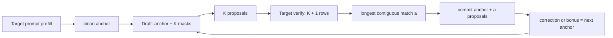

# Qwen3.5-4B DFlash rollback

`quant` 分支实现了 Qwen3.5-4B 的 persistent DFlash rollback，并支持同一套代码在两种 Target
精度下运行：

- 默认 FP16：不传量化参数；
- Target W8A8 dynamic：追加 `--config ... --quant_mode enable`；
- Draft 始终使用官方 Qwen3.5-4B-DFlash checkpoint 和 FP16 执行路径。

当前版本已经避免在每轮验证时重算不断增长的历史前缀。它是 strict-greedy、batch 1 的
Qwen3.5 DFlash port，不是 z-lab/dflash 全部 generation API 的逐行复制，也尚未取得 Ascend
310P 端到端加速结论。

`framework/quant-air-om` 分支在这份 `quant` 实现上增加了独立部署层：用现有 W8A8 Target
和 FP16 Draft 导出 TorchAir AIR，通过 ATC 生成 OM，并由 C++ AscendCL runner 加载 OM、
循环生成 token。入口和完整验证方法见
[基于 quant 的 AIR/OM/C++ 框架](docs/QUANT_AIR_OM_FRAMEWORK.md)。第一版 OM 使用静态完整前缀
重算来冻结功能 ABI；现有 persistent rollback 仍是后续增量 OM 状态 ABI 的语义基线。

## 当前实现

| 环节 | 当前行为 |
| --- | --- |
| Prompt | Target 按最多 64 个真实 token 分块 prefill；多 token 继续走原 GDR chunk 路线 |
| Draft | 官方 6 层、69 tensor；维护逐层 committed KV cache，只计算新增 feature 与当前 block |
| `block_size` | 包含 1 个 anchor；`B=16` 表示最多 15 个 proposal，Target verify 总行数最多 16 |
| Target verify | 一次输入 `[anchor, d1, ..., dK]`，不附带历史前缀 |
| 接受 | 只提交最长连续匹配前缀；提交行数为 `1 + accepted` |
| CPU/CUDA rollback | 恢复 round-start cache/state，再逐 token 重放 anchor 与已接受 proposal |
| NPU rollback | GDR-MTP state bank + NPU Tensor conv golden + paged-KV logical cursor |
| 量化 | 只量化 Target Linear 和 Target 输入 embedding；Draft embedding、LM head 和主体保持 FP16 |
| 正确性 | `validate` 用独立 ordinary incremental session 做 token/EOS/stop-reason 零差异门禁 |



每轮结束都保持同一个状态边界：

```text
Target state/cache/feature 已处理到 current anchor 之前
current anchor 已输出，但尚未作为 Target 输入处理
```

因此 correction 或 all-match bonus 只能成为下一轮 anchor，不能在当前轮提前写入状态。

## 快速运行

需要 Python 3.10、`transformers==5.14.1`、匹配设备的 PyTorch，以及本地 Target/Draft
checkpoint。仓库不包含权重、cache、ONNX/OM、日志或性能报告。

### FP16 NPU

不传 `--config` 和 `--quant_mode enable` 即为非量化模式：

```bash
export PYTHONPATH=/path/to/copied-runtime

python -B -m models.dflash_v1.run_npu \
  --target-dir /path/to/Qwen3.5-4B \
  --draft-dir /path/to/Qwen3.5-4B-DFlash \
  --kv-cache-max-len 2048 \
  --prompt "请用一句话解释为什么天空是蓝色的。" \
  --prompt-mode chat --enable-thinking \
  --max-new-tokens 32 \
  --execution-mode validate \
  --block-size 16 \
  --device npu:0 \
  --report /path/to/run/dflash-fp16.json
```

NPU 进程必须已经注册 `npu_gated_delta_rule_mtp`。`kv-cache-max-len` 需要覆盖 prompt 和输出，
并能被 64 整除。

### Target W8A8 dynamic

在相同命令后追加：

```bash
  --config ./config/qwen3.5.yaml \
  --quant_mode enable
```

YAML 沿用原 `inference.py` 的三个字段：

```yaml
quanted_pth: /data/qwen35-w8a8/linear
embedding_weight_path: /data/qwen35-w8a8/embedding_weight.bin
embedding_scale_path: /data/qwen35-w8a8/embedding_scale.bin
```

分支内置了原 `utils.quant_model` 的等价转换，不再需要填写 quantizer/provider 回调。关闭量化时
省略上述参数，或显式传 `--quant_mode disable`。

正确性门禁通过后，可以把 `--execution-mode validate` 改为 `dflash`，只运行 DFlash 生产路径。
该模式没有当次 ordinary 对照，因此报告不会伪造 exact-match PASS。

## 文档

| 文档 | 内容 |
| --- | --- |
| [当前架构](docs/DFLASH_ARCHITECTURE.md) | token/feature/cache/state 流程，以及与锁定官方 DFlash 的差异 |
| [自定义算子](docs/DFLASH_OPERATORS.md) | 已有、生产必需、条件新增和性能优化算子的功能与 I/O |
| [运行与验证](docs/DFLASH_RUN_AND_VALIDATE.md) | CPU/CUDA/NPU、W8A8、benchmark、msprof 和报告门禁 |
| [源码索引](models/dflash_v1/README.md) | 入口、scheduler、Target、Draft 和量化文件映射 |
| [AIR/OM/C++ 框架](docs/QUANT_AIR_OM_FRAMEWORK.md) | 从 quant 权重到 AIR、OM、C++ token 推理和闭源时延 A/B |

## 结果应怎样解释

- CPU/reduced-shape 测试是模拟证据，不是 Ascend 310P 交付证据。
- `benchmark_npu --mode ordinary` 是 rollback receiver 的内部控制组，不是原 main
  `inference.py`。
- 原非 DFlash 基线仍从原部署工程运行
  `python3 inference.py --config ./config/qwen3.5.ymal --max_token 32`，且不传
  `--quant_mode enable`。
- 算子累计时间不能直接当成整网延迟；正式加速比必须使用相同 prompt token、输出 token、精度、
  warmup、同步边界和输出 hash 的独立进程 3+10 测量。
- 真实 NPU 结论必须禁用 fallback，并记录 runtime、device、源码内容身份和 kernel/profile 证据。

当前完成度和后续工作以[当前架构的差异矩阵](docs/DFLASH_ARCHITECTURE.md#7-与完整-dflash-的差异)与
[算子优先级表](docs/DFLASH_OPERATORS.md#2-总表)为准，其他文档不再重复维护第二套架构描述。
