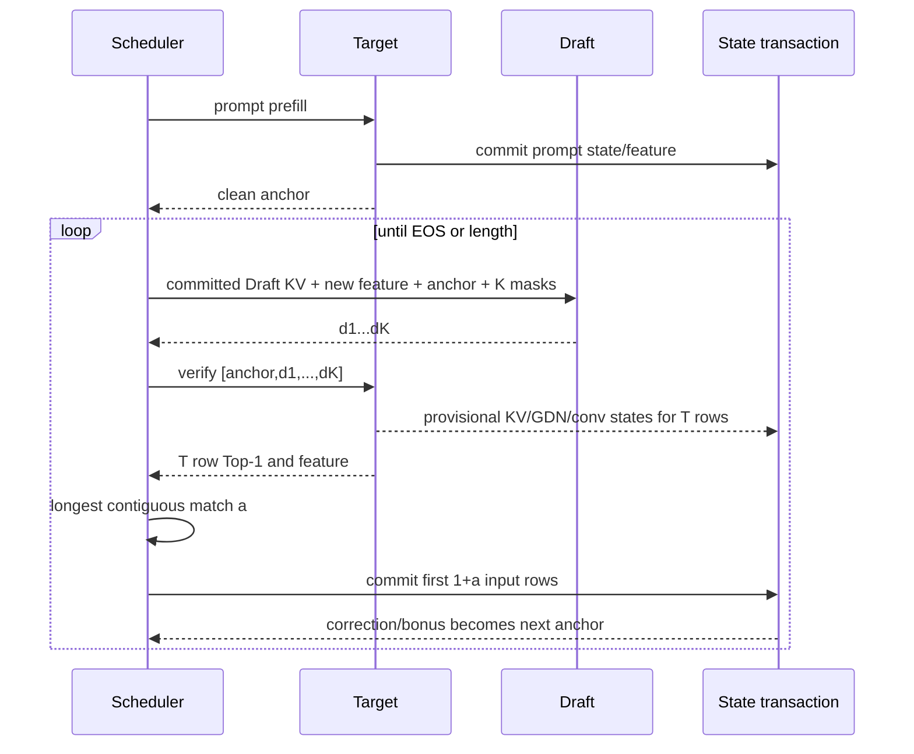

# 当前 DFlash rollback 架构

本文是 `quant` 分支唯一的架构说明，覆盖 FP16 与 Target W8A8 两种模式。算子 ABI 见
[自定义算子清单](DFLASH_OPERATORS.md)，命令和报告门禁见
[运行与验证](DFLASH_RUN_AND_VALIDATE.md)。

对照基线固定为：

- [z-lab/dflash `07ebd93`](https://github.com/z-lab/dflash/tree/07ebd93db9f472af339b644bb70221ad8428328a)；
- `z-lab/Qwen3.5-4B-DFlash` revision
  `9a1996ccf887b79ab3af4fcbf8c1d1f4b5658bcf`；
- 普通 DFlash，不把 DFlash2 的 selector/dynamic-conv 算进当前目标。

## 1. 当前定位

当前实现可以准确描述为：

```text
官方 Qwen3.5-4B DFlash Draft/checkpoint
+ block draft / one-shot Target verify / longest-prefix accept
+ 为 Qwen3.5 hybrid GDN Target 实现的 persistent transactional rollback
+ FP16 或 Target-only W8A8 execution backend
+ strict-greedy ordinary 零差异验证层
```

当前不是完整官方 generation 功能集：只支持 batch 1、strict greedy；不支持 temperature、top-p、
top-k rejection sampling，也没有官方 stream/generate API。NPU 路线仍保留 causal-conv Tensor
golden 和若干未融合热点，因此“能运行”不等于“已经完成生产优化”。

## 2. 固定口径

| 符号 | 含义 |
| --- | --- |
| `B` / `block_size` | 本轮 Draft query 和 Target verify 的最大总行数，包含 anchor，范围 2..16 |
| `K` | proposal 数，不包含 anchor，`K <= B-1` |
| `T` | 实际 Target verify 行数，`T=K+1 <= B` |
| `a` | 从第一个 proposal 开始的最长连续接受数，`0 <= a <= K` |

官方常用档位与当前 CLI 完全相同：

| `block_size B` | 2 | 4 | 6 | 8 | 16 |
| ---: | ---: | ---: | ---: | ---: | ---: |
| proposal `K` | 1 | 3 | 5 | 7 | 15 |
| verify `T` | 2 | 4 | 6 | 8 | 16 |

生成尾轮或 proposal 提前遇到 EOS 时，实际 K/T 可以更小。报告中的 `block_size` 始终使用 B，
接受率诊断中的 `proposal_count` 才使用 K。

Target 是唯一裁判。每轮结束都必须保持：

```text
Target state/cache/feature 已处理到 current anchor 之前
current anchor 已输出，但尚未作为 Target 输入处理
```

因此接受 `a` 个 proposal 后提交 `anchor + d1..da`，共 `1+a` 行；correction 或 all-match bonus
是下一轮 anchor，不能提前提交。

## 3. 一次请求



### 3.1 Prompt

Target 只 prefill 一次。HIAI bridge 按 KV block 边界拆成最多 64 个真实 token 的 chunk：

- 多 token chunk 继续调用原 `npu_chunk_gated_delta_rule`，使用原版 GDR prefill 路线；
- bridge 为每次 Target forward 构造 `INT16[B] gdr_effective_length`，值是本次调用的真实
  token 行数，而不是累计上下文长度 `allQLen`；
- 不用逐 token prefill 代替原 GDR；
- 不把 padding 写进 persistent GDN/conv/KV state；
- 中间 chunk 跳过完整 LM head，最后一个真实 prompt row 产生 clean anchor。

full-prefix correctness oracle 仍可把例如 37 个真实 token 对齐到 64 行物理输入，此时
`allQLen=37`、`gdr_effective_length=[37]`、物理 GDR 序列长度为 64。persistent rollback prompt
使用真实 token chunk，因此其 `gdr_effective_length` 等于每个 chunk 的实际 T；decode 为 1。
verify 虽也向 modeling 传入当前 T，但只走精确 T 的 GDR-MTP 分支，GDR-MTP ABI 未增加该输入。

Feature collector 读取 Target decoder 层 `1,5,9,13,17,21,25,29` 在 final norm 之前的 hidden，
拼成 `[batch, tokens, 20480]`。

### 3.2 Draft

锁定 Draft 合同：

| 项目 | 值 |
| --- | ---: |
| 层数 | 6：5 层 sliding causal + 1 层 full/block attention |
| hidden / intermediate | 2560 / 9216 |
| Q heads / KV heads / head dim | 32 / 8 / 128 |
| vocab | 248320 |
| checkpoint tensors | 69 |
| feature | 8 个 Target 层拼接为 20480，再投影到 2560 |
| mask token | 248077 |

Draft 输入由两部分组成：已提交的逐层 KV context，以及 `[anchor, MASK x K]` 当前 block。它只为
新增 committed feature 和当前 transient block 生成 K/V；成功后只保留 committed 部分，block
本身全部 crop。异常时 staged K/V 整轮放弃。

这消除了历史 feature 的重复 projection/KV projection，但 attention 仍要读取 committed
context；是否需要静态/paged Draft cache 或融合 GQA，由 NPU profile 决定。

### 3.3 Verify 与接受

```text
input = [anchor, d1, d2, ..., dK]
top1  = [t1,     t2, t3, ..., bonus]
```

从左向右比较 `d1==t1, d2==t2, ...`。首次不匹配位置为 `a` 时：

```text
emitted proposals = d[:a]
correction         = top1[a]
committed inputs   = input[:a+1]
next anchor        = correction
```

全部命中时 `a=K`，`top1[K]` 是 bonus。当前实现若某轮 `a=0`，该请求后续关闭 Draft，继续在同一
transaction 中执行 S=1 Target-only generation；这是保持精确性的低接受率保护策略，不是官方
runner 的固定行为。

## 4. 组件和所有权

| 组件 | 责任 | 不负责 |
| --- | --- | --- |
| Scheduler | bootstrap、proposal、verify、accept、EOS、长度和 fallback | 不直接改 Target cache |
| Draft adapter | feature projection、6 层 KV 生命周期、proposal | 不决定接受数 |
| Target transaction | provisional verify、commit/abort、状态一致性 | 不改变接受规则 |
| Feature collector | 八层 hidden 的 token 对齐与 committed slice | 不保留拒绝尾部 |
| Runner | `validate` 对照或 `dflash` 单跑、身份与报告 | 单跑不伪造 correctness PASS |

| 路线 | Target | Draft primitives | 状态实现 |
| --- | --- | --- | --- |
| CPU/CUDA | `modeling_qwen3_5_dflash.py` | `TorchDFlashOps` | DynamicCache + GDN snapshot/restore + bounded replay |
| HIAI/NPU | 独立 rollback modeling/wrapper | package-local NPU Tensor decomposition | GDR/conv bank + paged-KV logical cursor |

ordinary `models/modeling_qwen3_5_hiai_nd.py` 保持权威，只增加原 GDR 新
`effective_length` ABI 的参数传播；原部署 wrapper 不被 rollback 覆盖。rollback 仍使用独立
modeling、wrapper adapter 和 bridge。

## 5. 状态事务

三类 Target 状态必须用同一个 `a` 原子提交：

| 状态 | CPU/CUDA | HIAI/NPU |
| --- | --- | --- |
| 8 层 full-attention KV | verify 前 snapshot 长度；恢复后重放 `1+a` 行 | provisional 物理写入；logical cursor 仅推进 `1+a` |
| 24 层 GDN recurrent | 恢复 round-start state 后逐 token 重放 | `npu_gated_delta_rule_mtp` 返回每行 FP32 state bank |
| 24 层 GDN causal-conv | 恢复 round-start window 后逐 token 重放 | NPU Tensor golden 返回每行 FP16 conv bank |
| Target feature | 使用 replay 的 `1+a` 行 | 截取 verify feature 前 `1+a` 行 |

CPU/CUDA 不重放 prompt 或更早历史，只重放当前 anchor 与 accepted proposal，最多 16 个 S=1
调用。NPU 可以保留 rejected KV 的物理内容，但 mask/length 不得读取它，下一轮从 committed
logical cursor 覆写。

`accepted_tokens` 传给 GDR-MTP/conv bank 时表示“上一轮选择哪个 provisional slot”，不是当前轮
尚未计算出的接受数。T 改变时先选择 committed slot，再 rebase 为新 T。任一层 verify 失败后，
整个 session 失效，不能继续使用部分更新的状态。

`gdr_effective_length` 与 `accepted_tokens` 不属于同一合同：前者只描述原 GDR 本次物理输入中
有多少行有效，后者只让 rollback 算子选择上一轮已提交的 state-bank slot。

## 6. FP16 与 W8A8

两种模式共用同一个 scheduler、rollback transaction 和 Draft：

```text
默认 FP16 Target

--config ... --quant_mode enable
    -> 读取原 YAML 的 quanted_pth / embedding_weight_path / embedding_scale_path
    -> 使用内置原 utils.quant_model 等价实现
    -> Target nn.Linear 替换为原 HIAI QLinear
    -> Target INT8 embedding row * FP32 scale -> FP16
    -> Draft embedding、LM head、6 层主体仍为 FP16
```

W8A8 只处理本次真实输入：prompt `T=1..64`、decode `T=1`、verify `T=1..16`。关闭量化时不调用
converter、不加载 INT8 artifact，并拒绝意外出现的 QLinear。

量化 correctness 有两层，不能混用：

1. scheduler 门禁：同一个 W8A8 Target 的 ordinary 与 DFlash token 必须完全相同；
2. 模型精度门禁：W8A8 ordinary 是否与 FP16 ordinary 相同，需要单独比较，不能由第 1 条推出。

## 7. 与完整 DFlash 的差异

这里的“完整 DFlash”指上面锁定的 z-lab 算法与 Qwen3.5 checkpoint 行为，不包含 DFlash2。

| 维度 | 锁定完整 DFlash | 当前 `quant` 分支 | 状态 |
| --- | --- | --- | --- |
| Draft checkpoint/结构 | checkpoint 驱动 | 同一 revision、6 层、69 tensor、hash fail-closed | 对齐 |
| Feature、block、verify | 8 层 feature；B 含 anchor；一次 Target verify | 相同 | 对齐 |
| Greedy accept | 最长连续 Top-1，随后 correction/bonus | 相同 | 对齐 |
| Draft KV | 跨轮 cache，当前 block 后 crop/trim | request-local committed/transient cache | 语义对齐，代码重写 |
| Target rollback | Transformers cache crop；Qwen3.5 MLX 捕获并短重算 GDN | CPU/CUDA restore+S1 replay；NPU state bank+logical cursor | 目标相同，实现不同 |
| Sampling | temperature/top-p/top-k、概率比 rejection 和 residual correction | 仅 strict greedy | 缺失的软件能力 |
| Batch/API | generate/stream；不同 backend 能力不同 | batch 1 CLI/JSON report | 缺失的软件能力 |
| 量化范围 | backend 可支持量化 Target/Draft | 仅 Target W8A8，Draft FP16 | 部分覆盖 |
| NPU causal-conv | backend 原生状态恢复 | NPU Tensor golden | 生产算子待补 |
| NPU Draft | backend 优化实现 | 无 CPU fallback 的 PyTorch/Torch-NPU 分解 primitives | 功能有，性能未闭合 |
| 低接受率 | 继续由官方 scheduler 策略决定 | 首次零接受后本请求 Target-only | 当前新增精确 fallback |
| 验证 | 直接 generate/统计 | `validate` 额外跑 independent ordinary，逐 token 门禁 | 当前新增工程门禁 |
| 性能证据 | backend/workload 范围内报告 | 310P 同边界配对结果仍需闭合 | 不能声称达到官方速度 |

官方锁定提交中，Qwen3.5 的本地完整参考主要是 MLX；Transformers 本地列表未把 Qwen3.5
列为原样 backend。因此当前 CUDA 路线应称为 Qwen3.5 PyTorch rollback port，而不是“官方
Qwen3.5 CUDA 实现”。

## 8. 补齐路线

| 目标 | 还需工作 | 是否一定需要新自定义算子 |
| --- | --- | --- |
| 当前 strict-greedy correctness | 完成 24 层 GDR/conv、8 层 KV、多轮 rejection 和 block-boundary 真机证据 | GDR-MTP 已有；当前可用 golden 跑通 |
| 去掉生产 golden | 用 `CausalConv1dMTP` 替换 conv Tensor 分解 | 是，生产优先 |
| 完整官方 generation 功能 | sampling 概率、rejection/residual correction、固定 RNG 门禁、stream/batch API | 否，首先是 scheduler/API 工作 |
| NPU 端到端提速 | profile Draft GQA/LM head、Target LM head、KV update、W8A8 dispatch 和同步 | 只对实测热点新增 |
| 静态图/OMC 交付 | 固定输入输出 ABI、cache writeback、逐算子 golden、转换和设备门禁 | 取决于现有编译器覆盖 |

具体算子优先级、功能和输入输出以[自定义算子清单](DFLASH_OPERATORS.md)为准。不要把整个
scheduler/transaction 包成一个巨型算子；state、KV、feature、position 使用同一个 `a` 是运行时
所有权协议。

## 9. 可声明的证据

正式报告至少检查：

```text
route = qwen3.5-dflash-incremental-rollback
verification_mode = incremental_transactional_rollback
historical_prefix_replay_during_verify = false
draft_kv_cache_audit.mode = upstream_equivalent_append_then_crop
target_quantization.scheme = disabled 或 w8a8_dynamic
```

只有 `execution_mode=validate` 且 ordinary/DFlash token、EOS、stop reason 全部一致时，
`strict_greedy_exact_match=true`。`execution_mode=dflash` 没有当次 ordinary 对照，该字段必须为
null。

CPU 是模拟证据，CUDA 是 framework 设备证据。Ascend 310P 还必须禁用 fallback，记录 runtime、
device、源码/算子身份和 kernel trace，并在 rejection 后继续至少一个 token 比较完整状态，才能
声明目标 rollback 通过。正确性通过不自动构成性能结论。
