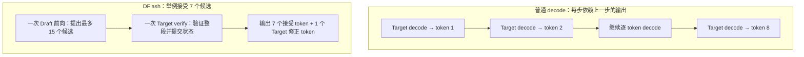
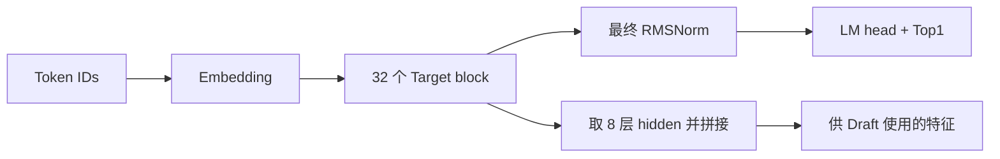
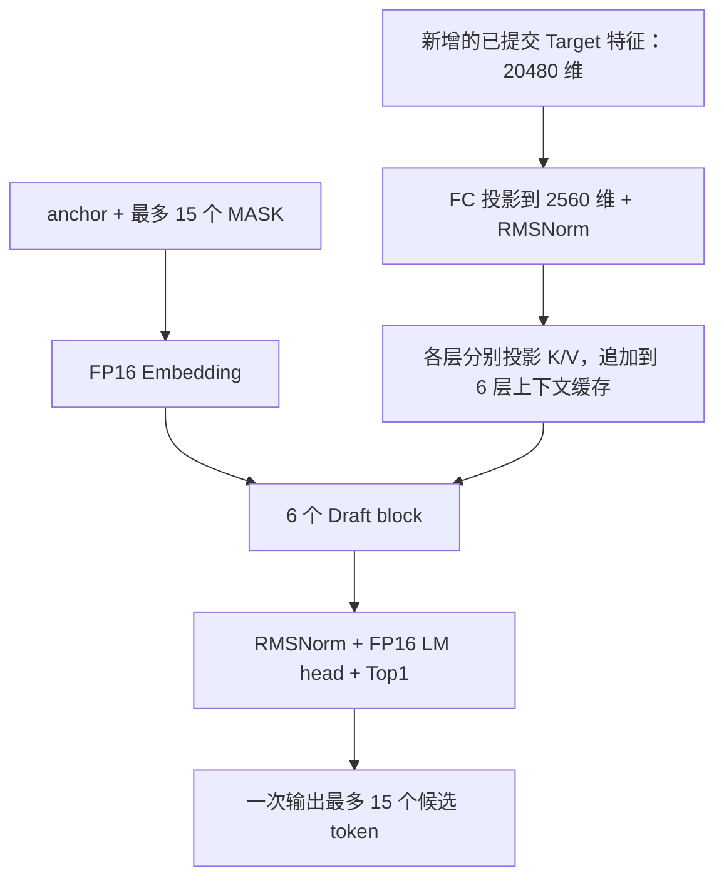
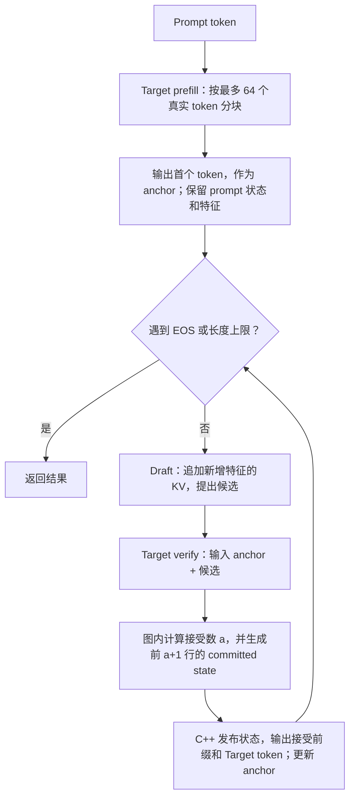

# Qwen3.5-4B DFlash：模型结构与运行流程

DFlash 用一个较小的 Draft 模型一次提出多个候选 token，再由 Qwen3.5-4B Target 一次验证。
只输出 Target 认可的连续前缀，因此可以减少逐 token 调用大模型的次数，同时保持 strict-greedy 输出一致。

本文介绍 Ascend 310P 上的当前实现：batch=1，Python NPU 或 AIR → OM → C++，
最多 15 个候选；OM 使用 W8A8 Target 和 FP16 Draft。完整命令见
[Python NPU 运行手册](DFLASH_RUN_AND_VALIDATE.md)和 [AIR/OM/C++ 部署手册](GDR_CHUNK_AIR_OM.md)。

## 1. DFlash 为什么能更快

普通 decode 每次只产生一个 token，下一次调用必须等这个 token 出来。
DFlash 先把候选序列猜出来，Target 就能把这些已知输入放在一次多 token 前向中验证。



这里有三项潜在收益：

| 机制 | 为什么有帮助 |
|---|---|
| 小模型一次生成整块候选 | Draft 只有 6 层，借助 Target 的中间特征，同时预测多个 MASK 位置，无需先串行跑 15 次 Draft |
| 大模型一次验证多行 | 多个 token 共用一次 Target 前向，可以摊薄模型调用、权重读取等开销，提高矩阵乘的多行计算效率 |
| 跨轮保留状态和上下文 | Target 保留已提交的 KV/GDN 状态，Draft 保留上下文 KV；verify 不重新计算历史 prompt |

普通 decode 也会复用缓存。这里保留缓存，是为了让投机验证只处理本轮的新输入，控制额外开销。

验证时，Draft 已经提供了整段候选。
Target 使用因果关系，计算每个位置在“历史 + anchor + 此位置之前的候选”条件下的预测。
从左到右连续匹配的部分，才与普通 greedy 路径一致；第一次不匹配之后的预测不能直接输出。

**减少调用次数不等于同倍数提速。** 设本轮提出 `K` 个候选（最多 15 个），接受其中 `a` 个。
在未碰到 EOS 或输出长度上限时，本轮新增 `a+1` 个 token。判断这轮是否划算，应比较：

```text
一轮 DFlash 耗时 = Draft + Target verify（含 commit）+ 主机调度
替代的普通 decode 耗时 ≈ (a + 1) × 单次普通 decode 耗时

只有前者更小，DFlash 才更快。
```

例如接受 7 个候选，一轮能替代约 8 次普通 decode，但并不保证快 8 倍。
接受率低、verify 算子慢、Draft 耗时高，都可能让 DFlash 比普通模式更慢。
接受率是“接受数 / 提出数”，还必须结合**每轮实际输出数和每轮时延**判断性能。
加速主要发生在 decode；短输出请求中，prefill 等共同开销也会限制整次请求的收益。

## 2. 两个模型分别长什么样

### Target：Qwen3.5-4B，负责最终判断



| 部分 | 结构 |
|---|---|
| 隐藏维度 | 2560 |
| 32 个 block | 每组 3 层 Gated DeltaNet + 1 层 full attention，共 24 层 GDN、8 层 full attention |
| 每个 block | RMSNorm → GDN/Attention → 残差相加 → RMSNorm → SwiGLU MLP → 残差相加 |
| GDN | causal-conv 处理投影结果，Gated Delta Rule 更新 recurrent state，再经过门控和输出投影 |
| Full attention | 通过 KV cache 读取历史，使用因果注意力 |
| LM head | 映射到 248320 维词表，Top1 选出得分最高的 token |
| Draft 特征 | 取下标 `1、5、9、13、17、21、25、29` 的 block 输出；每个 token 拼成 `8 × 2560 = 20480` 维 |

层下标从 0 开始；特征取自 block 完成残差相加之后、模型最终 RMSNorm 之前。
普通模式和 DFlash 使用同一个 Target；区别在于每次输入一行还是一段候选，以及怎样提交状态。

### Draft：6 层模型，负责一次提出多个候选

Draft 使用官方 Qwen3.5-4B-DFlash checkpoint。它有两路输入：Target 的已提交特征，
以及本轮的 `[anchor, MASK, …, MASK]`。`anchor` 是已经输出、但还没有被 Target 作为输入处理的 token。



| 项目 | 配置 |
|---|---|
| 层数 | 5 层 sliding causal attention + 1 层 full attention |
| 隐藏维度 / MLP 中间维度 | 2560 / 9216 |
| Q heads / KV heads / head dim | 32 / 8 / 128 |
| Attention 范围 | 前 5 层的 sliding window 为 4096；最后一层 full attention 允许有效 block 内各位置相互注意 |
| Block | 16 个位置：1 个 anchor + 15 个候选位置；MASK token ID 为 `248077` |
| Embedding / LM head | 使用 Target checkpoint 的 FP16 embedding 和 LM head |

各层的上下文 K/V 都由**同一份投影后的 Target 特征**通过该层的 K/V 投影得到。
当前 block 的 hidden 则顺序经过 6 个 Draft block。两路数据在 attention 中汇合。
持久缓存只接收已提交 Target 特征产生的 K/V；当前 MASK block 的临时 K/V 不保留到下一轮。

## 3. 为什么只需要四张 OM

同一套部署共有四张图，状态通过显式输入/输出在设备上衔接。

| OM | 一次调用做什么 | 固定输入规模 | 单独普通模式 | 单独 DFlash 模式 |
|---|---|---|---|---|
| `target_prefill.om` | 处理一块 prompt，输出最后有效行的 Top1、特征和状态 | 64 个 token 位置 | 加载 | 加载 |
| `target_decode.om` | 输入上一个 token，输出下一个 token 并更新状态 | 1 个 token | 加载 | 不加载 |
| `target_verify.om` | 验证候选、算 Top1 和接受数、完成第二遍 GDR commit | 16 个 token 位置 | 不加载 | 加载 |
| `draft.om` | 投影新增特征、追加 Draft KV、生成本轮候选 | 64 行特征 + 16 个 block 位置 | 不加载 | 加载 |

普通模式用 2 张，DFlash 用 3 张，共用 `target_prefill`。配对测量默认同时加载四张。
**commit 已包含在 verify OM 中，无需单独的 commit OM。**

固定规模指物理 tensor 大小，不代表每次都有这么多真实 token。
`valid_rows` 和 mask 限制有效范围。例如提出 7 个候选时，verify 的有效长度是 `1+7=8`，
物理输入仍为 16 行；填充行不属于已提交上下文。

三张 Target OM 使用自定义 `CacheUpdate` 写入 paged KV：prefill 每次写一块 64 行，
decode 写一行，verify 逐行写入 16 行并处理跨块位置。这样无需为了更新少量 token
而转换整份 KV 的布局，普通模式和 DFlash 都能减少这部分开销。
Draft 的上下文缓存采用另一种布局，仍使用 `ScatterElements`。
是否带来端到端提速，需要结合目标机上的算子耗时、接受率和整轮耗时测量。

## 4. 一次请求怎样运行

下图展示 Draft 保持启用时的生成循环：



1. **Prefill。** Target 处理完整 prompt，最后一个真实位置的 Top1 成为首个输出 token。
   该 token 也是第一轮 anchor；Target 此时的缓存只包含 prompt。
2. **Draft。** 将新增的已提交 Target 特征加入 Draft 上下文，用 anchor 和 MASK 一次生成候选。
3. **Verify。** Target 输入 `[anchor, d1, …, dK]`，得到每个位置预测的下一个 token。
4. **接受和提交。** 从第一个候选开始连续比较，接受 `a` 个；状态推进 `a+1` 行。
   输出接受的候选和 Target 的修正 token，后者成为下一轮 anchor。

例如：

```text
Verify 输入：   [anchor, A, B, X, Y]
Target Top1：   [A,      B, C, …, …]

接受候选：      [A, B]                 a = 2
本轮新输出：    [A, B, C]              3 个 token
提交的输入：    [anchor, A, B]         3 行状态
下一轮 anchor：C                       已输出，尚未写入 Target 状态
```

全部候选都匹配时，最后一行 Target Top1 还能提供一个 bonus token。
遇到 EOS 或输出长度上限时提前停止，因此尾轮不一定输出满 `a+1` 个 token。

**当前调度的两个细节：** 某轮有候选但接受数为 0 时，本请求后续关闭 Draft。
已加载 `target_decode` 就用它继续生成，否则用 verify 的一行有效输入继续生成。
长 prompt 超过一个 chunk 时，C++ 在中间 chunk 后调用 Draft OM 来建立上下文 KV，
该次候选丢弃；最后一块特征留给首轮 Draft。因此两种模式共用 prefill 图，DFlash 的完整
prefill 阶段仍可能多出 Draft 上下文准备开销。

## 5. Verify 内两遍 GDR 各自做什么

Qwen3.5 的 GDN 会把历史压缩进 recurrent state。验证完一段候选后，不能直接把包含
拒绝 token 的最终 state 留下来，也不能仅靠截短 KV 长度恢复这个 state。
当前做法是保留本轮起点，确定接受数后再次计算正确前缀的 GDR state。

| 项目 | 第一遍：验证 | 第二遍：commit |
|---|---|---|
| 覆盖的输入 | anchor + 全部候选 | anchor + 接受的连续候选 |
| `effective_length` | `K+1`，最多 16 | `a+1`，最多 16 |
| `chunk_size` | 64 | 64 |
| Q/K/V、g、beta | 本轮 Target 投影得到的数据 | 复用第一遍的数据 |
| `initial_state` | 本轮开始时的 state，转为 FP32 | **同一个起始 state** |
| `output_final_state` | `True` | `True` |
| `core_attn` | 继续参与 Target 层计算 | 不使用 |
| 最终 recurrent state | 保留真实设备输出缓冲区，运行时丢弃 | 转为持久状态格式后提交 |

因此 verify 图中有 **24 个验证 GDR + 24 个 commit GDR**。
Target 的投影、attention、MLP、LM head 只做一次完整前向；第二遍只重算 GDR 状态并选择
对应的 conv 状态，不再重跑整个 Target。这项额外开销已包含在 verify 时延中。

第一遍的 24 个 FP32 state 作为 OM 输出保留，各为 `[1,32,128,128]`，总计 **48 MiB**。
它们只提供真实设备缓冲区，不拷回主机、不替换已提交缓存；持久 recurrent state 只来自第二遍。

各类状态必须按同一个 `a+1` 前缀推进：

| 数据 | 跨轮保留规则 |
|---|---|
| Target GDN recurrent state | 保存第二遍 GDR 的 state；当前 OM 持久格式为 FP16，GDR 初始/最终 state 使用 FP32 |
| Target causal-conv state | 选择处理完前 `a+1` 行时的 conv 窗口 |
| Target attention KV | 可以先物理写入整段；逻辑长度只推进 `a+1`，拒绝尾部不可见，后续覆盖 |
| Target feature | 只让前 `a+1` 行作为下一轮 Draft 的有效新特征 |
| Draft KV | 只追加已提交 Target 特征形成的上下文；本轮候选 block 不作为持久上下文 |

C++ 检查主机接受数与 OM 输出一致，再切换状态缓冲区和逻辑长度。
这里的 C++ `Commit()` 是发布图内已算好的结果，没有额外执行一张模型。

## 6. 精度与显存怎么安排

### 计算精度

| 部分 | 当前 OM 的做法 |
|---|---|
| Target Linear，包括 Target LM head | W8A8 动态量化：INT8 权重和量化激活，输出 FP16 |
| Target embedding | INT8 权重行 × FP32 scale，再转 FP16 |
| Draft 主体、embedding、LM head | FP16 |
| Draft attention 的 QK / PV 矩阵乘 | 两个输入默认都转成 FP16；矩阵乘结果再转 FP32 |
| Draft attention 的缩放、mask、softmax | FP32；attention 最终结果转回 FP16 |

降低 Draft attention 矩阵乘输入精度，目的是让编译器有条件使用 Cube 矩阵计算路径。
**输入为 FP16、结果再转 FP32，不等于已经保证内部采用 FP32 累加或直接输出 FP32。**
实际内核、累加方式和时延需查看 ATC 结果及 msprof。

`factory.json` 中 `draft_attention_matmul_dtype` 默认是 `float16`，设为 `float32` 可导出对照组；
改动后重新导出 AIR、编译 OM。Python 原生 Torch-NPU Draft attention 的 QK/PV 保留 FP32 对照。
Draft 精度变化可能改变逐轮候选和接受率；最终输出仍必须与同精度 Target 的普通 greedy 逐 token 一致。

### 设备显存

| 运行方式 | 同时驻留的 OM |
|---|---|
| 普通模式单跑 | prefill + decode |
| DFlash 单跑 | prefill + draft + verify |
| 默认 paired 测量 | 四张都加载，交替测普通模式和 DFlash |
| `infer-cpp --low-memory` | 先加载普通模式两张并完成测量；卸载后加载 DFlash 三张并测量 |

低显存模式两组各执行 3 次预热和 10 次测量，模型装卸不计入生成时延，报告记录分组测量顺序。
chunk runtime 还会查询各 OM 的工作内存需求，支持时按最大需求复用一块串行工作内存，
无需为每张 OM 各留一份；查询不支持时使用各模型独立分配。
各 OM 的权重仍独立驻留，不能把“Draft 复用 Target embedding/head”理解成跨 OM 共享一份设备权重。

## 7. 从源码到运行，再到性能分析

```text
Target / Draft checkpoint + W8A8 输入 + factory.json
    → export-air：建立增量图，注册自定义算子导出映射
    → compile-om：ATC 编译，生成 OM 和 deployment-manifest.json
    → build-cpp：构建 AscendCL runner
    → infer-cpp：Python 处理文本和启动；C++ 加载 OM、调度、维护设备状态
    → token / 接受率 / 分阶段时延报告
```

Python NPU 方式直接调用 Torch-NPU 执行模型，适合验证和更细的阶段分析；
OM/C++ 方式将计算放进静态图，生成循环由 C++ 执行。两者使用相同的最长前缀接受规则，
应分别检查最终 token 一致性与逐轮候选差异。

OM 使用 `tools/profile_om.py --profile-mode ordinary|dflash --profile-stage all`，
自动从指定 deployment manifest 生成加载计划。Python NPU 使用 `tools/run_msprof.sh`；
OM 入口也调用这个 wrapper，共用 msprof 动态 PID 控制器，无需 pyACL：

| C++ 模式 | 可以单独采一次的阶段 | `all` |
|---|---|---|
| 普通模式 | `prefill`、`decode` | 同进程分别采两个阶段 |
| DFlash | `prefill`、`draft`、`verify` | 同进程分别采三个阶段；verify 包含两遍 GDR 和 commit |

预热放在采集窗口外；C++ prefill 的状态清零也在窗口外，Python prefill 则包含 begin 调用内的清零。
Python 还可单独采 feature projection、接受/提交等细分阶段，
其中 Python `verify` 只含第一遍 GDR，`accept-commit` 含第二遍；C++ `verify` 含整个融合图。
两个后端每阶段均输出算子类型汇总、单任务明细和慢算子排序，按原始 CSV 和输入/输出 dtype
分别统计，可直接查看 CacheUpdate、GDR 及 FP16/FP32 矩阵乘。范围和命令见运行手册。
判断“是否更快”用不带 profiler 的 3+10 测量；msprof 用来回答
“时间花在哪些算子上”，算子耗时简单求和不能替代端到端时延。

## 8. 对应源码在哪里

| 想看什么 | 文件与主要类/函数 |
|---|---|
| Draft 配置与模型层 | [dflash_config.py](../models/dflash_v1/dflash_config.py)、[modeling_dflash.py](../models/dflash_v1/modeling_dflash.py) |
| OM 中 Target、Draft、两遍 GDR | [incremental.py](../framework/python/qwen35_dflash/ascend310p/incremental.py)：`TargetRowsGraph`、`TargetCommitGraph`、`DraftContextGraph`、`DraftProposeGraph` |
| 图工厂和 FP16 attention matmul | [quant_factory.py](../framework/python/qwen35_dflash/ascend310p/quant_factory.py)：`create_quant_incremental_graphs`、`AirDFlashOps` |
| C++ 逐轮生成、接受和停止 | [chunk.cpp](../framework/runtime/cpp/src/chunk.cpp) |
| OM 加载、设备缓冲区、状态发布 | [acl_chunk.cpp](../framework/runtime/cpp/src/acl_chunk.cpp) |
| Python NPU 的 Target 和调度 | [modeling_qwen3_5_hiai_nd_dflash_rollback.py](../models/modeling_qwen3_5_hiai_nd_dflash_rollback.py)、[dflash_rollback_decode.py](../models/dflash_v1/dflash_rollback_decode.py) |
| OM 分阶段入口、公共采集和算子汇总 | [profile_om.py](../tools/profile_om.py)、[run_msprof.sh](../tools/run_msprof.sh)、[msprof_summary.py](../models/dflash_v1/msprof_summary.py) |

按步骤运行见 [AIR/OM/C++ 部署手册](GDR_CHUNK_AIR_OM.md)；
tensor ABI 和参数定义见 [接口参考](QUANT_AIR_OM_FRAMEWORK.md)，
自定义算子详情见 [算子清单](DFLASH_OPERATORS.md)。
