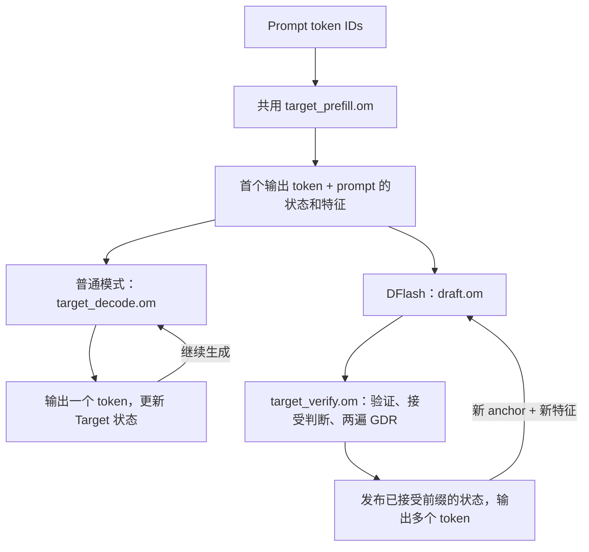
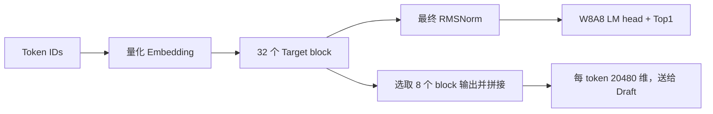
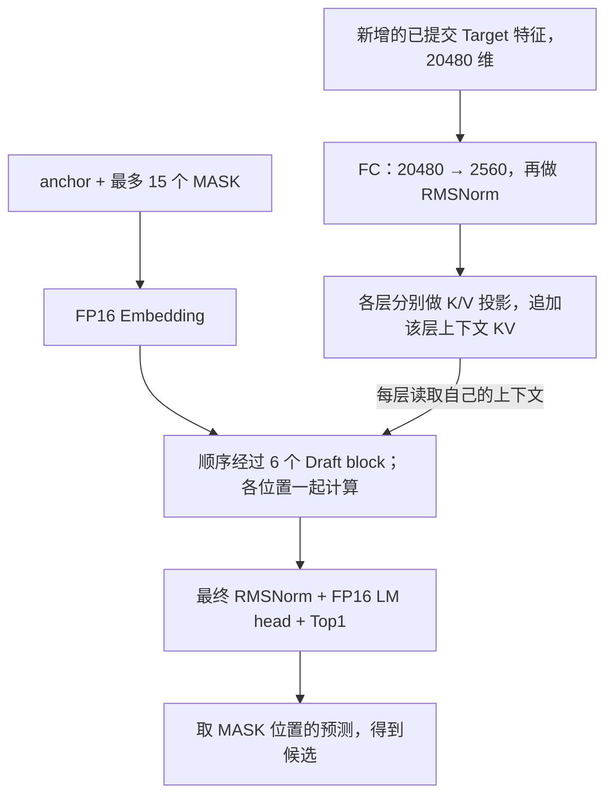

# Qwen3.5-4B DFlash：结构、生成流程与加速原理

DFlash 让一个较小的 **Draft** 一次提出多个候选，再让 **Target** 一次验证整段。
一轮接受多个 token，就能减少逐 token 调用大模型的次数。是否更快，取决于这些 token
节省的普通 decode 时间，能否覆盖 Draft、verify 和状态提交的开销。

本文对应 `feature/gdr-chunk-verify` 的增量实现：文本生成、batch=1、strict greedy，
每轮最多 15 个候选。重点介绍 W8A8 Target＋FP16 Draft 的 OM/C++ 路径，
并说明它与 Python NPU 路径的对应关系。操作命令见
[AIR/OM/C++ 部署手册](GDR_CHUNK_AIR_OM.md)和 [Python NPU 手册](DFLASH_RUN_AND_VALIDATE.md)。

## 1. 先看整体：普通模式用两张 OM，DFlash 用三张



循环遇到 EOS 或 `max_new_tokens` 就结束。图中的“状态”始终保存在设备上，
C++ 负责组织输入、调用 OM、读取 token 和接受数，以及发布下一轮使用的状态。

| OM | 一次调用的职责 | 物理输入规模 | 哪种模式使用 |
|---|---|---|---|
| `target_prefill.om` | 处理一块 prompt，输出最后有效行的 Top1、Target 特征和状态 | 64 行 token | 普通、DFlash 共用 |
| `target_decode.om` | 输入上一个输出 token，产生下一个 token 并更新状态 | 1 行 token | 普通模式 |
| `draft.om` | 投影新增特征、追加 Draft KV、一次生成候选 | 64 行特征＋16 行 block | DFlash |
| `target_verify.om` | 验证候选、计算接受数、生成正确前缀的状态 | 16 行 token | DFlash |

**一套普通/DFlash 对照部署共四张 OM；单独 DFlash 只加载三张。**
commit 已融合进 `target_verify.om`。Draft 的特征投影、上下文 KV 追加和候选生成
也在同一张 `draft.om` 中。

物理大小是固定张量尺寸，实际有效长度由输入参数和 mask 控制。
例如 7 个候选加 1 个 anchor，verify 只有 8 行有效，但物理张量仍为 16 行。
**填充行不可见，不代表它们的计算自动消失。**

## 2. 一次请求怎样生成 token

先明确三个词：

| 名称 | 含义 |
|---|---|
| anchor | 已经输出，但还没有作为输入写进 Target 状态的最新 token |
| `K` | 本轮实际送去验证的候选数，最多 15；EOS 可以缩短候选序列 |
| `a` | 从第一个候选起连续匹配 Target 的数量，`0 ≤ a ≤ K` |

### 第一步：prefill，生成首个 token

Target 按最多 64 个真实 token 分块处理 prompt。最后一块的最后有效位置产生首个
输出 token，也就是第一轮 anchor。此时 Target 状态包含完整 prompt，尚不包含 anchor。

Target 同时提供 8 个选定层的特征，供 Draft 构建上下文。
长 prompt 有多个 chunk 时，C++ 在中间 chunk 后调用 `draft.om`，将该块特征加入
Draft KV；这些调用产生的候选丢弃。最后一块特征留给第一轮正式 Draft。

因此，两种模式共用 prefill 图；完整生成报告中的 DFlash prefill 阶段，
在长 prompt 下还可能包含额外的 Draft 上下文准备调用。

### 第二步：Draft 一次提出候选

Draft 先追加新增的已提交 Target 特征，再处理 `[anchor, MASK, …, MASK]`，
一次输出最多 15 个候选。每个 MASK 位置各预测一个 token，层内的多个位置一起计算；
Draft 的 6 层仍按顺序执行。

生成时的候选预算为 `min(max_draft_tokens, 剩余输出预算, 15)`。
C++ 读取该范围内的候选，遇到候选 EOS 就截断，并把实际序列送去验证。

### 第三步：Target 验证，决定输出和状态

Target 输入 `[anchor, d1, …, dK]`，每行的 Top1 都是该行输入之后的下一个 token。
C++ 和图内接受逻辑从左向右比较：`d1` 对第 0 行 Top1，`d2` 对第 1 行 Top1，以此类推。
第一次不匹配即停止接受，不能跳过错误继续接受后面的候选。

```text
本轮开始：Target 状态已有历史 P；anchor 已输出，但不在状态中。

Verify 输入      [anchor, A, B, X, Y]
Target Top1      [A,      B, C, …, …]
                         ↑ 第三个候选 X 与预测 C 不同

接受的候选       [A, B]                   a = 2
本轮新增输出     [A, B, C]                3 个 token
本轮提交的输入   [anchor, A, B]           3 行状态
下轮 Target 状态 P + [anchor, A, B]
下轮 anchor      C                       已输出，尚未进入 Target 状态
```

**本轮输出与本轮提交的输入错开一个位置。** 通常都增加 `a+1` 项，但提交的第一项是
旧 anchor，输出的最后一项是新 anchor。全部候选接受时，Target 最后一行 Top1
可再提供一个 bonus token；碰到 EOS 或输出预算时，尾轮可能少输出这一项。

当前 C++ 和 Python 调度会持续投机，直到 EOS 或输出预算耗尽。
某轮 `a=0` 时，只提交旧 anchor 对应的 1 行状态；Target 的补充 token
作为下一轮 anchor，更新 Draft 上下文后再次提出候选。连续多轮零接受也不会关闭 Draft。
接受率与速度要重新测量；持续开启不代表一定更快，也不取消与普通模型的 token 一致性检查。

## 3. Target 和 Draft 内部是什么结构

### Target：32 层 Qwen3.5-4B，负责最终预测



| 部分 | 当前结构 |
|---|---|
| 隐藏维度 / 词表 | 2560 / 248320 |
| 层的排列 | 每组 3 层 Gated DeltaNet＋1 层 full attention，共 24 层 GDN、8 层 full attention |
| 每个 block | RMSNorm → GDN 或 attention → 残差相加 → RMSNorm → SwiGLU MLP → 残差相加 |
| GDN | 投影和 causal-conv 得到 Q/K/V，GDR 更新 recurrent state，再经过门控、归一化和输出投影 |
| Full attention | 对当前输入与历史 paged KV 做因果注意力 |
| Draft 特征来源 | 下标 `1、5、9、13、17、21、25、29` 的 block 输出，拼成 `8 × 2560 = 20480` 维 |

层下标从 0 开始，特征取自 block 残差完成后、模型最终 RMSNorm 之前。
普通和 DFlash 的 Target 使用同一套模型权重与层结构。prefill 每块、decode 每次只对
最后有效行计算 LM head；verify 对整块位置计算 LM head，以便逐位置验证候选。

### Draft：6 层模型，利用 Target 特征并行猜测



| 部分 | 当前结构 |
|---|---|
| 权重来源 | 官方 Qwen3.5-4B-DFlash checkpoint |
| 隐藏维度 / MLP 中间维度 | 2560 / 9216 |
| Q heads / KV heads / head dim | 32 / 8 / 128 |
| 前 5 层 | sliding causal attention，窗口 4096 |
| 最后 1 层 | full attention，有效 block 内允许非因果注意力 |
| 物理 block | 16 行：1 个 anchor＋15 个 MASK；MASK ID 为 `248077` |
| Embedding / LM head | 来自 Target checkpoint 的 FP16 模块 |

两条数据流要分清：**Target 特征提供上下文 K/V，当前 block hidden 提供 Q 和本块 K/V。**
同一份经过 FC 和 norm 的特征送给各层各自的 K/V 投影；当前 block hidden 则逐层更新。
上下文与本块 K/V 在 attention 中共同参与计算。

当前 OM 编译默认给 Draft 加 `--deterministic=1`，用于消除已复现的 FC 重复计算漂移。
它不改变上述结构、权重或 FP16 输入类型；Target 的编译默认保持原样。
FC 单图开启后已在设备上重复稳定，完整 Draft 的稳定性、接受率和速度仍需单独验证。
部署手册的多 prompt 测试会一次汇总 8 类请求，逐条比较普通与 DFlash 的最终输出及速度。

Draft 持久 KV 只保存已提交 Target 特征的投影结果。MASK block 的临时 K/V 不跨轮保留。
不足 15 个候选时，所有层都会屏蔽多余 block key，包括最后的非因果层，
以免填充位置影响有效候选。

## 4. Verify 为什么需要两遍 GDR

Full attention 的 KV 可以先写入候选位置，再用逻辑长度控制哪些位置可见。
GDN 的 recurrent state 则将历史压缩成一个状态张量，不能通过截短长度去掉拒绝 token 的影响。
因此每轮先保留起始状态，验证后再计算被接受前缀对应的状态。

```text
target_verify.om 内部

一次完整 Target 前向
  ├─ 24 个 GDN 层：第一遍 GDR → core_attn 继续参与层计算
  ├─ 8 个 full attention 层、各层 MLP
  └─ LM head + Top1 → 连续前缀接受数 a
                         ↓
复用各 GDN 层的 Q/K/V、g、beta，以及本轮起始 state
  └─ 24 次第二遍 GDR，effective_length = a+1
       → 正确的 recurrent state + 对应 conv state
                         ↓
OM 输出 → C++ 核对接受数 → 发布状态与逻辑长度
```

| 参数或结果 | 第一遍：用于验证 | 第二遍：用于 commit |
|---|---|---|
| `effective_length` | `K+1`，包含 anchor 和全部实际候选 | `a+1`，包含 anchor 和接受前缀 |
| `chunk_size` | 64 | 64 |
| `initial_state` | 本轮开始时该层的 state，转 FP32 | **同一份起始 state** |
| Q/K/V、g、beta | 本轮投影、conv 等计算得到 | 直接复用第一遍的数据 |
| `output_final_state` / QK L2 norm | `True` / `True` | `True` / `True` |
| `core_attn` | 用于后续 Target 计算 | 不使用 |
| 输出 recurrent state | 写入独立设备缓冲区，丢弃其内容 | 转为持久格式并提交 |

verify 的物理序列长度是 16，`chunk_size=64` 是算子属性，`effective_length` 是
本次调用的真实长度。这三个量含义不同；有效长度不是累计的历史 KV 长度。
普通 `target_decode.om` 的物理长度为 1，其 GDR 调用使用 `chunk_size=1`。

**第二遍只补算 GDR 状态并选择 conv 窗口，不重跑整个 Target。**
一张 verify 图包含 48 个 GDR 调用点，Target 的投影、attention、MLP、LM head 各完成一次前向。
`TargetCommitGraph` 是这张图内部的子模块；C++ `Commit()` 核对并发布结果，不执行额外 OM。

第一遍保持双输出，24 份原始 FP32 state 各为 `[1,32,128,128]`，合计 **48 MiB**。
这些输出有独立、可复用的设备缓冲区，不拷回 CPU，不作为下轮输入，也不参与 current/next
缓存切换。只有第二遍 state 能成为持久 recurrent state。

| 跨轮数据 | 以同一个 `a+1` 前缀推进 |
|---|---|
| Target recurrent state | 第二遍 GDR 的结果；持久格式 FP16，GDR 初始和最终 state 为 FP32 |
| Target conv state | 选择处理完前 `a+1` 行时的 conv 窗口 |
| Target attention KV | 可以物理写入全块，逻辑长度只推进 `a+1`；拒绝尾部被屏蔽并在之后覆盖 |
| Target 特征 | 下一次 Draft 只读取前 `a+1` 行有效新特征；输出张量补齐到 64 行 |
| Draft KV | 下一次 Draft 追加这批已提交特征；候选的临时 KV 不提交 |

## 5. 怎样判断 DFlash 能否更快

收益来自：小模型一次猜整块、大模型一次验证多行，以及两者复用跨轮状态。
多个 token 可能摊薄 Target 调用和权重读取开销，并让矩阵乘使用更大的行数。
普通 decode 也复用缓存；DFlash 的关键是减少为同一段最终输出调用 Target 的次数。

在未提前停止的一轮中，接受 `a` 个候选意味着新增 `a+1` 个 token：

```text
DFlash 本轮耗时 = Draft 时间 + Verify 时间（已含两遍 GDR 和 commit）+ 主机调度
对应普通耗时   ≈ (a+1) × 单 token decode 时间

DFlash 本轮耗时 < 对应普通耗时，才有加速。
```

下面仅为算例，**不是设备实测**：单 token decode 为 40 ms，一轮接受 7 个候选。

| 情况 | Draft | Verify，含 commit | 一轮约耗时，暂忽略主机开销 | 对应 8 次普通 decode | 结果 |
|---|---:|---:|---:|---:|---|
| 验证较快 | 30 ms | 70 ms | 100 ms | 320 ms | 约 3.2 倍 |
| 验证较慢 | 30 ms | 700 ms | 730 ms | 320 ms | 约 0.44 倍，即更慢 |

接受率相同也可能有完全不同的速度。需要一起查看：

| 指标 | 回答的问题 |
|---|---|
| 接受率 `accepted / drafted` | Draft 猜得有多准 |
| 每轮实际输出数、verify 次数 | 减少了多少 Target 调用 |
| Draft / verify / 普通 decode 时延 | 每轮代价是否划算 |
| prefill＋decode 总时延 | 整次生成是否更快 |

当前实现仍有明确成本：固定尺寸会计算填充行；长 prompt 的 Draft KV 初始化会顺带计算
丢弃的候选；verify 的 CacheUpdate 逐行处理跨页写入；Draft dense KV 更新及图内状态输出
可能涉及整块缓存复制。短输出请求还会被 prefill 等共同开销限制收益。

最终 token 一致性和逐轮候选一致性分别检查。Draft 精度、有效候选预算不同，都可能改变
候选和接受率；判断实现是否正确，仍以同配置 ordinary Target 的 token、EOS 和停止原因为准。

## 6. 自定义算子与计算精度

下表描述 OM 工厂的默认配置。具体部署以 `factory.json`、AIR 和 deployment manifest 为准。

| 位置 | 默认实现 / 精度 |
|---|---|
| Target Linear，含 LM head | 动态 W8A8：INT8 权重和量化激活，输出 FP16 |
| Target embedding | INT8 权重行乘 FP32 scale，再转 FP16 |
| Target full attention | `AdnFusedInferAttention`，读取 paged KV 与因果/有效长度 mask |
| Target KV 更新 | `CacheUpdate`：prefill 写一页 64 行，decode 写一行，verify 链式写入 16 行 |
| Target GDN | `ChunkGatedDeltaRule`；两遍参数和状态格式见上节 |
| Target 与 Draft 的 RMSNorm | 默认导出为自定义 `AdnRmsNorm` |
| Draft 主体、embedding、LM head | FP16；上下文 dense KV 更新使用 `ScatterElements` |
| Draft attention 的 QK、PV 矩阵乘 | 两个输入默认 FP16，结果转 FP32 供后续计算 |
| Draft attention 的缩放、mask、softmax | FP32；attention 最终结果转回 FP16 |

标准 4B 套件的 AIR 完整性检查要求：每张 Target 图至少 105 个 RMSNorm 节点，Draft 至少
32 个；CacheUpdate 在 prefill、decode、verify 中分别至少 16、16、256 个。
这些是导出图检查数，OM 的实际任务和时延以 msprof 为准。

Target 常规 norm 的缩放系数是 `1+weight`。Draft 使用有效 `weight`，保持
“FP32 归一化 → 转回输入 dtype → 乘权重”的顺序；两种公式不能直接互换。

`draft_attention_matmul_dtype` 默认 `float16`，可设为 `float32` 导出对照组。
Python 原生 NPU Draft 的 QK/PV 保留 FP32 对照。FP16 输入为 Cube 执行提供条件，
但图上“matmul 后转 FP32”不能证明内部累加精度或最终内核选择；这些需要检查编译结果和实测。

## 7. 显存主要花在哪里

```text
设备显存 ≈ 各张已加载 OM 的独立权重
         + OM 工作内存
         + Target / Draft 的 current、next 状态和特征
         + 第一遍 GDR 的 48 MiB discard 输出（使用 verify 时）
         + 运行时开销
```

| 运行方式 | 模型驻留方式 |
|---|---|
| 单独普通模式 | 同时加载 prefill＋decode，两张 |
| 单独 DFlash | 同时加载 prefill＋draft＋verify，三张 |
| 默认 paired | 四张同时加载，在同一进程交替测普通和 DFlash |
| paired `--low-memory` | 普通两张完成测量后卸载，再加载 DFlash 三张测量 |

低显存 paired 模式仍对两组各执行 3 次预热、10 次测量，报告记录分组顺序。
模型加载不计入生成时延。runtime 在各图内存查询成功时，按最大需求复用串行工作内存；
查询不支持时由各模型分别分配。

各 OM 的权重仍独立分配。Draft 使用 Target 的 embedding/head 权重来源，
不等于它们在多张 OM 中共用一份设备内存。容量越大，KV 等状态的内存需求也越大。

## 8. 从源码到执行，怎样采集各阶段

```text
Target / Draft checkpoint + W8A8 输入 + factory.json
    → export-air：构建增量图，注册自定义算子的导出映射
    → compile-om：ATC 生成 OM 与 deployment-manifest.json
    → build-cpp：生成 AscendCL runner
    → infer-cpp：Python 处理文本与启动，C++ 完成 OM 生成循环
    → 检查 token / EOS / 停止原因，再比较时延
```

Python NPU 直接通过 Torch-NPU 执行模型。两条路径采用相同的连续前缀接受规则，
但融合范围和默认 Draft attention 精度不同，比较时必须核对输入和计时范围。

OM 采集入口是 `tools/profile_om.py --profile-mode ordinary|dflash --profile-stage all`；
它根据指定清单准备加载计划，再调用公共 `run_msprof.sh` 和 msprof 动态 PID 控制器。
模型加载、预热和输入准备在采集窗口外，不使用 pyACL profiling API。

| C++ 窗口 | 窗口内做什么 |
|---|---|
| `prefill` | 处理完整 prompt 的全部 Target prefill chunk；不执行 Draft，不包含请求清零 |
| `decode` | 一次一行 Target decode，包括 Top1 和状态更新 |
| `draft` | 一次 Draft OM，包含末块新特征投影、KV 追加、候选生成 |
| `verify` | 一次 verify OM，包含两遍 GDR、Top1、接受判断和 committed state；C++ 发布在窗口外 |

普通模式 `all` 分别采 prefill、decode；DFlash `all` 分别采 prefill、draft、verify。
各阶段在同一进程中各采一次，不把准备阶段的算子混进窗口。
长 prompt 的完整生成 prefill 时间可能包含 Draft KV 初始化，不能与这里的纯 Target
prefill 窗口直接等同。

Python 还提供 `feature-project`、`verify-input`、`target-top1`、`accept-commit` 等细分窗口。
**Python `verify` 只测第一遍验证，C++ `verify` 测整个融合图。**
Python 的第二遍 GDR 在 `accept-commit` 中；Python prefill 的 begin 调用还包含状态清零。
完整范围见 [Python NPU 手册](DFLASH_RUN_AND_VALIDATE.md)。

C++ 在每个窗口外清零并重新准备请求，比较所有预热和采集的输入 token、有效输出，
记录到 `capture/profile/msprof/<label>.iterations.jsonl`。verify 仅比较实际有效行；
填充行保留用于诊断。有效差异会返回失败并记录首个不同位置。
需要核对 draft 输入时，可加 `--profile-audit-draft-inputs`：在窗口外读取
features、当前 Draft KV，并对这些字节和控制参数计算 SHA-256。
它覆盖独立 draft 阶段，也覆盖 verify 准备时重新调用 Draft 的那一次；
可用于 `draft`、`verify` 或 `all`。`draft_input_scope` 分别标记为
`draft_stage`、`verify_preparation`。各阶段独立准备输入，verify 不复用前一个
draft 采集窗口的候选，所以 draft 阶段通过不代表 verify 的准备输入也相同。
记录中的 `MATCH_SHA256` / `DIFFERENT_SHA256` 用于区分边界输入是否变化；
verify 记录中的 hash 仍指准备阶段的 Draft 输入。默认关闭时是 `NOT_RUN`。
检查不覆盖 Target verify 缓存或图内工作内存，也不表示已通过完整生成正确性检查。
输出比较在 stop/quit 后进行，因此“已完成采集握手”不等于“输出检查已通过”。
普通生成的重复检查只比较最终 token 和停止原因；被拒绝的 draft 候选即使变化，
也可能不影响这两项结果。阶段采集逐项比较有效候选，可以发现这类差异。

若边界输入 hash 相同但候选仍变，临时工具
[debug_draft_om.py](../tools/debug_draft_om.py) 可脱离 msprof 回放同一份完整输入：
分别连续运行 Draft、在 Prefill 后恢复快照再运行 Draft，并对照共享/独立工作内存。
它记录执行前后输入及所有输出的 hash，不提交回放输出 KV。原 OM 可复用，
只需更新 C++ runner；步骤与结果解释见 [固定输入回放](GDR_CHUNK_AIR_OM.md#151-输入-hash-相同但候选变化固定输入回放)。
回放过程的额外读回和同步会改变执行条件，结果通过不能代替原故障闭环。

性能结论使用不带 profiler 的 3 次预热＋10 次测量。msprof 的算子类型汇总、单任务明细和
热点排序用于解释时间去向，不能用算子时间简单求和代替端到端时延。
源代码说明和主机模拟测试也不能代替实际 OM 的设备正确性与性能验证。

## 9. 对应源码与操作手册

| 想查看的内容 | 入口 |
|---|---|
| Draft 配置和 6 层模型 | [dflash_config.py](../models/dflash_v1/dflash_config.py)、[modeling_dflash.py](../models/dflash_v1/modeling_dflash.py) |
| 三类 Target 图、两遍 GDR、融合 Draft | [incremental.py](../framework/python/qwen35_dflash/ascend310p/incremental.py)：`TargetRowsGraph`、`TargetCommitGraph`、`DraftGraph` |
| OM 工厂、Draft FP16 attention、算子绑定 | [quant_factory.py](../framework/python/qwen35_dflash/ascend310p/quant_factory.py)：`create_quant_incremental_graphs`、`AirDFlashOps` |
| C++ 每轮候选、接受、输出与停止 | [chunk.cpp](../framework/runtime/cpp/src/chunk.cpp)：`GenerateChunk` |
| OM 加载、缓存、长 prompt 准备与提交 | [acl_chunk.cpp](../framework/runtime/cpp/src/acl_chunk.cpp)：`Prefill`、`Propose`、`Verify`、`Commit` |
| Python NPU Target 与逐轮调度 | [modeling_qwen3_5_hiai_nd_dflash_rollback.py](../models/modeling_qwen3_5_hiai_nd_dflash_rollback.py)、[dflash_rollback_decode.py](../models/dflash_v1/dflash_rollback_decode.py) |
| C++ 采集范围和一致性检查 | [stage_profile.cpp](../framework/runtime/cpp/src/stage_profile.cpp) |
| OM 采集入口、公共 wrapper、算子汇总 | [profile_om.py](../tools/profile_om.py)、[run_msprof.sh](../tools/run_msprof.sh)、[msprof_summary.py](../models/dflash_v1/msprof_summary.py) |

从头部署和运行见 [AIR/OM/C++ 手册](GDR_CHUNK_AIR_OM.md)；
接口与 tensor 参数见 [接口参考](QUANT_AIR_OM_FRAMEWORK.md)；
自定义算子的 ABI 与调用要求见 [算子清单](DFLASH_OPERATORS.md)。
