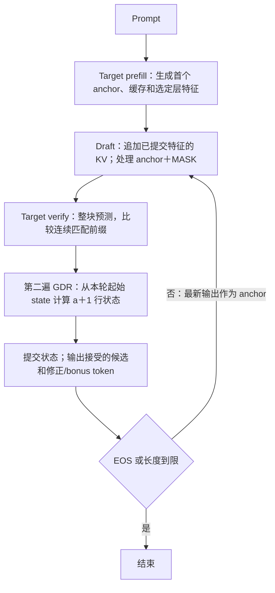

# 当前版本：运行命令与实测结果

更新日期：2026-09-11。对应分支：`feature/gdr-chunk-verify`。
本文汇总当前 Ascend 310P 的 **W8A8 Target＋FP16 Draft、AIR/OM/C++** 路径。
已有 OM 时直接执行下面的运行命令；首次部署按
[完整部署手册](GDR_CHUNK_AIR_OM.md)准备环境、量化输入和模型产物。
模型内部细节见 [DFlash 流程和架构](DFLASH_ARCHITECTURE.md)。
新增 `--verify-gdr chunk|mtp` 可选择两遍 Chunk 或 GDR MTP，见
[验证路径切换命令](GDR_VERIFY_ROUTES.md)。本页现有实测结果均为 Chunk；
MTP 的精度、接受率和时延待设备对照。

当前 8 条 prompt、每条生成 128 token 的结果：7 条加速，1 条变慢；
按全部正式测量的总时间计算，整体 **1.50075×**，吞吐增加 **50.07%**，
模型循环耗时减少 **33.37%**。加权候选接受率 **20.69%**。
本次显式允许普通模型与 DFlash 输出不同，两种模式各自通过 3 次预热＋10 次正式测量检查；
输出精确一致性未通过，任务质量尚未评估。

## 1. 当前版本运行的是什么

这里的“普通模型”是同一套量化 Target 的 `target_prefill.om＋target_decode.om`，
不是未量化 BF16 模型，也不是另一套 Python benchmark。

| 项目 | 当前实现 |
|---|---|
| Target | Qwen3.5-4B，32 层，24 层 Gated DeltaNet＋8 层 full attention，W8A8 Linear |
| Draft | 官方 6 层 DFlash，FP16；把 8 个 Target 层的特征从 20480 维投影到 2560 维 |
| OM 划分 | 普通用 prefill/decode 两张；DFlash 用 prefill/draft/verify 三张；对照部署共四张 |
| 候选块 | 1 个 anchor＋最多 15 个 MASK，一次 Draft 前向产生候选 |
| Verify | 一次 Target 前向验证整块，第二遍 GDR 计算接受前缀的 state；commit 融合在 verify OM 内 |
| 第一遍 GDR state | 保留真实设备输出缓冲区，合计 48 MiB；只丢弃内容，不提交到缓存 |
| 状态推进 | 接受 `a` 个候选，提交旧 anchor＋接受前缀，共 `a+1` 行 |
| 零接受 | 提交旧 anchor，输出 Target 的修正 token，下轮继续投机；不会自动关闭 Draft |
| Draft 确定性 | 当前编译默认给 Draft 加 `--deterministic=1`；既有 OM 需确认编译命令 |
| 低显存测试 | 先完成全部普通 prompt，卸载两张 OM，再加载三张 DFlash OM；权重仍各 OM 独立 |



普通模式在 prefill 后反复执行单 token decode。DFlash 用一次 Draft＋Verify 换取多个输出，
只有每轮节省的普通 decode 时间大于这两张图及调度开销，才会更快。

## 2. 已有 OM：运行和查看结果

### 2.1 保留本次部署的路径

在设备上的同一个 Bash 会话使用下列变量，路径按实际部署填写。
如果变量已经正确设置，保留现有值，尤其不要把确定性 Draft 的清单切回旧清单。

| 变量 | 指向 |
|---|---|
| `REPO_ROOT` | 当前分支源码根目录 |
| `AI_RUN_DIR` | 源码之外的运行目录，含 `runner.json` 和模型产物 |
| `MODEL_PYTHON` | 已配置模型依赖的 Python |
| `CANN_ROOT` | 设备 CANN 环境 |
| `TARGET_DIR` | Target checkpoint/tokenizer 目录 |
| `CPP_RUNNER` | 已编译的 `qwen35_dflash_acl_runner`，不能用 `_fake` |
| `DEPLOYMENT_MANIFEST` | 本次选用的 deployment manifest，包含确定性 Draft OM |

```bash
git -C "$REPO_ROOT" pull --ff-only
source "$CANN_ROOT/set_env.sh"
export PYTHONPATH="$REPO_ROOT/framework/python:$REPO_ROOT${PYTHONPATH:+:$PYTHONPATH}"
```

沿用 Chunk v3 bundle 时无需重建 AIR/OM。新增 MTP 路径需要新 bundle 和支持 MTP ABI 的 runner，
按 [切换手册](GDR_VERIFY_ROUTES.md)执行。
若 runner 仍是“零接受后关闭投机”的旧版本，需按第 3 节重编 runner。

### 2.2 一次测试全部 8 条 prompt

```bash
"$MODEL_PYTHON" -B "$REPO_ROOT/tools/benchmark_prompts.py" \
  --run-dir "$AI_RUN_DIR" \
  --runner "$CPP_RUNNER" \
  --deployment-manifest "$DEPLOYMENT_MANIFEST" \
  --runner-config "$AI_RUN_DIR/runner.json" \
  --model-dir "$TARGET_DIR" \
  --max-new-tokens 128 --max-draft-tokens 15 \
  --device-id 0 --eos-token-id 248044 \
  --low-memory --allow-output-differences
```

默认使用 chat 模板。每条 prompt 在每种模式下各做 3 次预热＋10 次正式测量，
每次请求重置缓存。每次命令创建新的 `prompt-suite-*`，不会覆盖旧结果。
只测某条时追加 `--prompt-id zh_plan`；可重复该参数选择多条。
自定义 prompt 用 `--prompts`，文件格式见 [部署手册](GDR_CHUNK_AIR_OM.md)。

`--allow-output-differences` 是本轮速度/精度实验的显式选择：
只允许跨模式输出不同，保留各模式重复性和执行检查。
这种结果标为 `PASS_WITH_DIFFERENCES`，原始 `ordinary_parity=FAIL` 保留。
去掉该参数即恢复默认严格输出对照；它不是 `infer-cpp` 或 `profile_om.py` 的参数。
原始 C++ 日志仍可能显示 parity FAIL，最终按 Python 汇总中的状态和原因解释。

### 2.3 解码文字、查看接受率、重新汇总已有测试

把 `SAVED_BATCH` 改为刚打印的 Output 目录。下面使用本次已有结果作例子：

```bash
export SAVED_BATCH="$AI_RUN_DIR/prompt-suite-5son4ozl/runner-batch.json"

"$MODEL_PYTHON" -B "$REPO_ROOT/tools/decode_outputs.py" \
  --report "$SAVED_BATCH" --model-dir "$TARGET_DIR" --prompt-id zh_explain

"$MODEL_PYTHON" -B "$REPO_ROOT/tools/decode_outputs.py" \
  --report "$SAVED_BATCH" --acceptance-only

"$MODEL_PYTHON" -B "$REPO_ROOT/tools/benchmark_prompts.py" \
  --run-dir "$AI_RUN_DIR" --summarize-existing "$SAVED_BATCH" \
  --allow-output-differences --model-dir "$TARGET_DIR"
```

最后一条只读取已有报告，输出新的 `prompt-summary-*`；不执行设备推理。
不需要文字时可去掉 `--model-dir`。原 batch 旁的 request、plan、prompts 和
case 文件需保持可访问。输出包括 `summary.json`、`summary.md`，
以及提供 tokenizer 时的 `generations.txt`。

## 3. 从哪一步重新生成产物

首次部署完整顺序：环境/算子检查 → 权重与量化输入准备 → 锁定输入和 factory →
导出 AIR → 编译 OM → 编译 C++ → 运行。
具体前置文件见 [完整部署手册第 1～7 节](GDR_CHUNK_AIR_OM.md)。

| 改动 | 从哪里开始 |
|---|---|
| 仅文档、Python 汇总或离线解码 | 更新源码，直接重新汇总；不编译 |
| C++ 调度、计时或设备缓冲区管理 | `build-cpp`；使用新 runner |
| 只给旧 Draft OM 开启确定性 | `recompile-draft-om`；复用同一 Draft AIR |
| norm、MatMul dtype、CacheUpdate、GDR 输出等图改动 | 新 bundle 中重新 export-air 和 compile-om |
| 量化输入/模型权重/factory 改变 | 重新锁定输入，再导出和编译 |

已有锁定的 `factory.json` 时，导出/编译命令如下。首次可使用空的
`$AI_RUN_DIR/artifacts`；重导出时将 bundle 改为另一未使用目录。
`ATC_BIN`、`SOC_VERSION` 使用设备实际工具链和具体型号。

```bash
cd "$AI_RUN_DIR"
"$MODEL_PYTHON" -B -m qwen35_dflash.ascend310p export-air \
  --factory qwen35_dflash.ascend310p.quant_factory:create_quant_incremental_graphs \
  --factory-config "$AI_RUN_DIR/factory.json" --bundle-dir "$AI_RUN_DIR/artifacts"

"$MODEL_PYTHON" -B -m qwen35_dflash.ascend310p compile-om \
  --air-manifest "$AI_RUN_DIR/artifacts/air-manifest.json" \
  --atc "$ATC_BIN" --soc-version "$SOC_VERSION"

export DEPLOYMENT_MANIFEST="$AI_RUN_DIR/artifacts/deployment-manifest.json"
```

只重编旧 Draft 的确定性版本，使用同目录下尚不存在的新 manifest 文件名：

```bash
"$MODEL_PYTHON" -B -m qwen35_dflash.ascend310p recompile-draft-om \
  --deployment-manifest "$DEPLOYMENT_MANIFEST" \
  --output "$AI_RUN_DIR/artifacts/deployment-manifest-deterministic.json" \
  --atc "$ATC_BIN"
export DEPLOYMENT_MANIFEST="$AI_RUN_DIR/artifacts/deployment-manifest-deterministic.json"
```

新 manifest 必须与输入 manifest 同目录；如原清单不在 `artifacts`，调整输出路径。
该命令不重编三个 Target OM。

编译 runner 时，build 目录和报告文件都使用未占用的新路径：

```bash
"$MODEL_PYTHON" -B -m qwen35_dflash.ascend310p build-cpp \
  --build-dir "$AI_RUN_DIR/build/cpp-current" --ascendcl-root "$CANN_ROOT" \
  --output "$AI_RUN_DIR/reports/cpp-build-current.json"
export CPP_RUNNER="$AI_RUN_DIR/build/cpp-current/qwen35_dflash_acl_runner"
```

## 4. 现有多 prompt 结果

来源是用户提供的设备结果 `prompt-suite-5son4ozl`，
按允许输出差异策略离线汇总为 `prompt-summary-s4cu60r4`。
两种模式均生成 128 token，以 `max_new_tokens` 结束；每种模式正式测量 10 次。
设备为用户报告的 Ascend 310P3 / device 0，低显存模式，投机持续开启，候选上限 15。
测试使用确定性 Draft 部署；具体 OM、runner 和软件版本身份以原 `request.json` 为准。
以下是已报告数据的整理，本次文档工作没有重新执行设备测试或取回原始报告文件。

### 4.1 相比普通模型增长多少

tok/s 按全部正式输出数除以全部模型循环时间计算。
“时延加速”是普通/DFlash 的模型总时延中位数之比；
“吞吐增幅”是 `(DFlash tok/s ÷ 普通 tok/s − 1) × 100%`，两种统计会有微小差别。

| Prompt | 普通 tok/s | DFlash tok/s | 时延加速 | 吞吐增幅 | 候选接受率 | 每投机轮输出 |
|---|---:|---:|---:|---:|---:|---:|
| zh_explain 中文解释 | 29.06 | 46.04 | 1.58× | +58.41% | 22.61% | 4.10 |
| zh_plan 中文规划 | 29.01 | 21.75 | 0.75× | -25.01% | 6.39% | 1.92 |
| math 数学 | 28.95 | 69.35 | 2.39× | +139.51% | 38.30% | 6.35 |
| code 代码 | 28.96 | 43.28 | 1.50× | +49.41% | 21.16% | 3.85 |
| translate 翻译 | 28.95 | 73.83 | 2.55× | +155.05% | 38.85% | 6.68 |
| summary 摘要 | 28.96 | 38.67 | 1.34× | +33.49% | 18.00% | 3.43 |
| en_explain 英文解释 | 28.97 | 46.07 | 1.59× | +59.05% | 22.59% | 4.10 |
| creative 中文创作 | 28.96 | 56.78 | 1.96× | +96.03% | 29.77% | 5.08 |

8 条均为 `PASS_WITH_DIFFERENCES`：重复运行检查通过，跨模式精确输出对照失败。
这些数字比较各模式自己的生成结果，不证明输出质量相等。

全部正式测量共输出 10240 token/模式：
普通总计 **353363.42 ms**，DFlash **235458.22 ms**；
整体吞吐 **28.98 → 43.49 tok/s**，总时间加速 **1.50075×**。
不能用各行加速倍数的算术平均代替这个整体加速。
接受候选 **7580 / 36630 = 20.69%**；这些已接受候选占最终输出的
**7580 / 10240 = 74.02%**，两种比例的分母不同。

### 4.2 生成时延与单次 decode 时延

| Prompt | 普通生成 128 token 中位数 ms | DFlash 生成 128 token 中位数 ms | 普通全程摊销 ms/token | 平均每次生成的投机轮数 |
|---|---:|---:|---:|---:|
| zh_explain | 4404.91 | 2781.29 | 34.41 | 31 |
| zh_plan | 4412.11 | 5893.52 | 34.48 | 66 |
| math | 4420.93 | 1846.56 | 34.54 | 20 |
| code | 4420.04 | 2954.61 | 34.53 | 33 |
| translate | 4421.45 | 1734.48 | 34.54 | 19 |
| summary | 4420.09 | 3305.12 | 34.52 | 37 |
| en_explain | 4419.17 | 2779.94 | 34.52 | 31 |
| creative | 4419.07 | 2256.16 | 34.53 | 25 |

“普通全程摊销”是 `1000 / ordinary_tokens_per_second`，包含 prefill。
**34.4～34.5 ms/token 不能写成纯 target_decode 单次时延。**
128 个输出中第一个来自 prefill，普通模式随后执行 127 次 decode。
纯普通 decode 的循环均值应从原报告
`sum(measurements[].latency_ms.decode) / sum(measurements[].counters.decode_iterations)`
计算；图调用时延则读取下一节的 `stage_ms.target_decode`。

当前提供的 summary 不含分项数组，以下结果暂不可填写：

| 待填实测项 | 原始 case 报告中的字段 | 范围 |
|---|---|---|
| Target prefill，ms/OM 调用 | `measurements[].stage_ms.target_prefill[]` | 一个 64 行物理 chunk，有效行数可不同 |
| 普通 target_decode，ms/OM 调用 | `ordinary.measurements[].stage_ms.target_decode[]` | 真正的一行 Target 图 |
| Draft，ms/OM 调用 | `dflash.measurements[].stage_ms.draft[]` | FC、norm、KV 追加、6 层 Draft、LM head/Top1 |
| Verify，ms/OM 调用 | `dflash.measurements[].stage_ms.target_verify[]` | Target 整块验证、两遍 GDR、接受数和 committed state |

不能用整体加速反推出 Draft 和 Verify 各占多少，也不能把历史单 GDR 的约 0.26 ms
当作整张 verify 的时延。精确分项无需重测，可从保留的原始 case 文件提取。

### 4.3 不重新跑模型，提取已有分项计时

以下命令只读 `SAVED_BATCH` 指向的原始 batch/case，输出每个图的调用次数、
均值、中位数和累计时间。只使用 `measurements`，不计 warmup；
缺少字段显示 `N/A`，不会填 0 或估算。

```bash
"$MODEL_PYTHON" -B - "$SAVED_BATCH" <<'PY'
import json, math, statistics, sys
from pathlib import Path
batch = Path(sys.argv[1]).resolve()
index = json.loads(batch.read_text())
if index.get("fake_acl") is not False:
    raise SystemExit("需要真实设备报告；fake/未声明设备结果不能作为实测")
print("| Prompt | Mode | OM | Calls | Mean ms | Median ms | Total ms |")
print("|---|---|---|---:|---:|---:|---:|")
stages = {"ordinary": ("target_prefill", "target_decode"),
          "dflash": ("target_prefill", "draft", "target_verify")}
for case in index["cases"]:
    path = Path(case["report"])
    if not path.is_absolute():
        path = batch.parent / path
    report = json.loads(path.read_text())
    for mode, names in stages.items():
        runs = report.get(mode, {}).get("measurements", [])
        for name in names:
            groups = [r.get("stage_ms", {}).get(name) for r in runs]
            if not groups or any(not g for g in groups):
                print(f"| {case['id']} | {mode} | {name} | N/A | N/A | N/A | N/A |")
                continue
            values = [v for group in groups for v in group]
            if any(type(v) not in (int, float) or not math.isfinite(v) or v < 0
                   for v in values):
                raise SystemExit(f"非法计时: {case['id']}/{mode}/{name}")
            print(f"| {case['id']} | {mode} | {name} | {len(values)} | "
                  f"{statistics.mean(values):.3f} | {statistics.median(values):.3f} | "
                  f"{math.fsum(values):.3f} |")
PY
```

`stage_ms` 是 C++ 同步图调用的墙钟时间，包含 dataset 绑定、必要的小输入 H2D、
OM 执行、token/控制量 D2H 和 stream 同步，未包含全部外层输入整理和状态指针发布。
它不是纯 AI Core kernel 时间；相关实现为
[`AclChunkExecutor::Call`](../framework/runtime/cpp/src/acl_chunk.cpp)。
完整 DFlash `latency_ms.decode` 包括 Draft＋Verify＋外层接受/提交调度，不能当作
纯 Target decode。两个图的独立中位数相加也不等于整轮中位数。

本套 8 条 prompt 都不超过 64 token，每次 prefill 只有一块。
对于更长 prompt，`stage_ms.draft` 还包含中间 prefill chunk 的 Draft KV 初始化调用；
这些调用不能计入正式投机轮次。跨轮候选数和上下文长度不同，
合并后的图时延分布是该请求轨迹的统计，不是某个固定形状单算子的 benchmark。

### 4.4 长度增加后，接受率怎样变化

下面按同一次 128-token 运行的投机轮起点分段。前 3 段平均每轮均提出 15 个候选；
最后一段受剩余输出预算影响，候选可能减少。

| Prompt | [0,32) | [32,64) | [64,96) | [96,128) |
|---|---:|---:|---:|---:|
| zh_explain | 48.33% | 17.04% | 24.17% | 14.04% |
| zh_plan | 7.56% | 5.88% | 3.67% | 10.34% |
| math | 37.33% | 21.90% | 53.33% | 62.96% |
| code | 20.83% | 22.86% | 17.33% | 27.03% |
| translate | 51.67% | 100.00% | 26.67% | 23.47% |
| summary | 20.00% | 11.67% | 14.67% | 46.00% |
| en_explain | 51.67% | 20.83% | 12.73% | 23.75% |
| creative | 33.33% | 46.67% | 14.81% | 44.26% |

整轮归到第一个新增输出的位置，跨区间不拆分；计数包含 10 次重复，
不是这么多条独立 prompt。末段候选变少会改变接受率分母，应同时看每轮输出数。
math 后段更好，code 相对稳定，zh_plan 从开头就差；尚不能归因于统一的长度/缓存退化。
这份汇总不足以确定具体 kernel 或缓存更新缺陷。

较早的 32-token、持续投机测试 `prompt-suite-2a0ofvh2` 有 5 条精确输出 PASS、
3 条差异；全部 8 条的接受率为 29.33%，仅 PASS 子集为 38.60%。
128-token 的 20.69% 应与全部 8 条比较，不能用两次独立测试的计数相减推算后 96 token。
旧版“零接受后关闭投机”的 30.14% 使用了不同调度，不能作为同配置长短对照。

## 5. msprof：普通 decode、Draft 和 Verify

第 4.3 节用于不带 profiler 的已有生成计时；msprof 用于查看阶段内的算子和瓶颈。
以下从同一条 case 读取 prompt/EOS，避免不小心采成另一条输入：

```bash
export PROMPT_CASE="${SAVED_BATCH}.cases/zh_explain.json"
export MSPROF_BIN=/absolute/path/msprof

"$MODEL_PYTHON" -B "$REPO_ROOT/tools/profile_om.py" \
  --run-dir "$AI_RUN_DIR" --runner "$CPP_RUNNER" \
  --deployment-manifest "$DEPLOYMENT_MANIFEST" --prompt-report "$PROMPT_CASE" \
  --profile-mode ordinary --profile-stage all --device-id 0 \
  --max-new-tokens 128 --max-draft-tokens 15 --profile-warmup 3

"$MODEL_PYTHON" -B "$REPO_ROOT/tools/profile_om.py" \
  --run-dir "$AI_RUN_DIR" --runner "$CPP_RUNNER" \
  --deployment-manifest "$DEPLOYMENT_MANIFEST" --prompt-report "$PROMPT_CASE" \
  --profile-mode dflash --profile-stage all --device-id 0 \
  --max-new-tokens 128 --max-draft-tokens 15 --profile-warmup 3
```

普通 `all` 分别采 prefill、decode；DFlash `all` 分别采 prefill、draft、verify。
每阶段先重建同一输入状态并预热，再采一个窗口。
这里采的是准备后的首个阶段调用，**不是完整 128-token 生成过程的所有轮次**；
`--max-new-tokens 128` 不会把单阶段窗口变成全程采集。
只测一项，把 `all` 改为 `decode`、`draft` 或 `verify`。

| 输出 | 用途 |
|---|---|
| `capture/all-stage-summary.csv` | 同步窗口时延和 `stage_scope` |
| `capture/all-stage-report.json` | 各阶段报告与采集信息 |
| `capture/all-operator-types.csv` | 按算子类型、dtype、设备和原 CSV 统计 |
| `capture/all-operator-tasks.csv` | 每个算子任务明细 |
| `capture/profile/msprof/all.iterations.jsonl` | warmup/采集输入输出与首个差异 |

单阶段命令使用对应 stage 名替换文件前缀 `all`。
C++ verify 已包含第二遍 GDR，不能再额外加一份 commit 时间。
Python NPU 的 verify 只测第一遍，第二遍在 accept-commit，二者范围不同。
算子累计时间、独立 profiler 窗口和完整请求时延不能直接混加。

## 6. 已解决的问题和仍需定位的部分

| 项目 | 已有证据与当前处理 |
|---|---|
| 第一遍 GDR 只留 core 输出很慢 | 单 GDR 测试：双输出约 0.26～0.27 ms；只输出 core 约 22～29 ms，MTE3 ratio 约 0.995。outstate=0 仍慢；当前保留双输出设备缓冲区 |
| Draft 重复计算漂移 | FC 单图 det0 native/OM 均 19/20 次变化；det1 均 0/20。冻结输入的 AdnRmsNorm、Tensor norm 和 V projection 测试稳定；没有证据将漂移归因于 norm |
| 当前完整生成重复性 | 本套 8 条在两种模式下各自通过 3+10；不代表所有输入或全部内部张量逐位稳定 |
| 零接受后不再投机 | 当前 always_on；本套关闭事件和 target-only 回退轮数均为 0 |
| 普通与 verify 分叉 | 首处分叉中，5 条是 Draft＝普通但 verify 拒绝；translate/creative 是 Draft＝verify 且被接受；zh_plan 三者不同。不是全部拒绝原因的统计 |
| 长生成接受率 | 部分 prompt 下降，部分回升；尚未定位到具体计算、特征或缓存更新问题 |

下一项定位：冻结首处分叉轮的输入状态，对照普通 decode、verify 有效长度 1 和整块
verify 首行；必要时比较同一批 Target 特征构建的增量 Draft KV 与重建结果。
这些是待执行实验，不是已证实的根因。

源报告自述的身份（用于在设备上追溯，本次未独立取回验证）：
`source_index_sha256=c877d44d3c47d74f432b07c53393d866b524f1b5d5e47e6f4ffef4825b03d5d7`，
`source_request_sha256=113f94f1db9a7b0b2cb6ef8ef9da3ef0eb91a6815af1dc0231df3b82ee893212`。
原始报告和清单保留在设备运行目录；不要把用户聊天里的指标摘录当作完整可重放产物。

### 6.1 deterministic 开关与已定位的精度漂移

开关名称是 **deterministic**。已定位的是 Draft 上下文特征投影 FC：
`draft.fc(features)`，对应 `fc.weight`，FP16 的 20480 → 2560 Linear。
它位于 hidden norm 和各层上下文 K/V 投影之前，不是 GDR，也不是 RMSNorm。
受测物理输入为 `[1,64,20480]`，有效 17 行；有效 FC 输出为 `[1,17,2560]`。

两个执行路径使用不同开关，不能互相替代：

| 路径 | 关闭 | 开启 | 生效方式 |
|---|---|---|---|
| PyTorch/Torch-NPU native FC 对照 | `torch.use_deterministic_algorithms(False, warn_only=False)` | `torch.use_deterministic_algorithms(True, warn_only=False)` | 对照脚本在各自新进程首次 NPU 操作之前设置并检查 getter |
| AIR → OM 的 FC / Draft | ATC `--deterministic=0` | ATC `--deterministic=1` | 编译选项；需要重编受测 OM |

在 Python 中开启确定性不会修改已经生成的 OM；运行时也没有一个
`infer-cpp --deterministic` 参数可改变旧 OM。
native 的上述设置是隔离 FC 对照脚本的行为，不代表普通 Python 推理入口默认也设置了它。

用户提供的 `debug-fc-determinism-h2t9fpe9` 对照使用同一份 FC AIR、权重和冻结输入，
每种模式在新进程运行 20 次：

| 对照项 | det0：关闭 | det1：开启 |
|---|---:|---:|
| native 有效 FC 输出相对首轮发生变化 | 19/20 | 0/20 |
| OM 有效 FC 输出相对首轮发生变化 | 19/20 | 0/20 |
| native 与 OM 的参考有效输出 | 存在差异 | 逐位一致 |

这是同一输入重复执行时，少数 FP16 输出元素在相邻值之间变化。
该组 det0 首个变化样例的最大差为 1 FP16 ULP；native 样例最大绝对差
0.0078125，OM 样例最大绝对差 0.001953125。它们是报告的样例，
不是全部轮次的最大误差。FC 的细小变化可以继续传播到 norm、K/V 和最终候选。
先前完整 Draft 已观察到候选下标 7（从 0 开始）在 `2972` 和 `13` 之间变化，
包括尚未开启 msprof 的 warmup，因而不能归因于 profiler 才产生的差异。

冻结同一 FC 输出后，单独 `norm_adn` 与 `norm_tensor` 均为 0/20 次变化，
两者有效输出逐位一致；冻结 norm 输出后的 V projection 也为 0/20。
因此已有实验将漂移定位到 FC 计算这一区域，**没有定位到具体 split-K/atomic
内核，也没有证据把它归因于 AdnRmsNorm**。

det0 与 det1 两份参考输出之间另有 8 个元素不同，最大 1 ULP：
这是不同计算模式间的舍入差异，与“同模式每次运行都在变”不同。
开启确定性解决了这组 FC 的重复性问题，不能据此宣称 FP16 精度恢复为 FP32、
所有输入都稳定，或普通 decode 与 verify 必须相同。确定性开关本身的性能代价
尚无同范围 A/B 时延数据；第 4 节是当前整套部署的结果。

当前编译策略：

- `compile-om` 默认只给增量套件的 `draft` 图补充 `--deterministic=1`；
  三个 Target 图没有被默认补上这个选项，实际参数以各图命令为准。
- 旧 Draft 使用第 3 节 `recompile-draft-om`，更新后继续使用新 manifest。
- 显式公共 `--atc-arg=--deterministic=0` 会覆盖 Draft 的默认，并传到所有
  待编译图；不能把它误当作“只关闭一个 FC”的生产开关。

查看实际部署，而非只看当前源码默认值：

```bash
"$MODEL_PYTHON" -B - "$DEPLOYMENT_MANIFEST" <<'PY'
import json, sys
manifest = json.load(open(sys.argv[1]))
for graph in manifest["graphs"]:
    flags = [a for a in graph["atc_command"] if a.startswith("--deterministic=")]
    print(graph["name"], flags or ["未显式设置；不能据此宣称已开启"],
          graph["om"]["sha256"])
PY
```

若保留了原始上下文探针目录，可复现 FC 开关对照：

```bash
export FC_PROBE_DIR="$AI_RUN_DIR/debug-draft-context-fmfxogyf"
"$MODEL_PYTHON" -B "$REPO_ROOT/tools/debug_draft_context/fc_determinism.py" all \
  --run-dir "$AI_RUN_DIR" --probe-dir "$FC_PROBE_DIR" \
  --repetitions 20 --device-id 0 --atc "$ATC_BIN" --ascendcl-root "$CANN_ROOT"
```

这会生成新的 `debug-fc-determinism-*`，需原探针的 AIR、冻结输入和权重路径仍有效。
它只测试 FC，不替换生产 Draft；当前生产部署的重复性仍由完整模型测试单独检查。
