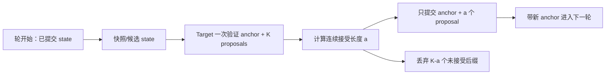
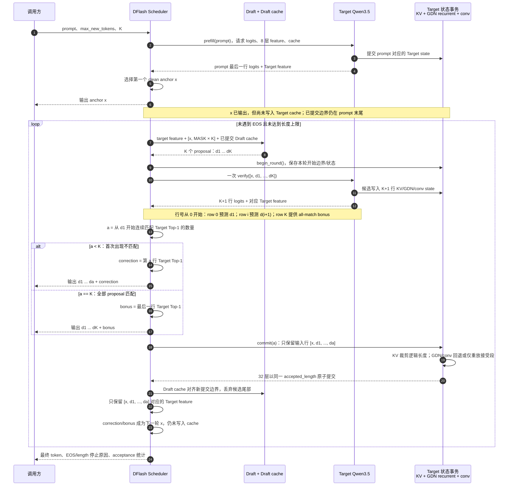

# 从 V1 到完整 DFlash 与真正提速

本页说明当前 correctness-first V1 与完整 DFlash 运行时之间还差什么，
以及 Ascend NPU 上哪些状态和算子需要改造。它是后续开发路线，不是对当前
`v1-r1` 已具备性能收益的声明。

先记住结论：

> 当前 V1 的 token 验证规则是对的，但为了隔离 NPU 状态，它会重算完整前缀并逐个
> 检查 proposal。完整 DFlash 的提速关键是：Draft 一次提出 K 个 token，Target 一次
> 验证整块，然后只保留已接受前缀的 KV/GDN 状态。

官方参考实现锁定到 `z-lab/dflash` commit
[`07ebd93`](https://github.com/z-lab/dflash/tree/07ebd93db9f472af339b644bb70221ad8428328a)。
其 Transformers 调度在
[`dflash/model.py`](https://github.com/z-lab/dflash/blob/07ebd93db9f472af339b644bb70221ad8428328a/dflash/model.py)，
GDN 状态回退的参考思路可见
[`dflash/model_mlx.py`](https://github.com/z-lab/dflash/blob/07ebd93db9f472af339b644bb70221ad8428328a/dflash/model_mlx.py)。

## 1. 当前 V1 与完整路线的差异

| 项目 | 当前 `v1-r1` | 完整、可提速路线 |
|---|---|---|
| Draft | 并行产生 K 个 proposal | 同样并行产生 K 个 proposal |
| Target 验证 | 对 proposal 逐个重算完整前缀 | 对 `[anchor, d1, ..., dK]` 只执行一次 |
| Target 状态 | 每次新建 KV/GDN state，返回后丢弃 | 跨轮复用已提交状态 |
| 错误 proposal | 天然不会进入下次调用 | 必须从候选状态中丢弃 |
| Draft cache | 可重算已提交前缀 | 保留已提交部分，只处理新 context/block |
| 性能目标 | 正确性和设备接线 | 减少 Target 调用数、计算量和同步次数 |

因此，仅把当前 `verification_mode` 从 `sequential` 改成 `vectorized` 并不等于
完成提速。如果没有状态事务，一次整块验证会把未接受 token 的 KV/GDN 状态
污染到下一轮。

## 2. 完整 DFlash 的一轮验证

设当前已经有一个 Target 产生的 clean anchor `x`，Draft 输出 K 个候选：

```text
d1, d2, ..., dK
```

完整 greedy 验证应该是：

```text
1. 验证输入 = [x, d1, d2, ..., dK]
2. Target 只 forward 一次，返回 [t1, t2, ..., tK, bonus]
3. 从头比较 d1==t1, d2==t2, ...
4. 设连续命中 a 个，本轮输出 [d1, ..., da, t(a+1)]
5. Target 状态只提交 [x, d1, ..., da]
6. bonus/correction t(a+1) 是下一轮 anchor，本轮不把它写入 cache
```

第 5 步是 NPU 改造的核心。验证 forward 已经计算了全部 K 个候选，但下一轮
只能看到 anchor 和连续接受的 proposal。



### 2.1 完整高性能 DFlash 时序图

下面这张图描述的是最终希望实现的增量、整块验证路径，不是当前 `v1-r1` 已经
启用的运行路径。本文中的 **K 始终表示 proposal 数，不包含 anchor**，所以一次
Target verify 的输入长度是 `K+1`。



读图时重点看五件事：

1. Draft 产生的 proposal 必须先回到 Scheduler，再进入 Target；它不能直接写入最终输出。
2. 每轮只有一次 Target verify，输入是 `anchor + K proposals`，这是相对当前 V1
   减少 Target 调用数的主要来源。
3. Target 的 `K+1` 行状态先是**候选状态**。知道连续接受长度 `a` 后，才把
   `anchor + a 个 proposal` 变成**已提交状态**。
4. correction/bonus 虽由验证 logits 得出并在本轮输出，但该 token 本身还没有作为
   Target 输入执行；它作为下一轮 anchor，在下一次 verify 时才进入 Target cache。
5. KV、GDN recurrent state、conv state、位置计数和有效长度必须共用同一个 `a`
   原子提交。只回退其中一种状态会让下一轮结果漂移。

图中的“Target 状态事务”不是第四个模型或独立进程，而是 Target runtime/bridge
必须提供的一组状态所有权边界。图中也没有再跑一条 ordinary baseline：普通增量
greedy 属于开发验收的对照路线，不应进入最终高性能生成的热路径。

例如 Draft 给出 `[202, 999, 888]`，Target 验证行给出的前两个 Top-1 是
`[202, 303]`，则 `a=1`。本轮输出 `[202, 303]`，Target 状态只提交
`[旧 anchor, 202]`；`999/888` 的候选状态被丢弃，`303` 成为下一轮尚未缓存的
anchor。这样既避免重新计算整个历史前缀，也不会让错误 proposal 污染下一轮。

当前 `v1-r1` 的逐前缀、无跨轮状态版本见
[V1 准确调用时序](DFLASH_V1_ARCHITECTURE.md#21-一轮-dflash-的准确调用时序)。
上图只有在本页后续的整块 verifier oracle、状态事务和跨轮 cache 门禁全部通过后，
才能成为默认运行路径。采样模式会把“连续 Top-1 相等”换成 rejection sampling，
但候选状态、接受长度和提交/回退的时序边界不变。

## 3. Target 上必须处理的三类状态

### 3.1 Full-attention KV cache

候选块的 K/V 会被写入 block-table cache。接受长度确定后必须：

- 把逻辑 cache 长度移到 `round_start + 1 + accepted`；
- 下一轮从该位置继续写；
- 保证被拒绝后缀不在 attention 的有效长度内；
- 正确处理 proposal block 跨越 64-token block 边界的情况。

物理上不一定要把无效尾部清零；只要逻辑长度、mask 和后续覆写位置完全正确，
它就不应该被读取。

### 3.2 GDN recurrent state

GDN recurrent state 是整个前缀的压缩状态，不能像 KV 那样只改一个长度指针。
如果候选 forward 后直接保留 final state，被拒绝的 proposal 也已经混进去了。

可选实现方式：

1. 算子输出每个 proposal 位置对应的 recurrent state，最后选中接受位置；
2. 保存轮开始 state 和 GDN 中间输入，得到 `accepted` 后只重放已接受段；
3. 新增一个以 `accepted_length` 为输入的 state-commit 伴随算子。

无论选哪个，都必须能与“只增量执行 anchor+已接受 token”的 reference state 对齐。

#### 已选定的 MTP recurrent 接入方案

后续完整 DFlash 的 GDR 接入固定采用现有 MTP 方案，不再使用 K+2 boundary 数组：

```text
当前输入 token   = [anchor,d1,...,dK]
GDR seq_len      = K + 1
当前输出 states  = K + 1 个
```

设上一轮输出 `prev_states[0..K_prev]`，上一轮连续接受 proposal 数为 `prev_acc`。当前 GDR 先选择
上一轮已提交 state，再依次执行本轮 anchor 和 K 个 proposal：

```text
selected_state = prev_states[prev_acc]

states[0] = recurrent(selected_state, anchor)
states[1] = recurrent(states[0], d1)
...
states[K] = recurrent(states[K-1], dK)
```

这里的 `states[0]` 也可以称为“proposal 阶段 initial state”：它已经包含当前 anchor，但它不是
GDR 调用前的输入 state。Target logits 返回后，Scheduler 才得到本轮连续接受数 `curr_acc`；
下一轮从 `states[curr_acc]` 开始。因此：

```text
curr_acc = 0 → 保留 anchor，丢弃全部 proposal
curr_acc = a → 保留 anchor + 前 a 个 proposal
curr_acc = K → 保留 anchor + 全部 K 个 proposal
```

`prev_acc` 是本轮 GDR 的输入，`curr_acc` 是本轮验证后的调度结果，不能混成同一个时刻的值。
correction/bonus 尚未作为 Target 输入执行，不进入本轮 `states`；它成为下一轮 anchor，下一轮的
`states[0]` 才会将其执行进去。

第一轮还没有 `prev_states`，Bridge 必须用 prompt prefill 得到的已提交 recurrent state 建立明确
seed（例如单独的 seed state，或按算子 ABI 构造可被初始 `prev_acc` 选中的 slot）。不能使用
未初始化数组元素，也不能把尚未执行的第一个 anchor 提前写入 seed。

KV、conv state、position 和逻辑长度必须使用与 `curr_acc` 相同的提交边界，并保证 anchor 在每个
状态系统中恰好执行一次。

这套 MTP recurrent 目前**尚未接入**当前 V1 runtime；当前默认路线仍是每次新建状态并逐 proposal
重算完整前缀。接入时至少还需要：

1. Bridge/runtime 将本轮开始 state、全部 token-boundary state 和同一个 `accepted_length` 暴露给事务层；
2. 32 层中所有 GDN 层原子选择同一索引，任何一层失败都回到轮开始 state；
3. `conv_state` 单独保存相同 token 边界或按接受段重放，不能只切 recurrent state；
4. 对 `a=0,1,K-1,K` 比较下一 token logits 和 state，结果必须等于普通增量 Target；
5. 通过这些门禁后，Scheduler 才能从 sequential verifier 切换到单次整块 verify。

### 3.3 GDN convolution state

`conv_state` 同样会被原位更新。必须保存轮开始窗口，并在接受长度确定后
仅提交 anchor 和已接受 proposal 对应的最后 `kernel_size-1` 个输入。如果
causal-conv 实现会原位改 state，它也必须加入同一个事务边界。

## 4. 自定义算子到底要改哪些

下表区分“语义必须改”和“先验证，不一定改 kernel”。不能只根据算子名称
猜 ABI；shape、dtype、format 和原地更新语义要以目标环境的实际声明和 trace 为准。

| 目标路线部件 | 后续要做的事 | 是否必须改底层 kernel |
|---|---|---|
| `CacheUpdate` | 支持 `K+1` 候选写入、跨 64 block 位置，并在接受后只提交逻辑前缀 | 如已有多行/向量位置 ABI，可仅改 runtime；否则需扩展算子或新增 commit/crop 伴随算子 |
| `ChunkGatedDeltaRule` | 候选执行不能直接覆盖已提交 recurrent state；要能得到接受位置的 state | 若 MTP 版本已输出 state array 并接收 `accept_token_idx`，先冻结 initial 是否占 index 0 以及 `a→commit_index` 映射；final-state-only 接口则需扩展输出或新增 state-commit/replay 路径 |
| causal-conv state update | 快照候选前 `conv_state`，接受后只保留已提交窗口 | 如可用非原地输出+显式 copy 完成，无需新 kernel；如只有原地融合路径，需加 snapshot/commit 能力 |
| fused infer attention | 验证 `q_seq_len=2..17`、块内 causal mask、历史 KV、`actual_seq_lengths` 及跨 block 语义 | 支持且数值通过则不改；若只支持 decode=1 或 prefill=64，才需改 kernel/调度 |
| `DynamicQuant` / quant matmul | 如 Target 量化，验证 `K+1` 行动态量化与 matmul，不能假定 decode 只有 1 行 | 没有 token-count 限制就不改；有限制时扩展 |
| RMSNorm/RoPE/MLP | 确认 `K+1` 行和位置向量正确 | 通常无需语义改造，只在 profiling 显示瓶颈时融合 |

最重要的是：`CacheUpdate` 和 GDN state 不能各自随便提交。所有 32 层必须使用
同一个 `accepted_length`，要么全部成功，要么全部回到轮开始状态。

## 5. Draft 侧功能与性能改造

当前 `dflash_ascend310p_ops.py` 的 6 个 Python ABI 已能表达 Draft 数学：

```text
rms_norm, linear, rotary, attention, swiglu, top1
```

它们是在 NPU tensor 上执行的分解 PyTorch 实现，不是高性能 fused kernel。
因此分两阶段：

### 功能完整性

- 保持 6 层、69 个官方 tensor、8 层 Target feature 和 mask 规则不变；
- 加入 Draft attention KV cache，每轮只处理新 context/block；
- 在接受后把 Draft cache crop 到新的 committed boundary；
- 保持最后一层对并行 block 的 non-causal 可见性，前 5 层保持 causal sliding attention。

### 性能优化

按 profiling 结果逐项做，不建议一次重写全部：

1. 优先优化 `fc.weight [2560,20480]` 的 feature projection 和 6 层线性层；
2. 把 Q/K/V 投影、RMSNorm、RoPE、SwiGLU 按稳定 shape 融合；
3. 为 5 层 sliding causal + 1 层 block non-causal 提供对应的小 block attention；
4. 将 LM head + argmax 融合或分块 Top-1，避免完整落地 `[B,K,248320]` logits；
5. 最后再考虑 Draft W8A8/量化，每一层都要与 FP16 的 Top-1/acceptance 对照。

Draft 融合算子与 Target 的 `CacheUpdate`/`ChunkGatedDeltaRule` 是两组不同的接线。
不要用全局 hook 把同名 PyTorch 算子全部替换。

## 6. 建议实现顺序

### 阶段 A：锁定现有 V1 baseline

- 固定 prompt、tokenizer、thinking 模式、dtype、K 和 EOS；
- 保留 ordinary/DFlash 零 token 差异报告；
- 记录 Target forward 数、Draft 时间、verify 时间、同步次数和显存。

### 阶段 B：先做无状态的单次整块 verifier oracle

- 在 CPU/CUDA 上将单次整块 Target 每一行的 Top-1，与独立前缀调用逐行对比；
- 覆盖 K=1/4/8/16，以及 mismatch 在第 0、中间、最后位和 all-match；
- NPU 上先用 scratch state 验证 `q_seq_len=2..17`，不提交候选 state。

这一阶段不提速，但能先判定多 token attention/GDN 是否会选择不等价 kernel。

### 阶段 C：实现 Target 状态事务

- 定义 `begin_round → provisional_verify → commit(accepted_length)` 接口；
- 将 KV、recurrent state、conv state、逻辑长度和位置计数纳入一个事务；
- 任何层失败都 fail closed，不允许部分层已提交；
- 状态提交后与普通增量 Target 的下一 token logits 对比。

### 阶段 D：调度器切换到生产 vectorized verify

- 每轮 Target verify 调用数从最多 `K+1` 降到 1；
- accept scan 、EOS 裁剪和 commit length 使用同一个结果；
- 保留 sequential full-prefix 作为 debug oracle，不作为默认性能路径。

### 阶段 E：Draft cache 和 NPU 融合

- 先加 Draft cache，再用 profiling 选择融合点；
- 每替换一个 Draft 算子，都与 `TorchDFlashOps` 比较 hidden、Top-1 和 acceptance；
- 并行减少 Python `.item()` 和不必要的 NPU 同步。

### 阶段 F：量化和长时性能收口

- FP16 先达到 strict greedy 零差异；
- 再对 Target/Draft 分别启用量化，不一次同时改两边；
- 分 prompt 类型和生成早/中/后段统计 acceptance length；
- 报告 TTFT、TPOT、tokens/s、Target calls/token、峰值显存和长时稳定性。

## 7. 必须有的测试矩阵

| 类型 | 至少覆盖 |
|---|---|
| 接受位置 | `accepted=0, 1, K-1, K` |
| K | `1, 4, 8, 16` |
| block 边界 | committed position 位于 `62, 63, 64, 65` 附近 |
| 停止 | proposal 内 EOS、correction EOS、bonus EOS、长度截断 |
| GDN state | 候选后回退，再跑下一 token，与普通增量路径对比 |
| KV state | 被拒绝尾部不可见，后续写入位置正确 |
| feature | 仅保留 anchor+已接受行，层号/顺序/shape 不变 |
| 整网 | ordinary incremental 与 DFlash 最终 token/EOS/stop 零差异 |
| 重复运行 | 多 prompt、多轮、固定 seed，无状态泄漏、无内存增长 |

对整块 verifier，还要增加一个逐行 oracle：

```text
vectorized Target 第 i 行 Top-1
==
Target(已提交前缀 + proposal[:i]) 的最后一行 Top-1
```

只有这个关系在 NPU 上通过，才能用一次整块调用取代当前的逐前缀验证。

## 8. 如果要支持原始 DFlash 的采样模式

当前项目的硬门禁是 temperature=0 的 strict greedy。官方还支持采样验证：按 Target
概率 `p` 和 Draft 概率 `q` 做 rejection sampling，拒绝时从校正后的 residual
分布取 correction。要补齐这一模式，还需要：

- Draft 返回 proposal 概率，而不只是 Top-1 ID；
- Target 保留验证行的概率或足够精确的 logits；
- 设备上实现接受随机数、residual 分布与采样；
- 使用固定随机流的分布/统计验证，不再用“与 ordinary 单次 token 完全一样”
  作为唯一判据。

在 greedy vectorized verify 和状态提交完全通过前，不建议同时引入采样。

## 9. “功能完整”和“真正提速”的完成标准

### 功能完整

- 一次 Target 整块验证；
- KV/GDN/conv state 只提交连续接受前缀；
- Draft cache 和 Target cache 能跨轮复用；
- strict greedy 与 ordinary incremental Target 零 token/EOS/stop 差异；
- NPU 上无 CPU fallback，所有状态调用计数能对账。

### 真正提速

- `Target verify calls / emitted token` 明显低于 ordinary；
- Draft + state commit 的总成本小于节省的 Target 成本；
- 在相同 prompt/output 和相同测量边界下，TPOT/tokens/s 有可重复改善；
- 短 prompt、长 prompt、早/中/后生成阶段以及 K=1/4/8/16 都分开报告；
- 长时运行无 cache/state 漂移、无内存持续增长。

如果一次整块 verify 或 state transaction 任意一项失败，应显式回到当前
sequential full-prefix V1，不能带着部分候选状态继续生成。
