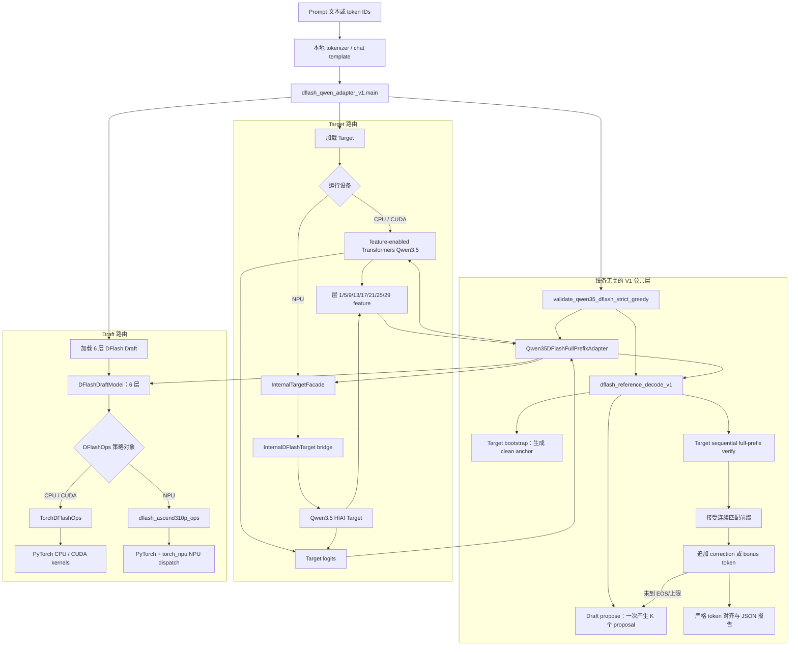
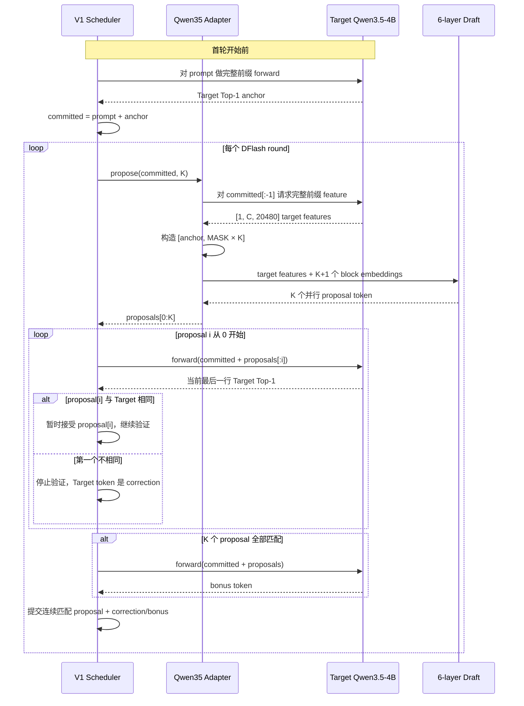
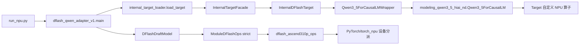
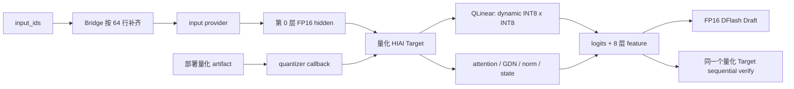

# DFlash V1 项目架构与完整实现流程

本文从源码调用关系出发，说明本项目的 DFlash V1 是如何运行的，以及 CPU、CUDA GPU、
Ascend NPU 三条路线之间哪些部分共用、哪些部分不同。

如果只记住一句话，可以记成：

> Target 决定正确答案，Draft 并行猜测后续 token，调度器只接受与 Target 连续一致的猜测；
> CPU、GPU、NPU 共用这套规则，但 Target 的执行实现和 Draft 的算子后端随设备变化。

本文描述的是当前 `v1-r1` correctness-first 实现。它每次调用 Target 都重新计算完整前缀，
优先保证最终 token 与普通 greedy 完全一致，不代表已经完成 KV/GDN 投机状态提交的高性能版本。

## 1. 先建立整体概念

DFlash 推理包含两个模型：

- **Target 模型**：完整的 Qwen3.5-4B，参数大、结果权威。它提供 logits，同时在 DFlash 请求下
  提供 8 个指定 decoder 层的 hidden feature。
- **Draft 模型**：官方 Qwen3.5-4B-DFlash checkpoint 对应的 6 层小模型。它读取 Target feature，
  一次并行预测最多 `K=16` 个 proposal token。

调度器不相信 Draft 的结果。每轮都由 Target 重新验证，只有最长连续匹配前缀会被接受；
第一个不匹配位置使用 Target token 纠正。如果全部 proposal 都匹配，再由 Target 给一个 bonus
token。因此 sequential V1 中最终提交的每个 token 都有 Target greedy 依据。

### 1.1 总体框架图



这张图里最重要的是两个分叉：

1. **Target 分叉**：CPU/CUDA 使用 Transformers 版本，NPU 使用 HIAI 版本。
2. **Draft 原语分叉**：CPU/CUDA 使用 `TorchDFlashOps`，NPU 使用
   `dflash_ascend310p_ops`。

分叉之外的 `Qwen35DFlashFullPrefixAdapter`、`DFlashDraftModel` 结构和
`dflash_reference_decode_v1` 调度规则是共用的。

## 2. 一轮 DFlash 到底做了什么

下面的时序图展示一次完整 proposal/verify round。`committed` 表示已经由 Target 确认并提交的
前缀。



### 2.1 为什么先生成一个 anchor

官方 DFlash 数据流不是直接拿 prompt 最后一个 token 当 draft block 的第一行。代码会先让
Target 对 prompt 生成一个 clean token，这个 token 才是 Draft block 的 anchor。

设 Target bootstrap 后的已提交前缀为：

```text
[prompt tokens..., anchor]
```

`Qwen35DFlashFullPrefixAdapter.propose()` 会拆成：

```text
Target feature context = committed[:-1] = prompt tokens
Draft block           = [anchor, MASK, MASK, ..., MASK]
                                        └── K 个 MASK ──┘
```

这也是为什么 `max_draft_tokens=K` 表示 **proposal 数**，不包含 anchor。官方最大值是
`K=16`，所以 Draft query 总行数是 `K+1=17`，不是 16。

### 2.2 sequential 验证为何比较慢

默认 `verification_mode="sequential"`。proposal `i` 只用：

```text
committed + proposals[:i]
```

做一次新的 Target 完整前缀 forward。第一个错误 proposal 不会作为后续 Target 的上下文。

项目仍保留一次 Target 调用验证整块的 `vectorized` 模式，但它只用于诊断。某些设备 kernel 会
随输入长度改变计算路径，因此不能假设“更长输入里的早期 logits 行”和“较短输入最后一行”
数值或 Top-1 必然相同。`v1-r1` 以 sequential 路线作为正确性决策。

## 3. 关键 Tensor 合同

Qwen3.5-4B 的固定参数包括：

| 项目 | 值 |
|---|---:|
| Target decoder 层数 | 32 |
| Target hidden size | 2560 |
| 捕获层（从 0 开始） | `1,5,9,13,17,21,25,29` |
| 拼接后的 feature width | `8 × 2560 = 20480` |
| Draft decoder 层数 | 6 |
| Draft attention heads / KV heads | 32 / 8 |
| Draft head dim | 128 |
| Draft 最大 proposal 数 `K` | 16 |
| mask token ID | 248077 |
| vocab size | 248320 |
| EOS token ID | 248044 |

一次 Draft 调用中的主要 Tensor：

| Tensor | Shape | 含义 |
|---|---|---|
| `prefix_ids` | `[1, P]` | 已提交前缀，最后一个 token 是 clean anchor |
| `context_ids` | `[1, P-1]` | 去掉 anchor 后交给 Target 捕获 feature 的上下文 |
| 单层 Target hidden | `[1, P-1, 2560]` | 指定 decoder 层的层后、final norm 前输出 |
| `target_hidden` | `[1, P-1, 20480]` | 8 层 feature 按固定层号顺序拼接 |
| `block_ids` | `[1, K+1]` | 一行 anchor 加 K 行 mask token |
| `noise_embedding` | `[1, K+1, 2560]` | 使用 Target input embedding 权重得到 |
| 投影后的 Target feature | `[1, P-1, 2560]` | `fc(20480→2560)` 后再做 `hidden_norm` |
| Draft hidden | `[1, K+1, 2560]` | 6 层 Draft 的输出，row 0 仍是 anchor |
| proposal hidden | `[1, K, 2560]` | 丢掉 row 0 后的 `draft_hidden()` |
| proposal token IDs | `[1, K]` | 共享 Target LM head 做 Top-1 后得到 |

所有路线都要求 Target input embedding 和 LM head 的 shape 为
`[248320, 2560]`，并要求 Target、Draft、feature、embedding、LM head 在同一设备和 dtype 上。

## 4. Target feature 是怎么实现的

Draft 不直接读取 Target 的 KV cache。它读取 8 个 Target decoder 层的层后 hidden state。

### 4.1 捕获位置

Target decoder loop 的逻辑是：

```python
for layer_id, decoder_layer in enumerate(layers):
    hidden_states = decoder_layer(...)
    collector.capture(layer_id, hidden_states)  # 层后

hidden_states = final_norm(hidden_states)       # 最终 norm 在捕获之后
```

因此捕获点是：

```text
decoder layer 输出之后
        ↓
DFlashFeatureCollector.capture
        ↓
最终 RMSNorm 之前
```

捕获层号固定为 `1,5,9,13,17,21,25,29`。它们是从 0 开始的 decoder layer ID。

### 4.2 `DFlashFeatureCollector`

实现位于 `models/dflash_v1/dflash_target_features.py`：

1. 只处理配置中的 8 个层，其他层立即返回。
2. 检查每层都是 `[B,S,2560]`。
3. 检查 8 层的 batch/sequence、dtype、device 一致。
4. 默认 `detach=True, clone=True`，防止目标实现后续原地修改 hidden tensor。
5. 把每层写入预分配的 `[B,S,20480]` buffer 对应区间。
6. `finalize()` 检查 8 层没有缺失，再返回完整 feature。

预分配 buffer 的顺序就是 checkpoint 合同的层号顺序，不按捕获先后动态排序。

### 4.3 feature 开关必须零影响

`output_dflash_features=False` 是默认值。普通推理不应该改变原有 logits、cache 或返回类型。

- CPU/CUDA Target 在关闭时返回普通 Transformers output；开启时增加 `dflash_features` 字段。
- NPU Target 在关闭时返回 logits Tensor；开启时返回
  `(logits, dflash_features)`。

Adapter 会分别执行 feature 关闭/开启的 Target forward，立即 clone 两份 logits，再检查：

- device/dtype 不变；
- 所有位置 Top-1 不变；
- 浮点差异在对应 dtype 的有界容差内；
- feature shape 正确。

这就是报告中的 `feature_capture_zero_impact`。

## 5. 六层 Draft 模型是怎么实现的

核心实现位于 `models/dflash_v1/modeling_dflash.py`，结构由官方 Draft `config.json` 和 69 个
checkpoint Tensor 锁定。

### 5.1 输入准备

Target feature 首先经过：

```text
[B,C,20480]
   │
   ├─ fc.weight [2560,20480]
   ▼
[B,C,2560]
   │
   └─ hidden_norm
```

Draft 自身的初始 hidden 是：

```text
embedding([anchor, MASK × K]) -> [B,K+1,2560]
```

输入 embedding 和最终 LM head 都复用 Target 权重，所以 Target/Draft 必须共享词表、hidden size、
device 和 dtype。

### 5.2 每个 Draft decoder layer

每层的 query 来自 Draft block hidden：

```text
Q = q_proj(draft_hidden)
```

key/value 同时包含 Target 上下文和 Draft block：

```text
K = concat(k_proj(projected_target_feature), k_proj(draft_hidden))
V = concat(v_proj(projected_target_feature), v_proj(draft_hidden))
```

随后执行：

```text
input RMSNorm
→ attention
→ residual add
→ post-attention RMSNorm
→ SwiGLU MLP
→ residual add
```

6 层类型是：

```text
layer 0..4: sliding_attention，causal，window=4096
layer 5:    full_attention，对并行 Draft block 非 causal
```

这里的 “non-causal” 只描述最后一层 Draft block 内的并行去噪注意力，不代表最终 token 可以绕过
Target 验证。

### 5.3 输出 proposal

6 层结束后：

```text
final RMSNorm
→ 丢掉 anchor 对应的 row 0
→ 使用 Target lm_head.weight
→ argmax
→ [B,K] proposal IDs
```

`output_multiplier` 和可选的 tanh softcap 都是单调变换，不改变 Top-1，所以 `draft_top1()` 可以
直接走 `DFlashOps.top1()` 边界。

### 5.4 Draft 为什么没有 cache

当前 `DFlashDraftModel` 是 cache-free 实现。每一轮都会根据当前 committed prefix 重新取得
Target feature，并重新计算完整 Draft block。这使 CPU/GPU/NPU 的行为容易对齐，也避免 V1
引入 Draft cache 失效或回滚问题，代价是计算量更大。

## 6. V1 调度器是怎么保证正确性的

公共调度器位于 `models/dflash_v1/dflash_reference_decode_v1.py`。

### 6.1 普通 greedy 基线

`ordinary_full_prefix_greedy()` 每生成一个 token 都：

1. 把完整 committed token 转成 `[1,S]`；
2. 调用一次 Target；
3. 读取最后一行 logits 的 Top-1；
4. 把该 token 提交；
5. 遇到 EOS 或 `max_new_tokens` 停止。

它是 correctness oracle，不是使用增量 KV cache 的性能基线。

### 6.2 DFlash strict greedy

`dflash_full_prefix_greedy()` 每轮：

1. 调用 Draft 得到不超过 `K` 个 proposal。
2. 从 proposal 0 开始依次调用 Target 验证。
3. 只接受从开头连续匹配的 proposal。
4. 第一个不匹配时提交 Target correction。
5. 如果全部匹配，再调用 Target 得到一个 bonus token。
6. 处理 EOS 和剩余生成长度。

最后 `assert_exact_greedy_match()` 要求 ordinary 与 DFlash 的：

- generated token IDs 完全相同；
- EOS 结果完全相同；
- stop reason 完全相同。

不存在“接受率高就允许最终 token 不同”的路径。

### 6.3 接受率字段怎么理解

`accepted_draft_tokens / drafted_tokens` 只表示 proposal 命中比例。一次 verify round 实际提交的
token 还包含 correction 或 all-accepted bonus。因此吞吐意义更接近：

```text
每轮实际提交 token 数
= 接受的连续 proposal 数 + 1 个 correction/bonus（未因 EOS/上限截断时）
```

比较不同 K 或 workload 时，应优先看每 verify round 的平均 emitted token，而不是只看
`accepted / proposed`。

## 7. CPU 版本怎么实现

CPU 路线不是简化的 toy scheduler，而是完整的 PyTorch framework golden。

### 7.1 CPU Target

未传 `--target-loader` 时，Adapter 从
`models/dflash_v1/modeling_qwen3_5_dflash.py` 加载 feature-enabled
`Qwen3_5ForConditionalGeneration`，然后把模型放到 CPU。

该文件基于 Transformers 5.14.1 的 Qwen3.5 结构，只在 text decoder loop 增加选择性 feature
collector 和 opt-in output 字段。普通 Target 数学仍由 PyTorch/Transformers 执行。

### 7.2 CPU Draft

`_select_draft_ops()` 为 CPU 返回：

```python
TorchDFlashOps(), "torch"
```

`DFlashDraftModel` 的线性层、RMSNorm、RoPE、attention、SwiGLU、Top-1 都通过这个策略对象执行。
`TorchDFlashOps.attention()` 使用 PyTorch SDPA；其他原语使用 `F.linear`、`torch` reduction、
`F.silu` 等标准算子。

### 7.3 CPU 路线能证明什么

它可以验证：

- checkpoint/config/shape 合同；
- Target feature 层号和拼接顺序；
- Draft 六层数学和 mask 逻辑；
- anchor 与 K 的定义；
- sequential acceptance/correction/bonus 调度；
- 普通 greedy 与 DFlash token 完全一致。

它不能证明 NPU HIAI Target、自定义算子、调用级状态隔离或 NPU 性能。

## 8. CUDA GPU 版本怎么实现

CUDA 路线与 CPU 共用 Target 源码、Draft 结构、调度器和 `TorchDFlashOps`。主要区别只是
Target/Draft 参数和输入 Tensor 被放在 CUDA 设备上。

### 8.1 设备分派

Adapter 在加载大权重前检查：

- PyTorch 是否为 CUDA build；
- `torch.cuda.is_available()`；
- 显式 `cuda:N` 时先选择对应设备；
- BF16 请求时设备是否支持 BF16。

CUDA 的 Draft backend 标识为 `torch_cuda`。`TorchDFlashOps` 本身没有一份复制的 CUDA
源码；PyTorch 根据 Tensor 的 `cuda` device 把普通算子分派到 CUDA kernel，attention 走 CUDA
SDPA。

因此 CPU→GPU 并不是 monkey patch，也不是替换 Python 模型类，而是：

```text
同一模型结构 + 同一 TorchDFlashOps + 不同 tensor.device
```

### 8.2 GPU 为什么是重要 golden

GPU 可以在真实加速器上验证 Draft 的低精度计算、显存/device 一致性和完整 DFlash 调度。
如果 CPU、CUDA FP16/BF16 在相同前缀上得到一致的 proposal/acceptance trace，可以显著降低
Draft 公共数学错误的可能性。

但接受率依赖 Target hidden feature 和 logits。NPU Target 是另一份设备适配实现，所以 GPU
接受率正常不自动证明 NPU 接受率正常；NPU 仍需执行自己的 Target parity、state isolation 和
strict-greedy 门禁。

## 9. NPU 版本怎么实现

NPU 路线继续使用公共 Scheduler、Adapter 和 6 层 Draft 结构，但 Target 与两类算子后端需要
分开理解。

### 9.1 NPU 调用链



`run_npu.py` 是收敛后的 NPU 入口，它自动固定：

- `device=npu:*`；
- `dtype=float16`；
- EOS `248044`；
- package-local `internal_target_loader`；
- package-local `dflash_ascend310p_ops`；
- 禁止 Draft op fallback；
- 直接集成的 HIAI source 路径。

### 9.2 NPU Target 改了什么

NPU Target 位于 `models/modeling_qwen3_5_hiai_nd.py`。它保留原有 HIAI attention、GDN、
block-table KV 和其他设备算子，只增加一条 opt-in feature 旁路：

```text
output_dflash_features=False
    → 原 logits Tensor 返回

output_dflash_features=True
    → (logits, [B,S,20480] dflash_features)
```

它不是把 CPU Target 搬到 NPU，也不是运行时 patch。Target 文件中显式调用自己的 NPU 算子。

主执行路径的重要调用包括：

| Target 区域 | NPU 调用 | 作用 |
|---|---|---|
| RMSNorm | `torch_npu.adn_rms_norm` | Target 层归一化 |
| Full attention KV | `torch_npu.npu_cache_update_` | 写入 block-table K/V cache |
| Full attention | `torch_npu.adn_fused_infer_attention` | HIAI fused attention |
| GDN | `torch_npu.npu_chunk_gated_delta_rule` | linear-attention 核心计算 |
| GDN state | `copy_` 到 fresh recurrent state | 保存本次调用内的最终状态 |

`run_npu` 默认仍是 FP16、非量化 Target。`quant` 分支只有显式传入量化 mode、量化器、artifact
和 input provider 时才启用 `QLinear`；报告必须记录完整 QLinear 覆盖和 provider 调用计数，不能
仅因源码中存在量化 API 就声称本次实际执行了量化路线。

### 9.3 为什么 NPU 需要 Bridge

公共 V1 调度器看到的 Target ABI 是：

```text
input_ids [1,S] → logits，必要时再返回 dflash_features
```

HIAI Target 内部则需要：

- linear-attention 层的 `conv_state + recurrent_state`；
- full-attention 层的 block-table `K + V cache`；
- `attention_mask`、`position_ids`、`new_kv_cache_pos`、`allQLen`；
- prefill/decode chunk 语义。

`models/internal_dflash_bridge.py` 把这两个接口连接起来。每一次 Target full-prefix 调用都：

1. 根据 32 层 `layer_types` 新建一套状态。
2. 24 个 linear-attention 层分别分配全零 `(conv_state, recurrent_state)`。
3. 8 个 full-attention 层分别分配全零 block-table `(key_cache, value_cache)`。
4. 根据 `kv_cache_max_len` 重建每个 full-attention 层的 block table。
5. 构造 causal mask、position IDs 和 cache positions。
6. 执行一次 fresh prefill。
7. 只返回 logits 和可选 feature，不把任何 KV/GDN state 交给 Scheduler。
8. NPU 同步完成后才让本次临时 state 离开作用域。

这意味着 HIAI 自定义算子仍会在一次 Target forward 内原地更新 state，但更新的是本次调用新建的
state。下一次完整前缀调用不会复用它。

### 9.4 为什么多 token 前缀要补齐到 64

Target GDN 代码按输入长度选择：

```python
chunk_size = 1 if seq_len == 1 else 64
```

因此 Bridge 的物理执行长度规则是：

```text
S = 1    → execution length = 1
S > 1    → execution length = ceil(S / 64) × 64
```

例如真实前缀长度为 17，Target 实际收到 64 行，其中后 47 行是右侧 pad。Bridge 同时保证：

- `allQLen=[17]` 仍是逻辑长度；
- 返回 logits/feature 只截取前 17 行；
- `logits_to_keep=1` 取真实第 17 行，而不是 pad 的最后一行；
- pad token 不会进入 Scheduler 的 committed prefix。

这是适配 Target GDN 物理 chunk 的执行细节，不改变 DFlash 的逻辑 token 序列。

### 9.5 为什么必须同步 NPU

NPU custom op 可能异步执行。如果 Target forward 返回后立即让本次 fresh KV/GDN Tensor 失去
引用，allocator 可能在 kernel 完成前复用存储，造成下一次完整前缀调用数值漂移。

Bridge 在返回前调用设备 `synchronize()`，并记录：

```text
full_prefix_calls
full_prefix_completions
device_synchronizations
last_requested_sequence_length
last_execution_sequence_length
total_padding_tokens
```

正式报告要求已完成的每次 Target forward 都有对应同步。

### 9.6 `InternalTargetFacade` 的职责

`internal_target_loader.py` 最终返回的不是裸 HIAI 模型，而是
`InternalTargetFacade`。Facade：

- 检查 embedding/LM head shape、dtype、device；
- 检查 feature source/capture point/contract；
- 在每次 forward 前调用一次 isolation hook；
- 把 prepare→forward→output validation 放在同一个锁内；
- 禁止调用者传入 KV/GDN/cache state；
- 禁止 Target 把这些 state 返回到公共 ABI；
- 检查 logits/feature shape；
- 记录 prepare/forward/failure/call reconciliation 计数。

Bridge 本身实现 `prepare_dflash_full_prefix_call()`，所以默认路线不需要用户再手写 reset hook。

### 9.7 量化 Target 如何接入，以及怎么分层找错

量化实验只替换 Target 的 Linear 执行，公共 Scheduler、sequential verifier 和 6 层 FP16 Draft
都不改变。量化数据流如下：



这里故意保留两个 callback 边界：

- `quantizer` 解释部署 artifact，并建立真实 `QLinear(W_q, scale)`；
- `input provider` 复用量化推理自己的 embedding/scale 语义，返回第 0 层真正消费的
  `[1,S,2560]` FP16 hidden。

仓库不能仅凭一个路径猜 artifact 的二进制布局，也不能猜 embedding scale 应该乘、除还是融合，
所以这两个边界不会被一个“通用自动转换器”静默替代。正常 FP16 embedding 也要显式 provider，
这样误接非量化输入时会直接失败。

排错顺序固定为从便宜、局部到昂贵、整网：

```text
CPU 合成公式 vs INT64 oracle
        ↓
量化 Target 装配 + provider + P→Q→P
        ↓
同一次 activation：NPU QLinear vs CPU 公式
        ↓
普通增量量化 Target vs fresh full-prefix Target
        ↓
量化 ordinary greedy vs 量化 DFlash
        ↓
多 prompt 接受率、无 fallback trace、性能
```

第一步可直接运行 `python -B -m models.dflash_v1.validate_w8a8_cpu`，不需要权重或 NPU。它通过
只说明 CPU 公式实现正确；完整命令、报告字段和故障判定见
[量化版运行与排错指南](DFLASH_V1_QUANT_RUNBOOK.md)。

## 10. NPU Draft 是否使用 Target 自定义算子

**不使用。** 当前项目要把两类算子分清：

1. **NPU Target 自定义算子**：属于 HIAI Qwen3.5 Target，例如 GDN、CacheUpdate、fused
   attention。它们由 `modeling_qwen3_5_hiai_nd.py` 显式调用。
2. **DFlash Draft 原语**：属于 6 层小模型，包括 RMSNorm、linear、RoPE、attention、SwiGLU、
   Top-1。当前 NPU 路线由 `dflash_ascend310p_ops.py` 使用分解的 PyTorch Tensor 运算实现。

NPU Draft backend 不是回退到 CPU。所有输入权重和中间 Tensor 都在 NPU 上，PyTorch 算子由
`torch_npu` 注册的设备后端执行。模块会严格检查 device/dtype/shape/finite，并且不提供缺失
原语时的自动 fallback；缺少任一原语都会直接失败，不会切回 `TorchDFlashOps`。

### 10.1 六个可替换 Draft 原语

统一接口定义在 `dflash_ops.py`：

| 原语 | CPU/CUDA `TorchDFlashOps` | NPU `dflash_ascend310p_ops` |
|---|---|---|
| `rms_norm` | FP32 reduction + cast back | 同一公式，NPU Tensor 上执行并严格检查 |
| `linear` | `F.linear` | `F.linear`，NPU device dispatch |
| `rotary` | PyTorch half rotation | 同一公式，NPU device dispatch |
| `attention` | PyTorch SDPA | 显式 QK matmul → mask → FP32 softmax → PV matmul |
| `swiglu` | `F.silu(gate) * up` | 同一公式，NPU device dispatch |
| `top1` | LM head linear + argmax | 同一公式，NPU device dispatch |

### 10.2 这是不是 hook

不是全局 hook，也没有替换 `torch` 命名空间。Draft 使用普通的依赖注入：

```python
draft = DFlashDraftModel.from_pretrained(..., ops=selected_ops)
```

每个 Draft 子模块保存同一个 `ops` 策略对象，在 forward 中调用 `ops.linear()`、
`ops.attention()` 等。以后如果实现 fused NPU Draft custom op，只需要提供相同的六函数 ABI，
不需要改 Scheduler 和 Draft 网络结构。

## 11. CPU、GPU、NPU 的相同点和不同点

| 层次 | CPU | CUDA GPU | Ascend NPU |
|---|---|---|---|
| Prompt/tokenizer | 共用本地 tokenizer | 共用 | 共用 |
| Scheduler | `dflash_reference_decode_v1` | 同左 | 同左 |
| Adapter | `Qwen35DFlashFullPrefixAdapter` | 同左 | 同左，外加 formal NPU 门禁 |
| Target 语义 | Qwen3.5-4B | Qwen3.5-4B | Qwen3.5-4B |
| Target 源码 | Transformers feature sibling | 同 CPU | HIAI feature-enabled source |
| Target feature | 8 层 `[B,S,20480]` | 同左 | 同一层号/shape/capture point |
| Target cache 策略 | `use_cache=False` 完整重算 | 同左 | Bridge 为每次调用新建 hybrid state |
| Draft 结构/权重 | 6 层官方 checkpoint | 同左 | 同左 |
| Draft ops | `TorchDFlashOps` | `TorchDFlashOps` | `ModuleDFlashOps` → package-local NPU backend |
| Draft attention | CPU SDPA | CUDA SDPA | 分解 matmul/mask/softmax/matmul |
| Target custom ops | 无 | 无 | HIAI Target 自己显式调用 |
| 最终正确性规则 | strict greedy exact match | 同左 | 同左 |

Target 源码不同本身不是错误，设备适配模型通常需要不同实现。但要作为同一个语义 Target，必须
同时满足：相同 checkpoint/tokenizer/config、相同 feature 层和捕获点、feature 开关零影响，
以及同一 workload 下普通 greedy 与 DFlash 最终 token 完全一致。

## 12. 从命令行到结果的真实调用路径

### 12.1 CPU/CUDA

```text
python -m models.dflash_v1.dflash_qwen_adapter_v1
  └─ main()
     ├─ _resolve_prompt()
     ├─ require_official_dflash_checkpoint()
     ├─ _load_target()
     │  └─ modeling_qwen3_5_dflash.Qwen3_5ForConditionalGeneration
     ├─ _select_draft_ops()
     │  └─ TorchDFlashOps
     ├─ DFlashDraftModel.from_pretrained()
     ├─ Qwen35DFlashFullPrefixAdapter(target, draft)
     ├─ validate_full_prefix_state_isolation()
     ├─ validate_feature_capture_zero_impact()
     ├─ ordinary_full_prefix_greedy()
     ├─ Target bootstrap
     ├─ dflash_full_prefix_greedy(sequential)
     ├─ assert_exact_greedy_match()
     └─ JSON report + 解码文本
```

### 12.2 NPU

```text
python -m models.dflash_v1.run_npu
  └─ run_npu.main()
     └─ dflash_qwen_adapter_v1.main()
        ├─ embedded runtime/source preflight
        ├─ internal_target_loader.load_target()
        │  ├─ models.internal_dflash_bridge.load_qwen35_target()
        │  │  ├─ Qwen3_5ForCausalLMWrapper
        │  │  ├─ package-local HIAI Qwen3_5ForCausalLM
        │  │  └─ InternalDFlashTarget
        │  └─ InternalTargetFacade
        ├─ _select_draft_ops()
        │  └─ ModuleDFlashOps(dflash_ascend310p_ops, strict=True)
        ├─ DFlashDraftModel.from_pretrained()
        ├─ 公共 state/feature/strict-greedy gates
        ├─ prepare/forward/synchronize 计数对账
        └─ JSON report + 解码文本
```

## 13. 启动前和运行后的门禁

### 13.1 所有设备共同检查

- Target config 是 Qwen3.5-4B 的 32 层 hybrid text config。
- Draft config 与官方 6 层 DFlash 合同完全匹配。
- Draft checkpoint 有 69 个正确名称/shape 的 Tensor。
- Target embedding、LM head、Draft 参数的 device/dtype 一致。
- feature shape 是 `[1,S,20480]`。
- feature 开关不改变 Target Top-1。
- ordinary 与 DFlash generated IDs、EOS、stop reason 完全相同。
- 至少真正执行一次 Draft/feature/Target verify round。

### 13.2 NPU 额外检查

- HIAI source 是直接 feature 集成版本，不在运行时 patch。
- Target loader、bridge、HIAI model class 属于当前 package-local 路线。
- 只允许 FP16 和单一 EOS `248044`。
- Draft backend 必须是 package-local strict backend，禁止 fallback。
- `kv_cache_max_len` 是 64 的倍数，所有 full-attention block table 已重建。
- `P→P` 立即重复调用通过。
- 异长 `P→Q→P` 的 logits/feature repeatability 通过。
- 每次 prepare 都对应一次 Target forward。
- 每次完成的 Bridge forward 都对应一次 NPU synchronize。
- 运行前后 source/runtime identity 不变。

这些门禁用于发现“调度器自洽但 Target 状态已经污染”的假通过。

## 14. 主要源码文件地图

| 文件 | 作用 |
|---|---|
| `models/dflash_v1/dflash_qwen_adapter_v1.py` | 总入口、模型加载、设备选择、Adapter、验证和报告 |
| `models/dflash_v1/dflash_reference_decode_v1.py` | ordinary/DFlash full-prefix 调度规则 |
| `models/dflash_v1/modeling_dflash.py` | 6 层 Draft 网络结构 |
| `models/dflash_v1/dflash_config.py` | 官方 Draft config、shape、层号和参数合同 |
| `models/dflash_v1/dflash_weights.py` | Draft checkpoint 身份检查和权重加载 |
| `models/dflash_v1/dflash_ops.py` | 6 个 Draft 原语接口与 CPU/CUDA PyTorch 实现 |
| `models/dflash_v1/dflash_ascend310p_ops.py` | NPU Draft 的严格分解 PyTorch backend |
| `models/dflash_v1/modeling_qwen3_5_dflash.py` | CPU/CUDA feature-enabled Target |
| `models/dflash_v1/dflash_target_features.py` | 8 层 feature collector 与输出合同 |
| `models/dflash_v1/run_npu.py` | 收敛后的 NPU 命令入口 |
| `models/dflash_v1/internal_target_loader.py` | NPU bridge/facade 装配和合同元数据 |
| `models/dflash_v1/internal_target_loader_template.py` | `InternalTargetFacade` 的完整校验实现 |
| `models/internal_dflash_bridge.py` | NPU Target 完整前缀→HIAI stateful ABI bridge |
| `models/modeling_qwen3_5_hiai_nd.py` | NPU HIAI Target 和直接 feature collector |
| `models/dflash_v1/dflash_hiai_feature_check.py` | HIAI feature 源码合同的只读检查 |
| `models/dflash_v1/diagnose_acceptance.py` | Target 路径、Draft trace 和接受率分层诊断 |

## 15. 常见误解

### 15.1 “既然是 PyTorch，为什么不能只改 device？”

Draft 的大部分普通 PyTorch 数学确实可以通过 `tensor.device` 在 CPU/CUDA/NPU 间分派。
但 NPU Target 已经有自己的 HIAI 模型 ABI、block-table KV、GDN recurrent state 和专用算子，
不能用 `.to("npu")` 自动得到同一套运行接口。因此 NPU 需要 Target source + Bridge；公共
Scheduler 和 Draft 结构仍然复用。

### 15.2 “NPU 是把 CPU 实现 hook 成自定义算子吗？”

不是。

- Target：NPU 模型源码显式调用 HIAI/NPU 算子。
- Draft：构造模型时注入一个实现 `DFlashOps` 的策略对象。
- Scheduler：不知道底层算子，只调用 Target logits/feature 和 Draft proposal 接口。

### 15.3 “CPU/GPU Target 和 NPU Target 文件不同，golden 还有意义吗？”

有意义，但证据范围不同。CPU/GPU 可以证明公共 Draft 数学和 Scheduler；NPU 必须再证明自己的
Target 语义、feature、状态隔离和 token exactness。不能只凭 GPU 接受率推导 NPU 接受率。

### 15.4 “接受率正常是否等于加速？”

不等于。当前 sequential full-prefix V1 为每个 proposal 重复调用 Target，主要用途是正确性和
接口闭环。真实加速还取决于 Target verify 调用数、K、接受长度、Target/Draft 时延、同步开销和
未来是否实现安全的投机状态提交。

## 16. V1 的明确边界

当前 V1 做到：

- 同一套 CPU/CUDA/NPU DFlash 调度语义；
- 官方 6 层 Draft checkpoint 和 K=1..16；
- CPU/CUDA framework Target feature 路线；
- NPU HIAI Target 直接 feature 路线；
- NPU full-prefix fresh KV/GDN state；
- multi-token GDN 64 行对齐和 state 生命周期同步；
- strict-greedy 最终 token 零差异门禁。

当前 V1 刻意不做：

- Scheduler 持有或复用投机 Target KV/GDN state；
- 接受前缀后的 KV/GDN 事务提交；
- mismatch 后的状态 rollback；
- Draft cache；
- 把 NPU Draft 六个分解原语宣称为 fused custom op；
- 用 CPU/GPU 结果替代 NPU 设备验证；
- 仅凭接受率宣称端到端性能收益。

## 17. 延伸阅读

- [DFlash V1 实现与设备接入说明](../README_DFLASH_V1.md)
- [CPU/Golden 运行说明](DFLASH_V1_GOLDEN.md)
- [CUDA GPU 运行说明](DFLASH_V1_GPU.md)
- [Ascend NPU 部署与运行](NPU_DEPLOYMENT.md)
- [Ascend 310P 接口与验证边界](DFLASH_V1_ASCEND310P.md)
