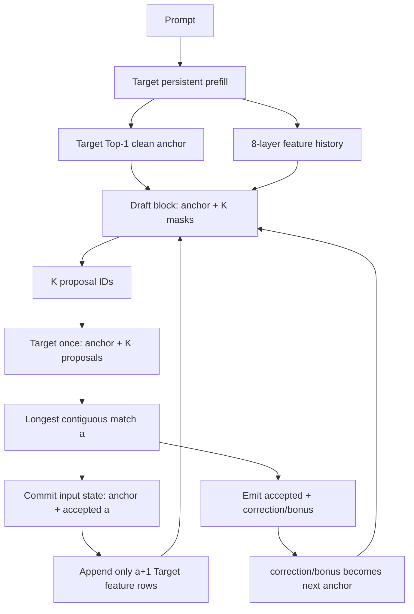

# DFlash rollback 整体架构

Target 是权威裁判，Draft 一次提出 K 个候选。当前默认路线让 Target 一次验证 T=K+1 行，随后
只提交 anchor 和连续接受的 proposal 状态；普通基线与 DFlash 都使用持久增量状态，不再验证
增长的完整历史前缀。

## 1. 组件

| 角色 | CPU/CUDA | HIAI/NPU |
|---|---|---|
| Target modeling | `dflash_v1/modeling_qwen3_5_dflash.py` | `modeling_qwen3_5_hiai_nd_dflash_rollback.py` |
| Target transaction | `FrameworkDFlashRollbackTarget` | `InternalDFlashTarget(rollback_enabled=True)` |
| Draft | `DFlashDraftModel` + Torch ops | 同一 Draft + package-local NPU ops |
| Scheduler/adapter | `dflash_rollback_decode.py` / `dflash_rollback_adapter.py` | 相同 |
| CLI | `run_rollback.py` | `run_npu.py` → `run_rollback.py` |

原 `modeling_qwen3_5_hiai_nd.py` 和 `dflash_reference_decode_v1.py` 保留，分别用于普通接收端和
full-prefix oracle，不是默认 rollback Target/调度器。

## 2. 数据流



Bootstrap 后有一个重要不变量：

```text
Target state/features 已处理到 current anchor 之前
current anchor 已输出，但尚未作为 Target 输入处理
```

所以 Draft context feature 不含 anchor，verify block 第 0 行才是 anchor。

## 3. 状态事务

| 状态 | CPU/CUDA | HIAI/NPU |
|---|---|---|
| full-attention KV | verify 前记长度，commit 前 crop | provisional 物理写，logical cursor 只加 `1+a` |
| GDN conv | clone/restore，逐 token commit replay | T 槽 conv bank，当前为 NPU Tensor golden |
| GDN recurrent | clone/restore，逐 token commit replay | `npu_gated_delta_rule_mtp` FP32 state bank |
| Target feature | verify output 只追加前 `1+a` 行 | 同左 |
| 失败 | 恢复后销毁 transaction | session 整体失效，禁止部分提交 |

CPU/CUDA commit replay 最多 K+1 行，不包含 prompt 或更早 prefix。NPU 同 K 时下一轮直接用上一轮
`accepted=a` 选择 bank 槽；T 变化时先 select 再 rebase。

## 4. Token 验证

Target 输入和 logits 对齐：

```text
input  = [anchor, d1, d2, ..., dK]
top1   = [t1,     t2, t3, ..., bonus]
compare d1==t1, d2==t2, ...
```

首次错误下标为 a 时：

```text
accepted = d[:a]
correction = top1[a]
state commit rows = input[:a+1]
next anchor = correction
```

全部命中时 `top1[K]` 是 bonus。详细 EOS、max token 和边界示例见
[调度文档](DFLASH_V1_SCHEDULER.md)。

## 5. Ordinary 与正确性

普通路线执行一次 prompt prefill，之后每次只输入上一个 generated token。DFlash 路线从相同
prompt 建立独立 session。最终严格比较 token IDs、EOS 和 stop reason，没有容差。

整块 verify 可能与逐 token kernel 存在浮点路径差异；这不能通过“多接受”规避。出现 token
分叉时应查 GDR/conv/attention 的 causal prefix 等价、position、bank selector 和 cursor。

## 6. Feature 与 Draft

Target 在 decoder 层 `1,5,9,13,17,21,25,29` 后、final norm 前收集：

```text
8 × [B,S,2560] → [B,S,20480]
```

Draft 使用官方锁定的 6 层结构和 69 tensor checkpoint。Target embedding 与 LM head 与 Draft
共享数学权重。当前保存完整已提交 feature history，Draft 仍可重算自己的 context；Draft cache 是
后续性能优化，不影响 Target rollback 正确性。

## 7. 运行身份与边界

rollback 报告固定写出：

```text
route = qwen3.5-dflash-incremental-rollback
verification_mode = incremental_transactional_rollback
historical_prefix_replay_during_verify = false
```

CPU 是模拟证据；CUDA 是 framework 设备证据；只有目标 310P 上禁用 fallback 并记录 runtime、
device、operator package 和实际 kernel trace，才能声明 NPU 路线通过。当前仓库没有该真机证据。
