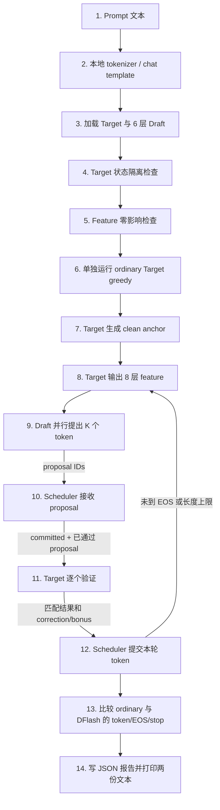

# DFlash V1 整体架构

这篇是项目的主文档，只回答四个问题：有哪些组件、一次生成怎样流动、CPU/GPU/NPU
哪里相同、应该按什么顺序验证。每个步骤的源码细节放在后面的子文档中。

如果只记住一句话：

> Target 是裁判，Draft 是一次猜多个 token 的助手；猜中的连续 token 可以直接提交，第一次猜错
> 就使用 Target 的答案纠正，所以 DFlash 最终文本必须与普通 Target greedy 完全相同。

当前版本是 correctness-first 的 V1：Target 每次都重新计算完整已提交前缀。它先把正确性和
设备接线验证清楚，不实现投机 KV/GDN 状态的提交或回滚。

## 1. 三个核心角色

| 角色 | 通俗理解 | 代码位置 |
|---|---|---|
| Target | 完整 Qwen3.5-4B，给出权威下一个 token，同时提供 8 层 feature | CPU/GPU 使用 `modeling_qwen3_5_dflash.py`；NPU 使用 `modeling_qwen3_5_hiai_nd.py` |
| Draft | 官方 6 层 DFlash 小模型，一次并行猜 K 个 proposal | `modeling_dflash.py` |
| Scheduler | 接收 Draft proposal，让 Target 逐个检查，只提交连续正确的部分 | `dflash_reference_decode_v1.py` |

`Qwen35DFlashFullPrefixAdapter` 位于 `dflash_qwen_adapter_v1.py`，负责把 Target 和 Draft
接到统一接口上：

```text
Target: input_ids [1,S] → logits [1,S,vocab]
                         → 可选 features [1,S,20480]

Draft:  committed prefix + Target features → proposal IDs [1,K]
```

## 2. 一次完整运行的总流程



图中 `Draft → Scheduler → Target verify` 是必须存在的闭环：Draft 只提供候选，Scheduler
不会直接提交它们；每个 proposal 都要经过 Target 判断。

最容易混淆的是第 6、7、10、11、13 步：

- 第 6 步先独立跑出一份普通 greedy 结果，作为最终对照答案。
- 第 7 步是 DFlash 路线自己的第一次 Target 调用，产生 Draft block 的 anchor。
- 第 10 步 Draft proposal 回到 Scheduler，不是直接进入最终输出。
- 第 11 步由 Target 对 proposal 做权威判断。
- 第 13 步再比较两条完整生成结果，任何 token、EOS 或停止原因不同都会直接报错。

验证的逐行例子和源码对应关系见
[调度与 token 验证](DFLASH_V1_SCHEDULER.md)及
[验证流程与报告解读](DFLASH_V1_VALIDATION.md)。

## 3. 一轮 DFlash 的直观例子

假设 prompt 后，Target 首先生成 anchor `101`。当前已提交前缀为：

```text
[prompt..., 101]
```

Draft 一次猜三个 token：

```text
[202, 999, 888]
```

Scheduler 收到 proposal 后，请 Target 逐个检查：

```text
位置 0 → Target 给出 202 → 与 proposal 202 相同，接受
位置 1 → Target 给出 303 → 与 proposal 999 不同，停止继续验证
```

本轮实际提交：

```text
[202, 303]
```

其中 `202` 是接受的 Draft token，`303` 是 Target correction。`999` 不会进入下一轮上下文，
`888` 也不会被继续使用。因此即使 Draft 猜错，最终生成仍沿着 Target greedy 路径前进。

如果三个 proposal 全部正确，Target 会再计算一个 bonus token，本轮最多提交 `K+1` 个 token。

## 4. Target feature 在哪里进入

Draft 不读取 Target KV cache，而是读取 Target 的 8 个 decoder layer 输出：

```text
层号 1,5,9,13,17,21,25,29（从 0 开始）
每层 [B,S,2560]
按固定顺序拼接 → [B,S,20480]
```

捕获点位于 decoder layer 输出之后、最终 norm 之前。feature 默认关闭；开启 feature 时必须保证
Target logits 不变。详细实现见 [Target 与 Feature](DFLASH_V1_TARGET_AND_FEATURE.md)。

## 5. Draft 怎么使用 feature

Draft 的输入由两部分组成：

```text
Target context feature: [B,C,20480] → 投影到 [B,C,2560]
Draft block:             [anchor, MASK × K] → embedding [B,K+1,2560]
```

6 层 Draft 并行计算后丢弃 anchor 行，通过 Target LM head 得到 K 个 proposal。这里的 K 只表示
proposal 数，不包含 anchor；所以 `K=16` 时 Draft block 有 17 行。

结构、mask 和设备算子分派见 [Draft 模型](DFLASH_V1_DRAFT.md)。

## 6. CPU、GPU、NPU 哪些相同，哪些不同

| 层次 | CPU | CUDA GPU | Ascend NPU |
|---|---|---|---|
| Scheduler 与验证规则 | 共用 | 共用 | 共用 |
| Draft 结构与权重 | 同一官方 6 层 checkpoint | 同左 | 同左 |
| Target 语义 | Qwen3.5-4B | Qwen3.5-4B | Qwen3.5-4B |
| Target 实现 | Transformers/PyTorch | 同一代码放到 CUDA | HIAI NPU 实现 |
| Draft ops | `TorchDFlashOps` | `TorchDFlashOps`，由 CUDA dispatch | `dflash_ascend310p_ops`，由 NPU dispatch |
| Target 状态 | `use_cache=False` 完整重算 | 同左 | Bridge 每次新建 KV/GDN state |
| 最终硬门禁 | ordinary 与 DFlash 零 token 差异 | 同左 | 同左，另加 NPU 状态/调用/无 fallback 门禁 |

CPU/GPU 能验证公共 Draft 数学和 Scheduler，但不能代替 NPU Target 验证。NPU 使用另一份设备适配
Target，feature、状态、kernel 选择和数值误差都可能影响 proposal 接受率。

## 7. “验证通过”到底表示什么

程序不是只看一个布尔值。它依次检查：

1. Target/Draft config、权重 shape、device、dtype 合法。
2. 相同前缀立即重复运行能稳定复现。
3. 中间插入不同长度前缀后，原前缀 logits/features 不被 KV/GDN 残留污染。
4. 打开 feature 不改变 Target logits。
5. ordinary Target 独立生成一份完整答案。
6. DFlash 至少真实执行一轮 feature → Draft → Scheduler → Target verify。
7. DFlash 最终 token IDs、EOS、stop reason 与 ordinary 完全相同。
8. NPU 上额外检查每次 prepare、Target forward、同步的调用数相互一致，且禁止 fallback。

接受率低不等于生成错误：只要 correction 后最终 token 完全一致，正确性仍然通过，但 DFlash
可能没有性能收益。每个门禁如何实现、失败时先查什么，见
[验证流程与报告解读](DFLASH_V1_VALIDATION.md)。

## 8. 推荐阅读和执行顺序

第一次接触建议按这个顺序：

1. 本文：先理解整体数据流。
2. [Target 与 Feature](DFLASH_V1_TARGET_AND_FEATURE.md)：理解 Target 改动和 NPU state。
3. [Draft 模型](DFLASH_V1_DRAFT.md)：理解 6 层网络为什么能一次提出 K 个 token。
4. [调度与 token 验证](DFLASH_V1_SCHEDULER.md)：理解 accept、correction、bonus。
5. [验证流程与报告解读](DFLASH_V1_VALIDATION.md)：理解程序为什么能判定正确或失败。
6. [从 V1 到完整 DFlash 与真正提速](DFLASH_FULL_AND_PERFORMANCE_ROADMAP.md)：
   理解单次整块验证、KV/GDN 提交回退和自定义算子改造。
7. 按设备选择运行文档：
   - [CPU/Golden](DFLASH_V1_GOLDEN.md)
   - [CUDA GPU](DFLASH_V1_GPU.md)
   - [NPU 部署与运行](NPU_DEPLOYMENT.md)
   - [Ascend 310P 边界](DFLASH_V1_ASCEND310P.md)

## 9. 主要源码地图

| 文件 | 主要职责 |
|---|---|
| `dflash_qwen_adapter_v1.py` | 总入口、模型装配、Target/Draft adapter、前置门禁、报告 |
| `dflash_reference_decode_v1.py` | ordinary greedy、DFlash sequential verify、最终精确比较 |
| `modeling_dflash.py` | 6 层 Draft 模型 |
| `dflash_config.py` | Draft shape、层数、K、mask token 等合同 |
| `dflash_weights.py` | Draft checkpoint 检查和加载 |
| `dflash_target_features.py` | 8 层 feature 收集与拼接 |
| `modeling_qwen3_5_dflash.py` | CPU/CUDA feature-enabled Target |
| `dflash_ops.py` | CPU/CUDA Draft 原语 |
| `dflash_ascend310p_ops.py` | NPU Draft 原语后端 |
| `internal_target_loader.py` | NPU Target facade |
| `../internal_dflash_bridge.py` | NPU 每次 full-prefix 的 fresh KV/GDN state 与 64-token 对齐 |
| `../modeling_qwen3_5_hiai_nd.py` | NPU Target 与 feature 直接集成 |

## 10. 当前版本不做什么

- 不让 Draft 决定最终答案。
- 不允许 ordinary/DFlash 最终 token 有任何差异。
- 不实现投机 KV/GDN 状态提交、回滚或复用。
- 不因为 CPU/GPU 通过就声称 NPU 已通过。
- 不因为功能正确就声称已有加速；性能需要单独测量。

后续如何把这些限制逐项变成可验证的增量运行时，见
[完整 DFlash 与提速路线](DFLASH_FULL_AND_PERFORMANCE_ROADMAP.md)。
