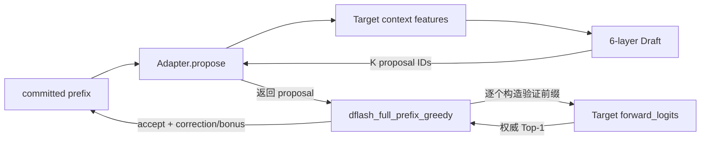

# DFlash V1：调度与 Token 验证

本文专门解释 Draft 输出的多个 token 怎样进入验证路线，以及 accept、correction、bonus 分别是
什么。公共实现位于 `models/dflash_v1/dflash_reference_decode_v1.py`。

先读整体关系：[DFlash V1 整体架构](DFLASH_V1_ARCHITECTURE.md)。

## 1. 最重要的连接

Draft 输出不会直接变成最终文本。真实链路是：



代码中的对应关系：

```text
_call_draft()
  └─ adapter.propose()
       └─ draft.draft_top1()
            ↓ proposal IDs 返回
dflash_full_prefix_greedy()
  └─ for proposal_index, proposal in enumerate(proposals)
       └─ _target_top1(committed + proposals[:proposal_index])
```

所以 Draft 路由和验证路由不是两个互不相干的分支；Scheduler 正是它们的连接点。

## 2. ordinary greedy 基线

`ordinary_full_prefix_greedy()` 是最简单的权威路线：

```text
committed = prompt
while 还需要生成:
    logits = Target(committed)
    token = argmax(logits 的最后一行)
    committed.append(token)
    如果 token 是 EOS: 停止
```

它每生成一个 token 都重新计算完整前缀，所以叫 `ordinary-full-prefix-greedy`。这不是性能最优的
增量 KV inference，而是与当前 V1 DFlash 使用相同 full-prefix 条件的 correctness oracle。

## 3. DFlash 开始前为什么 bootstrap

正式 DFlash 不是直接把 prompt 最后一个 token 当 anchor。`validate_qwen35_dflash_strict_greedy()`
先单独让 Target 生成一个 token：

```text
prompt → Target Top-1 → clean anchor
```

然后才把：

```text
seeded_prefix = prompt + anchor
```

交给 `dflash_full_prefix_greedy()`。最终 DFlash 结果由 `anchor + 后续 DFlash tail` 组成，再与
ordinary 的完整生成结果比较。

## 4. sequential 验证算法

当前正式模式是 `verification_mode="sequential"`。伪代码如下：

```text
while 还需要生成:
    proposals = Draft.propose(committed, K)
    accepted = []

    for i, proposal in enumerate(proposals):
        verify_prefix = committed + proposals[:i]
        target_token = Target.top1(verify_prefix)

        if proposal != target_token:
            correction = target_token
            break

        accepted.append(proposal)

    if 全部 proposals 都匹配:
        bonus = Target.top1(committed + proposals)

    committed += accepted
    committed += [correction 或 bonus]
```

关键点是 `proposals[:i]` 只包含已经通过的前序 proposal。第一个错误 proposal 从未作为后续
Target 上下文。

## 5. 一轮具体例子：中途猜错

已有前缀：

```text
committed = [..., 101]
```

Draft 返回：

```text
proposals = [202, 999, 888]
```

Scheduler 的调用顺序：

| 步骤 | 传给 Target 的前缀 | Target Top-1 | Draft proposal | 结果 |
|---|---|---:|---:|---|
| 验证 0 | `committed` | 202 | 202 | 接受 202 |
| 验证 1 | `committed + [202]` | 303 | 999 | 首次不匹配，停止 |

本轮提交：

```text
accepted   = [202]
correction = 303
emitted    = [202, 303]
```

proposal `999` 被 correction `303` 替换；`888` 不再验证，也不会进入 committed。

## 6. 一轮具体例子：全部猜对

Draft 返回：

```text
proposals = [202, 303, 404]
```

Target 逐个给出相同结果后，Scheduler 还会调用：

```text
Target(committed + [202,303,404]) → bonus 505
```

本轮提交：

```text
[202, 303, 404, 505]
```

前三个来自 Draft，但都已经被 Target 确认；`505` 直接来自 Target。因此 K 个 proposal 全部命中时，
一轮最多推进 `K+1` 个 token。

## 7. 如果 Draft 返回空 proposal

Scheduler 会退化成一次普通 Target Top-1：

```text
Target(committed) → fallback token
```

每轮必须至少提交一个 token，否则代码会抛出 `a DFlash round made no token-level progress`。

这里的 `fallback_token` 是统计字段的历史名称；在 strict sequential 路线里，它表示 correction、
all-accepted bonus 或 empty-draft 时的普通 Target token，不表示回退到 CPU 算子。

## 8. EOS 和生成上限

每轮 proposal 数先限制为：

```text
proposal_limit = min(K, 剩余可生成 token 数)
```

如果固定宽度 Draft 在某个位置提出 EOS，后面的 proposal 槽位不再参与验证。提交 accepted token
或 correction/bonus 后，一旦遇到 EOS 就立刻停止。

最终记录两个停止结果：

```text
reached_eos = true/false
stop_reason = eos 或 max_new_tokens
```

它们必须与 ordinary 路线完全一致。

## 9. 为什么正式路线不用一次向量化验证

`vectorized` 诊断模式会把：

```text
committed + 全部 proposals
```

一次送进 Target，再读取多行 logits。它调用次数少，但隐含一个假设：长序列某个早期位置的
logits 与较短前缀最后一行等价。

不同长度可能触发不同 kernel、padding 或数值路径，尤其是设备适配 Target。因此当前正式 V1
采用 sequential 独立前缀：proposal i 只在 `committed + proposals[:i]` 上验证。

`vectorized` 仍可用于定位 prefix-invariance 差异，但不能代替正式 acceptance 决策。

## 10. 最终零差异怎样检查

`assert_exact_greedy_match()` 比较 ordinary 与 DFlash：

```text
prompt_token_ids
generated_token_ids
reached_eos
stop_reason
```

生成 token 只要有一个不同，就报告第一个 generated offset，以及 ordinary/DFlash 各自的 token。
这里没有数值容差，也没有“接受率高就允许文本不同”的例外。

## 11. 统计字段怎么读

| 字段 | 含义 |
|---|---|
| `draft_calls` | 真正执行了多少个 Draft round |
| `drafted_tokens` | Draft 一共提出多少 proposal |
| `accepted_draft_tokens` | 最长连续前缀中被 Target 接受的 proposal 数 |
| `rejected_draft_tokens` | 没有被提交的 proposal 数 |
| `target_verify_calls` | proposal/correction/bonus 使用的 Target 验证调用数 |
| `fallback_tokens` | bootstrap、correction、bonus 或 empty-draft Target token 数 |
| `acceptance_rate` | `accepted_draft_tokens / drafted_tokens` |

仅看 acceptance rate 不够。更贴近一轮推进效率的是：

```text
mean_emitted_tokens_per_draft_round
```

它包含接受的 proposal 和本轮 correction/bonus。

## 12. 正确性与接受率要分开

```text
最终 token 不一致 → 正确性失败，必须修复
最终 token 一致但接受率低 → 正确，但可能没有加速收益
最终 token 一致且接受率高 → 再进入性能测量
```

接受率低时优先检查 anchor、Target feature、position/mask、Draft 权重和设备数值；不要修改
sequential verifier 去“多接受”错误 proposal。

`quant` 分支复用完全相同的 Scheduler。区别只在于 ordinary 和 DFlash 两路都必须装配同一个
量化 Target、同一个 input-provider 和同三条数据路径；不能拿 FP16 ordinary 去对照量化
DFlash。量化装配与数值门禁见 [量化版运行与排错指南](DFLASH_V1_QUANT_RUNBOOK.md)。

下一步阅读：

- [验证流程与报告解读](DFLASH_V1_VALIDATION.md)：当前 V1 怎样证明正确。
- [完整 DFlash 与提速路线](DFLASH_FULL_AND_PERFORMANCE_ROADMAP.md)：后续怎样将逐前缀验证
  升级为一次 Target 整块验证。
