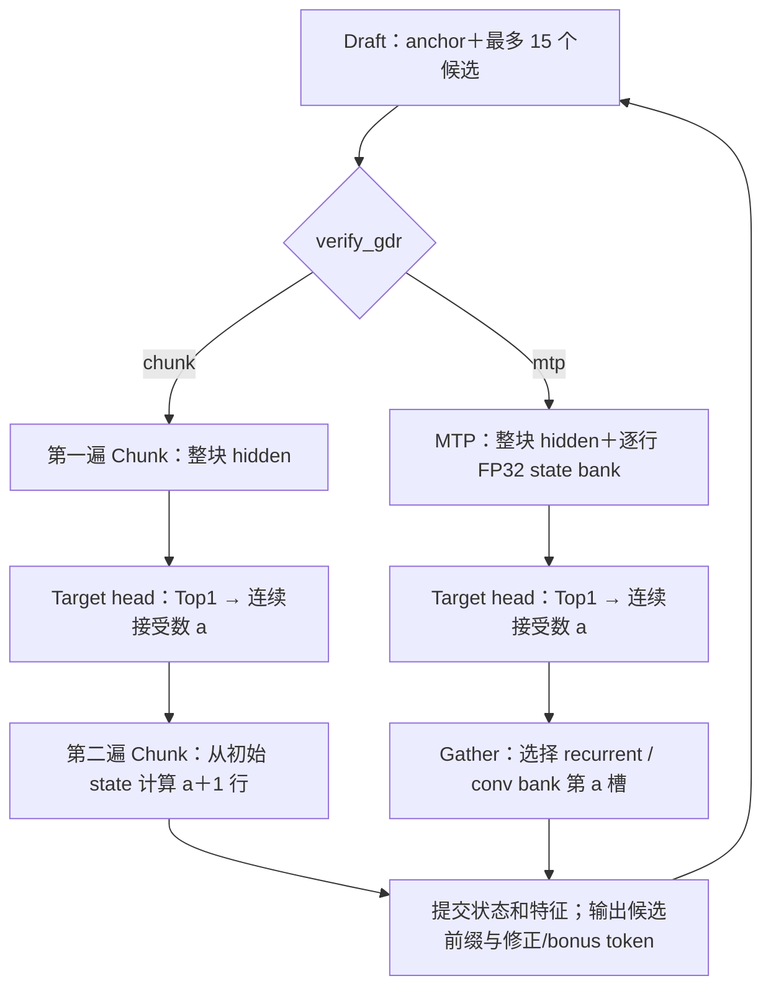

# 选择 GDR MTP 或两遍 Chunk 验证

AIR/OM/C++ 增量路径支持额外参数 `--verify-gdr chunk|mtp`。
默认仍是 `chunk`。这次复用同一仓库
[`framework/quant-air-om` 的 GDR MTP 接口](https://github.com/day8reak/qwen3.5-4B-dflash/blob/631c86fc0c4e053817f0786ab8067b5565638d50/framework/python/qwen35_dflash/ascend310p/custom_op_export.py)，
来源提交 `631c86fc0c4e053817f0786ab8067b5565638d50`。
接入的是现有 MTP 算子的前端、Meta、GE 转换及状态选择；不包含新的设备 kernel。

## 1. 两条路径怎样工作

| 项目 | `chunk`，默认 | `mtp` |
|---|---|---|
| Verify 每层 GDN | 两次 `ChunkGatedDeltaRule` | 一次 `GatedDeltaRuleMTP` |
| 第一遍/唯一一遍 | 计算整块 hidden，后续 Target head 得到 Top1 | 同时计算整块 hidden 和每行 FP32 recurrent state bank |
| 接受数 a 确定后 | 从本轮初始 state 重算 a+1 行 | 直接选 bank 的第 a 槽，不再运行 GDR |
| Conv 提交 | 选 conv bank 第 a 槽 | 同左 |
| 跨轮 recurrent state | FP16 | FP32 |
| MTP bank | 无 | 内部 `[1,16,32,128,128]` FP32，每个线性注意力层一份 |
| Verify 外部输出 | Top1、a、features、64 个 Target state、24 个 discard state | Top1、a、features、64 个 Target state；bank 在图内消费 |
| Verify 输出总数，4B | 91 | 67 |
| ABI | `qwen35-dflash-chunk-v3` | `qwen35-dflash-mtp-v1` |

两者都提交“旧 anchor＋a 个已接受候选”的状态；本轮修正/bonus token 留作下轮 anchor，
尚未进入刚提交的缓存。零接受也提交旧 anchor，并继续下一轮 Draft＋Verify。
Target KV 仍以逻辑长度控制可见范围，拒绝后未提交的物理行不会成为后续有效上下文。



MTP 的 `accepted_tokens` 输入表示**选择输入 bank 的哪个旧状态**，
不是当前轮尚未得到的接受数。本实现把已提交的标量 recurrent state
在每层调用前播种成 16 槽 FP32 bank，用 `INT8[1]=0` 选择初始槽；
当前轮接受数通过输出 bank 的 Gather 消费。MTP 调用没有 `effective_length` 输入，
固定计算 16 行；runtime `valid_rows` 仍限制 Target mask、接受判断和状态选择，
因此末尾短块和 K=1 也不会提交 padding。

普通 prefill/decode 仍用原来的 Chunk 算子，保留原有 FP16 缓存舍入。
MTP bundle 仅把普通路径舍入后的 recurrent state 用 FP32 容器保存，以便共用设备缓存接口；
DFlash MTP Verify 则保留选中状态的 FP32 数值。两条路径的 ABI 不同，不能混装图。
Draft 权重、算子和默认 `--deterministic=1` 编译策略不变。

## 2. 导出前检查 MTP 算子

使用 [部署手册](GDR_CHUNK_AIR_OM.md)中已配置的 CANN、模型 Python、
receiver、自定义算子环境和锁定的 `factory.json`。选择 MTP 时还需要已有
`GatedDeltaRuleMTP` 算子包在当前进程可见；`ASCEND_CUSTOM_OPP_PATH`
必须包含该包的 vendor 根目录，`LD_LIBRARY_PATH` 包含对应 `op_api/lib`。
同名 GE 原型只保留一套有效注册。

```bash
cd "$AI_RUN_DIR"
"$MODEL_PYTHON" -B - <<'PY'
import torch
import torch_npu
from qwen35_dflash.ascend310p.custom_op_export import validate_gdr_mtp_ge_prototype_environment
op = getattr(torch_npu, "npu_gated_delta_rule_mtp", None)
if not callable(op):
    op = getattr(torch.ops.npu, "npu_gated_delta_rule_mtp", None)
assert callable(op), "npu_gated_delta_rule_mtp is not registered"
result = validate_gdr_mtp_ge_prototype_environment()
print(result)
assert result["status"] == "PASS"
PY
```

接口为七个 Tensor 输入：
`query, key, value, g, beta, initial_state, accepted_tokens`，
三个属性：
`chunk_size=64, output_final_state=True, use_qk_l2norm_in_kernel=True`。
GE 输出名必须为 `core_attn`、`last_recurrent_state`，不能把后者注册成 `state_bank`。
前端会检查 dispatcher schema、FP32 bank 和 INT8 selector；算子缺失会报错，不回退到 Chunk 或 CPU。
默认 Chunk 导出不要求安装 GDR MTP。

## 3. 用一个参数选择导出路径

`--verify-gdr` 可以用于 `export-air` 和 `build-om`，
优先于 factory JSON 中的 `"verify_gdr": "chunk"` / `"mtp"`。
两处都省略时默认 Chunk。以下复用现有量化输入和 factory，导出到新的独立目录：

```bash
export VERIFY_GDR=mtp
export VERIFY_BUNDLE="$AI_RUN_DIR/artifacts-$VERIFY_GDR"

"$MODEL_PYTHON" -B -m qwen35_dflash.ascend310p export-air \
  --factory qwen35_dflash.ascend310p.quant_factory:create_quant_incremental_graphs \
  --factory-config "$AI_RUN_DIR/factory.json" \
  --verify-gdr "$VERIFY_GDR" --bundle-dir "$VERIFY_BUNDLE"

"$MODEL_PYTHON" -B -m qwen35_dflash.ascend310p compile-om \
  --air-manifest "$VERIFY_BUNDLE/air-manifest.json" \
  --atc "$ATC_BIN" --soc-version "$SOC_VERSION"

export DEPLOYMENT_MANIFEST="$VERIFY_BUNDLE/deployment-manifest.json"
```

把 `VERIFY_GDR` 改为 `chunk` 可导出两遍版本。目录需未被占用；重复实验另取目录名。
切换路径必须生成相应 AIR/OM，运行参数无法改变已经编译好的 OM 内部算子。
也不能用 `recompile-draft-om` 切换 Target Verify。
现有 Chunk v3 bundle 可继续使用，无需因增加 MTP 支持而重导出。

首次使用新增 MTP ABI 时重编一次 runner；同一个新 runner 可运行两种 bundle：

```bash
"$MODEL_PYTHON" -B -m qwen35_dflash.ascend310p build-cpp \
  --build-dir "$AI_RUN_DIR/build/cpp-gdr-routes" --ascendcl-root "$CANN_ROOT" \
  --output "$AI_RUN_DIR/reports/cpp-gdr-routes.json"
export CPP_RUNNER="$AI_RUN_DIR/build/cpp-gdr-routes/qwen35_dflash_acl_runner"
```

## 4. 跑相同的多 prompt 对照

```bash
"$MODEL_PYTHON" -B "$REPO_ROOT/tools/benchmark_prompts.py" \
  --run-dir "$AI_RUN_DIR" --runner "$CPP_RUNNER" \
  --deployment-manifest "$DEPLOYMENT_MANIFEST" --verify-gdr "$VERIFY_GDR" \
  --runner-config "$AI_RUN_DIR/runner.json" --model-dir "$TARGET_DIR" \
  --max-new-tokens 128 --max-draft-tokens 15 --device-id 0 \
  --low-memory --allow-output-differences
```

运行时 `--verify-gdr` 校验所选 deployment manifest 的路线；省略时从 manifest 读取。
若请求 MTP 却传入 Chunk 清单，会在执行模型前报错。切回 Chunk 时选原来的
Chunk deployment manifest 并传 `--verify-gdr chunk` 即可。
`infer-cpp`、`prepare-chunk-plan`、`profile_om.py` 同样支持这个校验参数；
`--summarize-existing` 读取保存且通过 hash 校验的 plan，不会重新解释或重跑旧结果。
此参数的支持范围是增量 AIR/OM/C++；已有 Python eager rollback 入口继续使用 Chunk。

新请求和汇总记录 `verify_gdr`，C++ case 报告的 `abi.id` 记录具体 ABI。
两条路径沿用相同的 3 次预热＋10 次正式测量、接受率计数和持续投机策略。
`--allow-output-differences` 仍是显式实验选项；去掉则使用严格普通模型输出对照。
读取文字、接受率、按位置分段和 decode/Draft/Verify 时延的命令见
[当前结果手册](DFLASH_CURRENT_USAGE_AND_RESULTS.md)。

## 5. 当前证据与待测项

已有 **20.69% 接受率、整体 1.50075×** 的 8 prompt 结果属于 Chunk 两遍路线，
不能当作 MTP 的结果。这次本地验证覆盖小模型状态选择/拒绝恢复、FP32 状态保留、
普通路径舍入、AOT/Meta/GE 接口、清单路线校验和 C++ fake-ACL 调度。
当前本地目标 profile 是 simulation-only，没有可用 310P、CANN/ATC；
新 MTP 路径的真实 AIR 导出、ATC 编译、设备精度、接受率和分项时延待实测。

MTP 减少了第二遍 GDR，代价是逐行 FP32 bank 的图内存储和 Gather。
24 层输出 bank 的逻辑元素载荷合计约 768 MiB；这不是 OM 峰值内存，
实际 workspace、输入 bank 生命周期和总显存必须查看编译/运行报告。
不能仅凭少一次算子调用承诺更快或更高接受率。
对照时保持 checkpoint、量化输入、prompt、输出预算、K、确定性配置和设备一致，
比较实际接受率、tokens/round、模型循环耗时及 Draft/Verify 分项；
允许输出差异时仍需另外检查生成内容质量。
