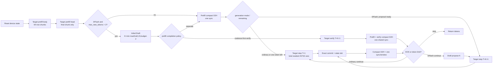

# 增量 OM 与 C++ 高性能路线

当前 `quant_dflash_recompute.om` 是 correctness 基线，不是最终性能形态。它的每次调用都重算完整
前缀，而且一个图同时运行 Target 和 Draft。C++ speculative round 又会调用这个大图两次：先取
proposal，再把 `prefix + proposals` 重算一次进行 verify。普通生成也会无条件支付 Draft 成本。

因此，拆成多个逻辑角色可能显著提速；**不是因为 OM 文件数从 1 变成 4**，而是因为它允许：

- prompt 只 prefill 一次；
- ordinary decode 每次只处理 1 行且不运行 Draft；
- Draft 复用自己的 KV 和 Target 新增 feature，只生成最多 15 个 proposal；
- 五图基线的 Target verify 固定处理 16 个因果行；四图候选只处理 `T=K+1` 个真实行。两者都只
  提交 `logical_proposal_count` 指定的前缀，不再重算历史前缀；
- proposal、KV、GDR/conv state 和 feature 全部留在 device；
- 默认每个 speculative round 只在 accept/commit 后同步一次；同一 OM ABI 的双轮候选可把两个
  完整 round 及两份 compact 结果排入同一 stream 后只同步一次；另一个独立候选可把最后一次
  prefill completion 与第一次 verify 合为一次 D2H/同步。

完整机器可读合同见 `framework/abi/incremental-performance-v2.json`。用户已明确批准该状态图，
批准记录位于 `framework/abi/approvals/incremental-performance-v2.json`，当前状态是
`APPROVED_IN_IMPLEMENTATION_NOT_ACTIVE`：可以实现，但还不能冒充已经生成、真机验证或达到性能
目标的 OM。

## 1. 五 OM 基线与四物理 OM 统一 Target-step 候选

四个逻辑角色是：

| 角色 | 主要工作 | 不应再做的工作 |
| --- | --- | --- |
| `target-prefill` | 1..64 行 prompt chunk，原 ChunkGatedDeltaRule | 非末 chunk 的完整 LM head、Draft proposal |
| `target-decode1` | 1 行普通 decode / zero-accept fallback | Draft |
| `draft-propose` | 复用 Draft KV，输出固定 `[anchor,p0..p14]` device carrier | Target |
| `target-verify-commit` | 五图固定 T=16；四图动态 T=1..16；逻辑 K=0..15、精确 accept/状态选择 | 历史前缀重算、host state 搬运 |

物理文件不一定恰好是四个：

- 当前实现把逻辑 `target-prefill` 物理拆成 `target-prefill` body 和
  `target-prefill-head`。body 导出签名不引用 `lm_head`，head 只保留量化
  `QLinear + argmax + EOS`；因此非末 chunk 真正不做词表投影，末 chunk 才执行一次 head；
- 源码现在还提供统一 `target-verify-commit`：Target body 使用动态 `T=1..16`，`T=1`
  表示零 proposal 的 ordinary decode，`T=K+1` 表示只计算本轮真实 K 个 proposal。由于 prefill
  head 已物理拆出，这条路线是四个物理文件，而不是三个文件；
- 如果 receiver 自定义算子和 ATC 能证明多 gear/分支完全可用，可进一步测试 2 个动态 OM；
- 如果静态小图明显更快且显存足够，才选 4 个静态 OM；
- 如果 launch/host 边界是主要热点，才测试 Draft→verify 的 supergraph。

真正的选择规则是：所有候选都必须零 token/EOS 差异，然后选真机端到端 median latency 最低者。

四物理 OM 候选的运行状态图如下。`T=1` 和 `T=K+1` 共用同一个已加载 Target model ID；每次
Target 事务完成后只下载 compact 结果并同步一次，完整 state 继续留在 device：



统一 Target-step 已通过 CPU `torch.export` 的 T=1/2/7/16 动态捕获和 Fake ACL C++ 完整生成
状态机。图内先将小型 token/top1/feature 载体补齐到固定 16 行，再执行原来的精确 accept/commit，
因此 13 个输出及 state ping-pong ABI 不变；昂贵的 Target body 和 GDR-MTP 只处理物理 T 行。
这些是非目标证据。`npu_gated_delta_rule_mtp` 的 T=1、TorchAir 16 档 gear、ATC、自定义节点保留、
真实 checkpoint ordinary parity 和时延都仍需 310P 证明，候选继续保持 `NOT_ACTIVE`。

统一候选的 T=1 dataset 不再把可变 proposal-count carrier 改写成 0。runner 在首次完整 prefill
control H2D 中一并初始化一个进程常驻、64-byte 对齐的 INT32 零值；所有 ordinary T=1 dataset
直接绑定该地址，而 T=2..16 始终绑定只保存正 K 的原 proposal carrier。这样 ordinary decode 不会
产生独立的 4-byte `K=0` H2D，也不会迫使下一次 DFlash prefill 把正 K 恢复回来。这个改动只改变
C++ 内部 buffer/view 路由；统一 Target-step 的输入名、shape、动态 gear、AIR/OM 和算子 ABI 都不变。

## 2. 为什么不能按 OM 数量认定更快

不同 Target OM 可能各自携带一份 Target 权重。CANN 文档允许串行模型共享一块最大 workspace，
但不能据此假设不同 OM 文件会自动共享权重。当前五图候选中有多个 Target 物理图，若权重重复，
可能多占数 GiB，甚至因为内存压力、装载失败或带宽竞争而更慢。

参考 CANN API：[`aclmdlQuerySize`](https://www.hiascend.com/document/detail/zh/CANNCommunityEdition/81RC1alpha002/apiref/appdevgapi/aclcppdevg_03_0304.html)
返回模型 work/weight 大小；[`aclmdlLoadFromFileWithMem`](https://www.hiascend.com/document/detail/zh/CANNCommunityEdition/900beta2/API/appdevgapi/aclcppdevg_03_0285.html)
允许调用方提供内存，并明确描述串行模型共享 workspace 的场景。后者对“同一模型多线程共享
weightPtr”的说明不能外推为“不同 OM 自动共享权重”。

每个候选必须先记录所有 OM 的：

```text
sum(weightSize)
max(workSize)                 # 仅在模型严格串行并使用显式共享 workspace 时
persistent state bytes
peak transient state/workspace
I/O buffer + runtime margin
```

然后在完整候选集同时 load 的条件下测试，不能逐个 OM 单独 load 成功就宣称组合可用。

### 2.1 查询完整候选集

构建后，使用新增的 `qwen35_dflash_om_inspect`。下面的 `999817216` 是本页表格中
`persistent state + T16 transient banks` 的小计；1 GiB margin 只是示例，真机应按 I/O、feature、
logit、allocator 和并存服务重新声明。`DEVICE_BUDGET_BYTES` 必须来自本次目标机预算，不能照抄：

```bash
CPP_BUILD="$AI_RUN_DIR/build/cpp-performance"
STATE_BYTES=999817216
IO_RUNTIME_MARGIN_BYTES=1073741824
DEVICE_BUDGET_BYTES=<本次进程可使用的设备字节预算>

cmake -S framework/runtime/cpp -B "$CPP_BUILD" \
  -DQWEN35_DFLASH_BUILD_ACL_RUNNER=ON \
  -DQWEN35_DFLASH_BUILD_TESTS=ON \
  -DASCENDCL_ROOT="$ASCEND_HOME_PATH"
cmake --build "$CPP_BUILD" -j

"$CPP_BUILD/qwen35_dflash_om_inspect" \
  --model target-prefill="$AI_RUN_DIR/om/target-prefill.om" \
  --model target-prefill-head="$AI_RUN_DIR/om/target-prefill-head.om" \
  --model target-decode1="$AI_RUN_DIR/om/target-decode1.om" \
  --model draft-propose="$AI_RUN_DIR/om/draft-propose.om" \
  --model target-verify-commit="$AI_RUN_DIR/om/target-verify-commit.om" \
  --state-bytes "$STATE_BYTES" \
  --io-runtime-margin-bytes "$IO_RUNTIME_MARGIN_BYTES" \
  --device-budget-bytes "$DEVICE_BUDGET_BYTES" \
  --output "$AI_RUN_DIR/out/performance/five-graph-memory.json"
```

四物理 OM 统一 Target-step 候选删除 `target-decode1` 行，并把输出名改为
`four-graph-unified-target-step-memory.json`。重点查看：

```bash
jq '{models, budget, assumptions, claim_boundary}' \
  "$AI_RUN_DIR/out/performance/five-graph-memory.json"

jq '.models[] | select(.role == "target-verify-commit") |
  {sha256, work_bytes, weight_bytes}' \
  "$AI_RUN_DIR/out/performance/five-graph-memory.json"
```

`per-linear-layer-jit-v1` 是否真的降低编译后 workspace，必须使用相同 checkpoint、量化文件、
`max_sequence_length`、CANN/ATC 和 SoC 分别生成旧/新 OM 后比较，不能拿源码字节公式替代：

```bash
OLD_REPORT=/ABSOLUTE/PATH/old-five-graph-memory.json
NEW_REPORT="$AI_RUN_DIR/out/performance/five-graph-memory.json"

jq -s '
  map(.models[] | select(.role == "target-verify-commit") |
      {sha256, work_bytes, weight_bytes}) |
  {old: .[0], new: .[1],
   work_bytes_delta: (.[1].work_bytes - .[0].work_bytes)}
' "$OLD_REPORT" "$NEW_REPORT"
```

这个 A/B 只判断编译后 workspace；最终是否更快仍以同身份、未开启 profiler 的 3+10
端到端报告为准。

`fits_declared_budget=true` 只表示静态估算未超预算。它不替代完整集合同时 load、运行时显存峰值、
数值正确性或性能测试。

## 3. 已知状态预算

以下按 batch 1、Target KV 最大长度 2048、verify `T=16` 计算：

| 项目 | 字节 | MiB | 生命周期 |
| --- | ---: | ---: | --- |
| Target scalar conv FP16 | 1,572,864 | 1.5 | persistent |
| Target scalar recurrent FP32 | 50,331,648 | 48 | persistent |
| 8 层 Target K/V FP16 | 67,108,864 | 64 | persistent |
| 6 层 Draft K/V FP16 | 50,331,648 | 48 | persistent |
| persistent state 小计 | 169,345,024 | 161.5 | request lifetime |
| Target conv bank FP16 | 25,165,824 | 24 | verify transient |
| Target recurrent bank FP32 | 805,306,368 | 768 | verify transient |
| verify bank 小计 | 830,472,192 | 792 | graph workspace/transient |
| 旧图入口同时播种的输入 bank | 830,472,192 | 792 | 已从源码图删除 |
| 当前单层 recurrent 即时播种 | 33,554,432 | 32 | layer-local transient |

这里尚未包含模型权重、ATC workspace、I/O、feature、logit 中间量和 allocator/runtime overhead。
尤其是 792 MiB state bank：它不应该每轮搬回 host，也不应该作为下一轮的持久输出。推荐在
verify graph 尾部根据接受数 `a` gather slot `a`，只持久化选中的 scalar state；bank 只作为当轮
workspace。

当前源码进一步使用 `per-linear-layer-jit-v1`：verify 的五个公开 Target state 输入仍是 scalar
ABI，wrapper 不再在进入 32 层 body 前一次性复制 24 份 T=16 GDN 输入 bank。causal-conv 直接
读取已经 committed 的 scalar conv state；只有 recurrent state 在每个 linear-attention layer
调用 GDR-MTP 前即时播种。这样每次 verify 明确删除 25,165,824 bytes 的 conv input-bank
materialization 和 24 次 bank-slot gather；recurrent 输入 seed 的源码图同时 live set 从整组
805,306,368 bytes 变成单层 33,554,432 bytes。数值、自定义算子签名和 OM 外部输入/输出均不变。
这里描述的是源码图工作量/生命周期，不是 310P 上已经实测的 OM 峰值：必须在新 AIR/OM 上检查
`target-verify-commit.work_bytes` 并以 msprof 结果为准。输出 provisional bank 仍然存在，不能把
这项改动误报成已消除全部 792 MiB verify bank。

`once-per-verify-v1` 还把固定 T=16 的 block/offset 向量从 logical cursor 只计算一次，并让 8 个
full-attention layer 的 K/V 更新共同复用。旧源码按 `8 layers * 2(K/V) * 16 rows` 分别构造
256 个 floor-div、256 个 remainder 以及对应 512 个 cast；当前源码只保留一个向量 floor-div、
一个向量 remainder 和两个 cast，即显式少构造 510 个 div/remainder 与 510 个 cast。attention
mask 也直接以 ADN 需要的 FP16 `0/-inf` 创建，删除每个 Target call 中 8 个重复 mask cast。
这些优化不改数值、公开 OM binding 或 CacheUpdate 自定义算子边界；当前 verify 仍有
`8*2*16=256` 个单 row CacheUpdate 节点，不能把 index hoist 误报成已经完成 batched cache update。
下一步的精确候选在 `framework/abi/batched-cache-update-v1.json`：用 `[T,2]` block/offset indices
把 256 个节点合并成 16 个，并保持外部 OM binding、FP16 更新字节和逻辑 cursor commit/rollback
不变。它仍是 `AWAITING_EXPLICIT_APPROVAL` 提案，不是已实现功能；实施前需要新的原样批准语句
`批准 batched-cache-update-v1`，之前对多 OM 状态图的批准不能替代本次算子/图边界批准。

持久 recurrent 统一用 FP32：普通 GDR 仍保留 receiver 现有的 FP16 输出边界，再把该结果无损
扩宽到 FP32；GDR-MTP 选中的 FP32 state 则无需每轮降回 FP16。这样 prefill/decode/verify 的
外部 binding dtype 固定，同时不丢掉 rollback 路线已经保留的 FP32 state。

## 4. 精确 accept/commit 合同

Target 输入与输出对齐为：

```text
input = [anchor, p0, p1, ..., p(K-1)]
top1  = [t0,     t1, t2, ..., tK]
```

`a` 是从开头连续满足 `p[j] == t[j]` 的 proposal 数。首次不匹配时输出
`p[0:a] + t[a]`；全部匹配时输出 `p[0:K] + t[K]`。如果已接受 proposal 中出现 EOS，必须在
第一个 EOS 截断，不能再输出 bonus。

Target 真正提交的输入行永远是 `anchor + a 个 accepted proposal`，即 `1+a` 行；对应 GDR/conv
bank slot 正好是 `a`。correction/bonus 虽然已经作为生成 token 输出，但仍是下一轮尚未处理的
anchor。这一规则与当前 rollback scheduler 一致，不能为了融合而改变。

生产 verify 固定物理 `T=16`，另传 `[1] INT32 logical_proposal_count`。如果本轮只需要 K 个
proposal，`pK..p14` 是 scratch suffix。Target 的 attention、GDR、conv、MLP 和 LM head 都是
因果计算，因此 suffix 不能影响前面的 logit、feature 或 state slot；graph tail 只比较逻辑前缀、
只 gather slot `a`、只推进 `1+a`。这不是 padding 近似：promote 前仍必须在逻辑
`K=1/3/5/7/15`、跨 62/63/64/65 位置以及拒绝后续跑 token 的测试中证明该因果 suffix 约束。

设备侧实现位于 `ExactAcceptCommitStateGraph`。它还会在第一个 proposal EOS 截断 drafted/accepted
范围、抑制 EOS 后 bonus，并把未提交 feature 行清零。主机可先运行捕获与穷举测试：

```bash
PYTHONPATH="$PWD/framework/python:$PWD" "$MODEL_PYTHON" -m pytest -q \
  tests/test_incremental_om_transaction.py \
  tests/test_incremental_performance_contract.py
```

## 5. C++ 热循环目标

推荐的 C++ request context 一次建立并复用：

```text
ACL device/context/stream
所有候选 OM model ID/description
一块共享 serial workspace（仅在 query/load 验证后）
每个 role 的 dataset
两组可 ping-pong 的 scalar state / feature buffer
Target paged KV、Draft KV、logical cursor
proposal/verify/commit 小 buffer
```

高性能 speculative round 应是：

```text
enqueue draft-propose
  [anchor,p0..p14] device buffer ───────┐
enqueue target-verify-commit <──────────┘
enqueue compact commit result D2H
aclrtSynchronizeStream                  # 本轮唯一 host-visible barrier
host 只处理 EOS/长度/输出文本
```

同一 tensor ABI 还支持精确的双事务窗口：

```text
enqueue round 0: Draft -> Verify -> compact result arena 0
enqueue round 1: Draft -> Verify -> compact result arena 1
enqueue contiguous arena 0..1 D2H       # 512 + 452 = 964 bytes, one API call
aclrtSynchronizeStream                  # 两个事务共用一个 barrier
host 按 round 0、round 1 顺序提交，并在第一个 EOS 停止
```

第二轮依赖第一轮留在 device 的 state、feature 和 anchor，因此所有执行和 D2H 必须在同一 stream
上保持顺序。只有剩余 token 至少容纳两次最坏 `K+1` commit 时才会使用双轮；否则自动退回单轮。
两套 compact slot 都是 512-byte 对齐跨度，verify live payload 是 452 bytes；合并下载会多搬
`512-452=60` bytes 对齐 gap，但同时少一次 D2H API 调用和一次 barrier。report 分别记录实际
D2H、被合并的逻辑 D2H 和 padding bytes，不能把 padding 隐藏成 payload 减少。
若第一轮遇到 EOS，第二轮可能已经排队，但 host 不会提交 EOS 后 token。这是有界的无效 device
工作，所以 EOS 密集 workload 可能更慢，必须真机 A/B，不能仅凭少一次同步启用。

禁止把 proposal 先 D2H、同步、再 H2D 给 Target；禁止把 state bank、KV、feature 或完整 logits
每轮搬到 CPU。ordinary route 则只调用 prefill/decode，不得调用 Draft。

当前单一基线 runner 的 JSON 也会新增：

```text
model_memory_query.work_bytes
model_memory_query.weight_bytes
model_memory_query.source = aclmdlQuerySize
execution_io_counters.host_to_device_bytes
execution_io_counters.full_host_to_device_bytes
execution_io_counters.device_to_host_bytes
execution_io_counters.full_device_to_host_bytes
execution_io_counters.maximum_target_elements_per_call
```

当前 runner 已在不改变 OM ABI 的前提下使用 changed-range H2D，并把 Target D2H 限制为尾部
`K+1` 行；上述计数用于让 msprof API timeline 与 runner 自报字节互相校验。这只能减少传输和
host API 开销，不能消除 OM 内部的完整前缀重算。只有上述多模型 inspector 才会按
`sum(weights) + max(serial workspace) + state + margin` 计算候选集合。

### 5.1 已接入的五图生产候选 runner

`qwen35_dflash_incremental_acl_runner` 现在是独立的生产可执行文件，不再只存在于 Fake-ACL
测试里。它与单重计算 OM 的 `qwen35_dflash_acl_runner` 并存，方便在同一份源码、同一设备和
同一 workload 下做 A/B。当前 runner 已实现：

- 五个 model ID、description、dataset 和 device buffer 一次加载、整个进程复用；
- 五个串行模型通过 `aclmdlLoadFromFileWithMem` 共用一块 `max(workSize)` workspace；每个 OM
  仍分配自己的 `weightSize`，不假设跨文件共享权重；
- Target/Draft state 双缓冲留在 device，proposal 与 feature carrier 不回 host；
- 默认 `draft-propose -> target-verify-commit -> compact D2H -> synchronize` 每轮一个 barrier；
  `dflash_sync_window=2` 在 token budget 安全时复用现有两套 compact arena，连续排两个完整事务和
  一次合并 compact D2H 后只同步一次，不改变 AIR/OM 输入输出；
- 默认 `prefill_completion_policy=separate` 在最后一个 prefill 后暴露首 token；精确候选
  `coalesce-first-verify` 复用相同的两套 compact arena，把最后 prefill、已准备好的 Draft 和第一次
  Target verify 连续排入同一 stream，再用一次连续 D2H 和一次同步同时取回 prefill/verify 结果。
  它每个合格 DFlash 请求少一次 D2H 和一次 barrier，但会把第一次 verify 计入 `prefill_ms`，推迟
  首 token 的 host 可见时间；
- 多 chunk prompt 的每个 `target-prefill` 把固定 64 行 feature 直接写入连续 device arena；中间
  chunk 不执行 `target-prefill-head`、不执行 `draft-propose`、不下载 compact 结果、不同步；最后
  一个 chunk 才依次执行一次 head 和（DFlash 模式下）一次完整 prompt 对应动态 gear 的 Draft，
  并完成整个 prompt 唯一一次 D2H 和 barrier；
- reset 支持两个精确策略：默认 `async-memset` 把 state clear 排入第一次 prefill；候选
  `immutable-zero` 在进程启动时建立只读零状态，使每次请求不再清零大状态。二者都没有
  reset-only barrier，后者以额外一套 Target+Draft 状态显存换 TTFT；
- 每个 prompt chunk 的 64 个 ID、有效长度、累计 prompt token 数、proposal count 和 EOS 表共用
  一个 packed host/device control carrier，仍只下发一次 H2D；但复制长度按本次图真正消费的 live
  prefix 收窄为 base/count/proposal/full 四档。五图默认宽度为 578/644/708/896 bytes；统一四图在
  EOS count 后追加一个对齐的常驻 INT32 零值，前三档仍为 578/644/708 bytes，full/slot 变为
  960 bytes。中间 Target chunk 只复制 ID 与有效长度，最终 Draft 才复制累计 token 数，正 proposal
  变化时延伸到 proposal，EOS 表和常驻零值仅在进程首次使用或 Reset 改变 EOS 身份时刷新；每个
  device 子段仍按 64 bytes 对齐并保留 AscendCL 要求的分段 padding。prefill 后只有正 proposal
  count 真正变化时才单独下发 4-byte H2D；统一候选的 ordinary T=1 直接绑定常驻零值，不改写该
  carrier；
- Target/Draft state arena 与 compact result arena 也使用同一条 64-byte 起始地址、
  `ALIGN_UP(payload,32)+32` 分段规则；Fake ACL 会拒绝任何未对齐的模型输入/输出绑定；
- compact result 使用与 Target state 同步翻转的两套 device arena；上一事务最后提交的 token
  始终留在 device。第 0 行直接绑定到下一次 `target-decode1`；多 token 结果的末行因模型输入
  起始地址必须 64-byte 对齐，先做一次 8-byte D2D 到现有对齐 scalar。标准 scheduler 不再上传
  decode ID，只有调用者显式改写 ID 才走 pinned-host H2D；token 语义和五个 OM 的 ABI 均不改变；
- Draft 的 verify-source `N=1..16` 与 prompt-source
  `N=64,128,...,kv_cache_max_len` 离散 gear 通过 TorchAir
  `set_dim_gears` 写入 AIR；C++ 启动时逐档核验并预建 dataset，request 热循环不调用
  `aclmdlSetInputDynamicDims`。默认 `fixed-16` 仍绑定 N=16；候选 `committed-prefix` 在同步后绑定
  `accepted+1` 行，在 window 2 尚未读回上一事务时绑定其严格因果上界 `K+1`；
- ordinary 路径执行 `target-prefill` body、末尾一次 `target-prefill-head` 和后续
  `target-decode1`，不执行 Draft。

这些是源代码和 Fake-ACL 可验证的执行属性，仍不是物理 310P 的性能结论。

当前实现把所有 prompt feature slab 留在 device，并在最后一个 chunk 以一个动态 Draft 调用一次性
写入 Draft KV。因此每个 DFlash 请求的 prefill Draft 次数固定为 1；长度 2048 时，相比逐 chunk
执行会少 31 次 Draft。代价是一个连续 feature arena。Qwen3.5-4B 的 feature width 为 20480、
FP16、capacity=2048 时，arena payload 是 `32*64*20480*2 = 83,886,080` bytes（80 MiB），
另有一个 terminal guard；该 arena 在 prompt 后复用为 verify feature carrier，相比旧的两块
64-row carrier 合计增加约 75 MiB，不复制新的 Draft 权重。

第五个物理 OM 是 `target-prefill-head`，不是第五份 4B Target：prefill body 模块不注册
`lm_head`，其 `torch.export` 输入签名也不得出现 `lm_head` 参数；head 模块不注册
`language_model`，只保留原 prefill 中移出的量化输出头。这个源码/导出结构可以证明没有在 Python
图里有意重复 head，但最终仍必须用 `aclmdlQuerySize` 检查五个实际 OM 的 `weightSize`：只有
`weight(target-prefill) + weight(target-prefill-head)` 与拆分前 prefill 的体量相符、完整集合能同时
load，才能把“总权重基本持平”作为真机结论。

### 5.2 生成五个 AIR/OM

沿用量化 factory 配置，但生产 context 容量应按真实 workload 设置，例如 2048；必须是 64 的
倍数。`eos_table_width` 必须能容纳 tokenizer 的全部 EOS ID：

```json
{
  "max_sequence_length": 2048,
  "eos_table_width": 4,
  "dtype": "float16",
  "device": "npu:0"
}
```

其余权重、量化、自定义算子和 receiver 路径与重计算 factory 配置相同。执行：

```bash
export MODEL_PYTHON=/ABSOLUTE/PATH/TO/MODEL/PYTHON
export INCREMENTAL_BUNDLE="$AI_RUN_DIR/artifacts/quant-dflash-incremental"

"$MODEL_PYTHON" -m qwen35_dflash.ascend310p build-om \
  --factory \
    qwen35_dflash.ascend310p.quant_factory:create_quant_incremental_state_graphs \
  --factory-config "$AI_RUN_DIR/factory-incremental.json" \
  --bundle-dir "$INCREMENTAL_BUNDLE" \
  --atc /ABSOLUTE/PATH/atc \
  --soc-version Ascend310P3

jq -r '.graphs[] | [.name,.role,.om.path,.om.sha256] | @tsv' \
  "$INCREMENTAL_BUNDLE/deployment-manifest.json"
```

输出必须恰好包含 `target-prefill`、`target-prefill-head`、`target-decode1`、
`draft-propose`、`target-verify-commit` 五个物理 role。导出/ATC 仍会按每个 graph 的合同检查
自定义节点，不能把它们
静默分解成普通 Tensor 子图。`draft-propose` 的 gear 由 exporter 在调用
`torchair.dynamo_export` 前对第 0 个输入执行 `torchair.inference.set_dim_gears`；不要给
`--framework=1` 的 AIR→OM ATC 命令额外拼 `--dynamic_dims`。生成 OM 后，C++ 启动会要求
`N=1..16` 和从 64 到 `max_sequence_length` 的每个 64 倍数都能由
`aclmdlGetInputDynamicDims` 查询到，缺一档就直接失败。

先用 manifest 确认拆图 ABI 和 head 自定义量化节点都被保留：

```bash
jq -e '
  ([.graphs[].name] == [
    "target-prefill", "target-prefill-head", "target-decode1",
    "draft-propose", "target-verify-commit"
  ]) and
  ((.graphs[] | select(.name == "target-prefill").input_names) == [
    "input_ids", "effective_length", "target_conv_state",
    "target_recurrent_state", "target_key_cache", "target_value_cache",
    "logical_target_cursor"
  ]) and
  ((.graphs[] | select(.name == "target-prefill-head").input_names) == [
    "last_hidden", "eos_token_ids", "eos_token_count"
  ]) and
  ((.graphs[] | select(.name == "target-prefill-head") |
    .custom_op_audit | length) == 2) and
  ([.graphs[] | select(.name == "target-prefill-head") |
    .custom_op_audit[] | .status] | all(. == "PASS")) and
  ((.graphs[] | select(.name == "target-verify-commit") |
    .metadata.verify_scalar_state_seed_policy) ==
      "per-linear-layer-jit-v1") and
  ((.graphs[] | select(.name == "target-verify-commit") |
    .metadata.verify_cache_index_policy) == "once-per-verify-v1") and
  ((.graphs[] | select(.name == "target-verify-commit") |
    .custom_op_audit[] |
    select(.torch_target == "qwen35_dflash.npu_cache_update.default") |
    .ge_node_occurrences) == 256)
' "$INCREMENTAL_BUNDLE/deployment-manifest.json"

PYTHONPATH="$PWD/framework/python:$PWD" "$MODEL_PYTHON" -m pytest -q \
  tests/test_incremental_om_graphs.py
```

第二条测试会检查 `torch.export` 参数签名：body 不得引用 `lm_head`，head 不得引用 Target
`language_model`。这仍不能代替真机 `aclmdlQuerySize`；实际 OM 的 weight/work 内存以第 2.1 节
完整五图查询为准。

#### 5.2.1 生成四物理 OM 的统一 Target-step 候选

使用同一个 factory 配置、checkpoint、量化文件和 receiver，只替换 factory 名；不要给 ATC
手写 `--dynamic_dims`，16 档由 TorchAir AIR 中的 gear 合同携带：

```bash
export UNIFIED_BUNDLE="$AI_RUN_DIR/artifacts/quant-dflash-unified-target-step"

"$MODEL_PYTHON" -m qwen35_dflash.ascend310p build-om \
  --factory \
    qwen35_dflash.ascend310p.quant_factory:create_quant_unified_target_step_graphs \
  --factory-config "$AI_RUN_DIR/factory-incremental.json" \
  --bundle-dir "$UNIFIED_BUNDLE" \
  --atc /ABSOLUTE/PATH/atc \
  --soc-version Ascend310P3
```

生成后必须恰好是四个 role，且统一 Target 输入第 1 维包含完整 T=1..16；所有声明的自定义算子
审计仍须为 PASS：

```bash
jq -e '
  ([.graphs[].name] == [
    "target-prefill", "target-prefill-head", "draft-propose",
    "target-verify-commit"
  ]) and
  ((.graphs[] | select(.name == "target-verify-commit") | .dynamic) == true) and
  ((.graphs[] | select(.name == "target-verify-commit") |
    .input_dim_gears["0"]["1"]) ==
    [1,2,3,4,5,6,7,8,9,10,11,12,13,14,15,16]) and
  ([.graphs[].custom_op_audit[]?.status] | all(. == "PASS"))
' "$UNIFIED_BUNDLE/deployment-manifest.json"

PYTHONPATH="$PWD/framework/python:$PWD" "$MODEL_PYTHON" -m pytest -q \
  tests/test_incremental_om_graphs.py \
  tests/test_incremental_cpp_runtime.py
```

C++ runner 看到 manifest 中没有 `target-decode1` 且 verify gear 合同完整时会自动选择四模型路径；
缺 T=1、任一中间 gear、动态标记或固定 13 输出都会在 load/控制面校验阶段失败。运行后再检查：

```bash
jq -e '
  (.abi.physical_topology ==
    "split-prefill-head-four-resident-unified-target-step-v1") and
  (.models | length == 4) and
  (.execution_io_counters.target_step_dynamic_gear_count == 16) and
  (.protocol.target_step_zero_count_policy ==
    "T=1 datasets bind a process-resident aligned INT32 zero; positive K stays in the mutable proposal carrier") and
  (.model_memory_query.target_step_zero_count_device_bytes == 4) and
  (.execution_io_counters.target_step_zero_count_device_bytes == 4) and
  (.execution_io_counters.target_step_zero_count_bindings ==
    .execution_io_counters.target_decode1_executions) and
  ((.execution_io_counters.target_step_input_rows +
    .execution_io_counters.target_step_padded_rows_elided) ==
   (16 * (.execution_io_counters.target_decode1_executions +
          .execution_io_counters.target_verify_commit_executions))) and
  (.ordinary_parity.token_id_mismatches == 0) and
  (.ordinary_parity.eos_mismatches == 0)
' "$AI_RUN_DIR/reports/cpp-unified-target-step.json"
```

`target_step_padded_rows_elided` 是相对“每次固定 T=16”的源码行数差，不是时延节省；真实收益只能
由关闭 profiler 后的配对 3+10 报告确认。

### 5.3 构建并通过控制面运行

```bash
"$MODEL_PYTHON" -m qwen35_dflash.ascend310p build-cpp \
  --build-dir "$AI_RUN_DIR/build/cpp-release" \
  --output "$AI_RUN_DIR/reports/cpp-build.json" \
  --ascendcl-root /ABSOLUTE/PATH/CANN \
  --device-memory-policy normal-only

cp config/quant_air_om_incremental_runner.example.json \
  "$AI_RUN_DIR/runner-incremental.json"
# 将 device_model/cann/driver/firmware 改成当前真机身份。

"$MODEL_PYTHON" -m qwen35_dflash.ascend310p infer-cpp \
  --deployment-manifest "$INCREMENTAL_BUNDLE/deployment-manifest.json" \
  --runner \
    "$AI_RUN_DIR/build/cpp-release/qwen35_dflash_incremental_acl_runner" \
  --runner-config "$AI_RUN_DIR/runner-incremental.json" \
  --model-dir /ABSOLUTE/PATH/Qwen3.5-4B \
  --prompt '请用一句话解释为什么天空是蓝色的。' \
  --chat \
  --max-new-tokens 32 \
  --max-draft-tokens 15 \
  --device-id 0 \
  --output "$AI_RUN_DIR/reports/cpp-incremental.json"
```

控制面会在启动前校验五个 role 的输入/输出顺序和 OM SHA-256；runner 自身会再次校验 hash，
加载后再从真实 OM description 校验 dtype、shape、state 对齐、完整 `N=1..16` verify gear 和
从 `N=64` 开始的 prompt gear。任何一层不符
都会停止，不能进入时延比较。

直接检查关键门禁：

```bash
jq '{
  status,
  runner_id,
  candidate_status,
  decode_carrier_policy: .protocol.decode_carrier_policy,
  models,
  abi,
  model_memory_query,
  execution_io_counters,
  ordinary_parity,
  ordinary_median_ms: .ordinary.latency_ms.model_total.median,
  dflash_median_ms: .dflash.latency_ms.model_total.median,
  speedup: .dflash_speedup_over_ordinary_model_total_median
}' "$AI_RUN_DIR/reports/cpp-incremental.json"

jq -e '
  (.models | map({key: .role, value: .}) | from_entries) as $m |
  ($m["target-prefill-head"].weight_bytes <
   $m["target-prefill"].weight_bytes) and
  (.execution_io_counters.target_prefill_head_executions ==
   .execution_io_counters.prefill_completion_synchronizations) and
  (.execution_io_counters.target_prefill_head_executions_elided ==
   .execution_io_counters.deferred_prefill_chunks)
' "$AI_RUN_DIR/reports/cpp-incremental.json"
```

正确的多 OM report 中，`model_executions` 等于五个物理 role execution 之和。设 prompt token 数为
`P`、`C=ceil(P/64)`，paired 3+10 的请求数 `R=2*(3+10)=26`，则必须满足：

```text
target_prefill_executions          = R * C
target_prefill_head_executions     = R
target_prefill_head_executions_elided = R * (C - 1)
prefill_completion_synchronizations = R
deferred_prefill_chunks            = R * (C - 1)
prefill_synchronizations_elided     = deferred_prefill_chunks
prefill_compact_downloads_elided    = deferred_prefill_chunks
prefill_draft_propose_executions    = (R / 2)              # DFlash requests
prefill_draft_propose_executions_elided = (R / 2) * (C - 1)
prefill_feature_rows_batched        = (R / 2) * C * 64
prefill_control_upload_operations   = target_prefill_executions
prefill_h2d_operations_elided       = target_prefill_executions
prefill_control_full_upload_operations
 + prefill_control_base_upload_operations
 + prefill_control_count_upload_operations
 + prefill_control_proposal_upload_operations
                                    = prefill_control_upload_operations
prefill_control_upload_bytes        = full_ops * full_bytes
                                    + base_ops * base_bytes
                                    + count_ops * count_bytes
                                    + proposal_ops * proposal_bytes
prefill_control_upload_bytes
 + prefill_control_h2d_bytes_elided = prefill_control_upload_operations
                                    * prefill_control_bytes_per_slot
decode_id_device_carrier_hits       + decode_id_upload_operations
                                    = target_decode1_executions
decode_id_h2d_operations_elided     = decode_id_device_carrier_hits
decode_id_device_compaction_operations
                                    = decode_id_multi_token_carrier_hits
decode_id_device_compaction_bytes   = 8 * decode_id_device_compaction_operations
decode_id_upload_bytes              = 8 * decode_id_upload_operations
speculative_sync_windows
 + speculative_synchronizations_elided
 + prefill_verify_coalesced_windows = verify-commit
stream_synchronizations             = R + decode1 + speculative_sync_windows
device_to_host_operations
 + speculative_d2h_operations_elided
 + prefill_verify_d2h_operations_elided = R + decode1 + verify-commit
speculative_d2h_operations_elided   = speculative_synchronizations_elided
speculative_d2h_padding_bytes       = speculative_d2h_operations_elided
                                    * (compact_slot_bytes
                                       - compact_verify_result_bytes)
prefill_verify_synchronizations_elided = prefill_verify_coalesced_windows
prefill_verify_d2h_operations_elided = prefill_verify_coalesced_windows
prefill_verify_prefill_slot0_windows
 + prefill_verify_prefill_slot1_windows = prefill_verify_coalesced_windows
prefill_verify_d2h_padding_bytes     = slot0_windows
                                    * (compact_slot_bytes
                                       - compact_ordinary_result_bytes)
                                    + slot1_windows
                                    * (compact_slot_bytes
                                       - compact_verify_result_bytes)
host_to_device_operations           = prefill_control_upload_operations
                                    + decode_id_upload_operations
                                    + proposal_count_upload_operations
```

上述 `prefill_draft_*` 的 `(R/2)` 前提是 `max_new_tokens>2`。Prefill 自身先提交 1 token，第一次
verify 最多再提交 `K+1`，所以最终 prefill 准备的 K 必须是
`min(max_draft_tokens,15,max_new_tokens-2)`；`max_new_tokens=2` 不运行无用 Draft，3 和 4 分别只能
准备 K=1 和 K=2。这也是生成预算的硬正确性门禁，不是性能启发式。

其中每个字段的 device offset 都按 64 bytes 对齐，每段物理跨度为
`ALIGN_UP(tensor_bytes,32)+32`，最终 carrier 再按 64 bytes 对齐。默认 `eos_table_width=4` 时，五图
完整 carrier 为 896 bytes，base/count/proposal prefix 为 578/644/708 bytes，持久 tail 为
188 bytes；统一四图的三个 prefix 不变，追加对齐常驻零值后完整 carrier 为 960 bytes，持久 tail
为 252 bytes。以 report 的 `prefill_control_bytes_per_slot` 为准，四条 prefill 路径仍各自只有一次
H2D，operation 之和必须等于 prefill 总数，实际 byte 与相对全量复制省掉的 byte 之和必须等于
`operations*prefill_control_bytes_per_slot`。总 H2D 的最后三个加数分别代表 prefill control prefix、
仅供显式调用者覆盖使用的 decode ID 回退，以及 prefill 后正 proposal count 改值；三类
operation/byte 分项之和必须严格等于总 H2D 计数。统一候选中，ordinary T=1 的
`target_step_zero_count_bindings` 必须等于逻辑 decode 次数；该绑定不计入 H2D。
每次 `target-decode1` 必须恰好落入 device carrier 或 host upload 两条路径之一；选择
`last-token-d2d` 时，多 token carrier 还必须以一条 8-byte D2D compaction 闭合；选择
`one-token-h2d` 时，这两个 multi-token/D2D 计数必须都为 0。这个布局遵守
[`aclrtMalloc` 对大块内存二次划分的 64-byte 起始地址与分段跨度约束](https://www.hiascend.com/document/detail/en/canncommercial/800/apiref/appdevgapi/aclcppdevg_03_0095.html)。

因此 2048-token prompt 的每次请求会把原来的 32 次 prefill host completion 降为 1 次，同时把
LM head 从 32 次降为 1 次；整个
paired 报告应消除 `26*31=806` 次 stream sync 和 compact D2H。它不减少 Target prefill 的
device 执行次数，但会消除 `13*31=403` 次中间 Draft 执行。为保证异步 H2D 源不在
最终同步前被覆盖，runner 会常驻 `2048/64=32` 个 pinned-host staging slot。五图每个 slot 为
896 bytes，总计 28,672 bytes，device control buffer 也是 896 bytes；统一四图每个 slot 为
960 bytes，总计 30,720 bytes，device control buffer 为 960 bytes。新增空间仅承载进程常驻零值
及其对齐跨度，prefix liveness 只收窄每次 DMA 的复制范围，不改变 OM ABI。相对于每 chunk 分别上传 ID
和有效长度，2048-token paired 报告至少再消除
`26*32=832` 次小 H2D API 调用。

70-token/two-chunk Fake ACL 的第一阶段冻结调用证据是 H2D operations 从 185 降为 130（减少
55，约 29.7%）；由于把 EOS/control 与真机要求的分段 padding 一并装入每个 carrier，H2D
payload 从 27,392 增至 47,216 bytes（其中本轮累计 prompt count 使每个 carrier 从 832 增至
896）。在此基础上，第一版 one-token device carrier 命中 65 次、回退上传 13 次，使 H2D
operations 从 130 降到 65，payload 从 47,216 降到 46,696 bytes。当前 last-token carrier 把
这 13 次多 token 回退改成 13 次、共 104 bytes 的 D2D，使 78 次 decode 全部命中 device
carrier，H2D operations 再降到 52，payload 降到 46,592 bytes。prefix liveness 在同一 52 个
prefill chunk 上命中 full/base/count/proposal=`1/38/12/1`，把 payload 进一步降到 31,296 bytes，
相对每次全量 896-byte carrier 省 15,296 bytes（32.829670%）；`one-token-h2d` 同样使用这四档，
总 H2D 为 65 operations/31,400 bytes。last-token 路由没有减少 memcpy API 总数：one-token 版本
的 65 次 H2D，变成 52 次 H2D + 13 次 D2D，仍为 65 次。compact device arena仍为两套共
1,024 bytes；D2H operations/bytes 保持 117/32,604 不变。这些都只证明 Fake ACL
下的调用结构、路由闭合和字节计数，不是 310P 时延结论；真机必须比较 8-byte H2D 与 D2D 的
API/timeline，并以未开 msprof 的同源 3+10 median/p90 决定是否保留该候选。

同一 70-token、`max_new_tokens=6,max_draft_tokens=3`、paired 3+10 Fake ACL workload 也冻结了
prefill/first-verify 合并的结构证据：`separate` 和 `coalesce-first-verify` 都执行 182 次模型并生成
完全相同的 `11..16`；候选将 D2H operations 和 stream synchronization 从 117 同时降到 104，
恰好每个 DFlash 请求各省 1 次。该用例的最终 prefill 落在 compact slot 0，所以每次连续下载多
`512-257=255` bytes padding，总 D2H bytes 从 32,604 增到 35,919。若 prefill 落在 slot 1，padding
则是 `512-452=60` bytes；报告分别用 slot0/slot1 计数闭合。这里仍只证明执行顺序、buffer 生命周期
和 token 精确性，不证明 310P 加速；而且候选的 `prefill_ms` 包含第一次 verify，不能把它与
`separate` 的首 token 时间直接当作同一语义。

同一 70-token、paired 3+10 Fake ACL workload 下，统一四图改造前每个 ordinary request 都把
proposal carrier 写成 0，下一次 DFlash 又恢复正 K：prefill full/base/count/proposal 路由为
`1/38/0/13`，另有 14 次、56 bytes 的 proposal-count H2D，总 H2D 为 66 次、32,120 bytes。
常驻零值改造后路由恢复为 `1/38/12/1`，独立 proposal-count H2D 为 0，总 H2D 为 52 次、
31,360 bytes，即少 14 次 API、760 bytes。代价是 unified device carrier 从 6,228 增至
6,292 bytes（增加一个 64-byte 对齐跨度），两槽 pinned staging 从 1,792 增至 1,920 bytes。
78 次 ordinary decode 全部以 resident-zero binding 闭合。这个 A/B 只证明 C++ 路由和计数差异；
是否降低 310P wall time 仍必须由真实 OM 的未 profile 3+10 和 msprof timeline 共同判定。

双事务同步窗口也冻结了一组匹配的 Fake ACL 结构证据：70-token prompt、`max_new_tokens=10`、
`max_draft_tokens=3`、paired 3+10 下，window 1 和 2 都生成 token `11..20`，stop reason 都是
`length`，模型执行都是 260 次，H2D 都是 52 次/31,360 bytes。window 1 的 D2H 是
182 次/51,844 bytes；window 2 把相邻 compact slot 合并下载后是 169 次/52,624 bytes，即少
13 次 D2H API、增加 780 bytes 对齐 padding。window 2 同时把 26 个 speculative transaction
合并成 13 个 host-visible window，使 stream synchronization 从 182 降到 169，恰好省 13 次；
没有减少模型工作。`decode_iterations` 因此表示 host-visible window，
而 `speculative_transactions` 才表示实际事务数。这个结果只证明排序、buffer 生命周期和计数闭合，
Fake ACL 耗时不能用于声称 310P 加速。

常用的 `max_new_tokens=32,max_draft_tokens=15` 还覆盖了边界调度：prefill 已生成 1 token 后剩余
31 个，第一事务取 `K0=15`，预留其最坏 16-token commit 后，第二事务自动取 `K1=14`，两次最坏
commit 正好填满 31 个 token。两套独立 4-byte pinned-host scalar staging（总计 8 bytes）保证 K0/K1 的 proposal-count
H2D 源在异步执行期间不会被覆盖。匹配的 Fake ACL paired 3+10 中，两种窗口的模型执行均为 533，
H2D 均为 65 次/32,180 bytes；window 1 的 D2H 为 455 次/122,005 bytes，window 2 为
442 次/122,785 bytes。候选由此少 13 次 D2H API、少 13 次同步，并增加 780 bytes padding；每个
DFlash measurement 的两个 transaction 从两个 host window 合并为一个。这个用例
证明 `K=15/14` 路由真实执行，不代表真机时延已经改善。

这条排队规则依赖 AscendCL 的公开异步语义：[Stream 内任务按原始顺序执行](https://www.hiascend.com/document/detail/en/canncommercial/800/appdevg/aclcppdevg/aclcppdevg_000004.html)，
[`aclmdlExecuteAsync` 是异步模型执行接口](https://www.hiascend.com/document/detail/zh/canncommercial/80RC3/apiref/appdevgapi/aclcppdevg_03_0299.html)，
而锁页 host 内存上的 [`aclrtMemcpyAsync` 仅表示任务已下发，必须同步后才能确认复制完成](https://www.hiascend.com/document/detail/en/canncommercial/850/API/appdevgapi/aclcppdevg_03_0106.html)。
因此五个 OM、所有 H2D 和最终 D2H 必须使用同一个 stream；最终同步前不得覆写或释放已下发
H2D 的 host 源。Fake ACL 回归会主动拒绝这种过早复用，但真实 CANN/310P 的首轮仍须按 5.7 节
采集 timeline，确认调用顺序和输出一致后才能把该候选作为正式时延证据。

### 5.4 A/B 选择状态重置策略

`async-memset` 不增加常驻状态内存，但每个请求会清零一套 Target+Draft 输入状态。
`immutable-zero` 只在 runner 构造阶段清零一次只读状态，第一次 prefill 从它读、向普通 ping-pong
状态写；后续 chunk/decode/verify 仍使用原来的双缓冲。因此它不改变五个 OM 的输入输出、token
语义或 AIR/OM，属于 C++ buffer plan 的精确候选。代价是
`immutable_zero_state_device_bytes == state_reset_bytes_per_request` 的额外常驻显存。

先生成两份只差一个字段的配置：

```bash
cp config/quant_air_om_incremental_runner.example.json \
  "$AI_RUN_DIR/runner-reset-memset.json"
cp config/quant_air_om_incremental_runner.example.json \
  "$AI_RUN_DIR/runner-reset-zero.json"

jq '.state_reset_policy = "async-memset"' \
  "$AI_RUN_DIR/runner-reset-memset.json" > \
  "$AI_RUN_DIR/runner-reset-memset.tmp.json"
mv "$AI_RUN_DIR/runner-reset-memset.tmp.json" \
  "$AI_RUN_DIR/runner-reset-memset.json"
jq '.state_reset_policy = "immutable-zero"' \
  "$AI_RUN_DIR/runner-reset-zero.json" > \
  "$AI_RUN_DIR/runner-reset-zero.tmp.json"
mv "$AI_RUN_DIR/runner-reset-zero.tmp.json" \
  "$AI_RUN_DIR/runner-reset-zero.json"
# 两份文件中的 device_model/cann/driver/firmware 仍须改成同一台真机身份。
```

用完全相同的代码、五个 OM、prompt、token 上限和 device 依次运行；如果差异接近噪声，再反向
顺序重跑一组，不能只保留较快的一次：

```bash
for RESET_POLICY in memset zero; do
  "$MODEL_PYTHON" -m qwen35_dflash.ascend310p infer-cpp \
    --deployment-manifest "$INCREMENTAL_BUNDLE/deployment-manifest.json" \
    --runner \
      "$AI_RUN_DIR/build/cpp-release/qwen35_dflash_incremental_acl_runner" \
    --runner-config "$AI_RUN_DIR/runner-reset-${RESET_POLICY}.json" \
    --model-dir /ABSOLUTE/PATH/Qwen3.5-4B \
    --prompt '请用一句话解释为什么天空是蓝色的。' \
    --chat \
    --max-new-tokens 32 \
    --max-draft-tokens 15 \
    --device-id 0 \
    --output "$AI_RUN_DIR/reports/reset-${RESET_POLICY}.json"
done
```

先检查计数闭合和显存，不要先看最快的一行：

```bash
jq -s 'map({
  policy: .protocol.state_reset_policy,
  parity: .ordinary_parity,
  state_bytes: .model_memory_query.state_device_bytes,
  working_state_bytes: .model_memory_query.working_state_device_bytes,
  zero_state_bytes: .model_memory_query.immutable_zero_state_device_bytes,
  reset_bytes_per_request: .model_memory_query.state_reset_bytes_per_request,
  explicit_device_bytes:
    .model_memory_query.explicit_allocated_device_bytes_excluding_runtime,
  request_memset_ops: .execution_io_counters.state_memset_operations,
  request_memset_bytes: .execution_io_counters.state_memset_bytes,
  startup_memset_ops:
    .execution_io_counters.state_initialization_memset_operations,
  startup_syncs:
    .execution_io_counters.state_initialization_stream_synchronizations,
  prefill_executions:
    .execution_io_counters.target_prefill_executions,
  prefill_completion_syncs:
    .execution_io_counters.prefill_completion_synchronizations,
  deferred_prefill_chunks:
    .execution_io_counters.deferred_prefill_chunks,
  prefill_syncs_elided:
    .execution_io_counters.prefill_synchronizations_elided,
  prefill_d2h_elided:
    .execution_io_counters.prefill_compact_downloads_elided,
  prefill_staging_slots:
    .execution_io_counters.prefill_staging_slots,
  prefill_staging_host_bytes:
    .execution_io_counters.prefill_staging_pinned_host_bytes,
  decode_carrier_hits:
    .execution_io_counters.decode_id_device_carrier_hits,
  decode_multi_token_carrier_hits:
    .execution_io_counters.decode_id_multi_token_carrier_hits,
  decode_fallback_uploads:
    .execution_io_counters.decode_id_upload_operations,
  decode_h2d_elided:
    .execution_io_counters.decode_id_h2d_operations_elided,
  decode_d2d_compactions:
    .execution_io_counters.decode_id_device_compaction_operations,
  decode_d2d_bytes:
    .execution_io_counters.decode_id_device_compaction_bytes,
  compact_ping_pong_bytes:
    .model_memory_query.compact_ping_pong_device_bytes,
  transaction_syncs: .execution_io_counters.stream_synchronizations,
  ordinary_median_ms: .ordinary.latency_ms.model_total.median,
  ordinary_p90_ms: .ordinary.latency_ms.model_total.p90,
  dflash_median_ms: .dflash.latency_ms.model_total.median,
  dflash_p90_ms: .dflash.latency_ms.model_total.p90
})' \
  "$AI_RUN_DIR/reports/reset-memset.json" \
  "$AI_RUN_DIR/reports/reset-zero.json"
```

预期结构门禁：

- `async-memset`：`zero_state_bytes=0`，请求内 `state_memset_operations=2*state_resets`，启动
  初始化计数为 0；
- `immutable-zero`：请求内 memset 为 0，启动时恰好 2 次 memset 和 1 次同步，且
  `zero_state_bytes=reset_bytes_per_request`；
- 两者的 transaction sync 数都必须等于 `prefill_completion_synchronizations + decode1 +
  speculative_sync_windows`，且 `speculative_sync_windows + speculative_synchronizations_elided +
  prefill_verify_coalesced_windows = verify`；中间 prefill chunk 和可选 prefill/verify 窗口的
  elided sync/D2H 计数必须闭合，token/EOS 必须一致；
- 只有 `immutable-zero` 的完整五 OM 集合真实 load 成功、显存峰值有余量，且未开 msprof 的
  10 次 `dflash` median/p90 明确更好时，才在部署配置中选择它；否则保留 `async-memset`。

这个优化主要影响每次请求的第一次 prefill/TTFT，对长生成的稳态 TPOT 理论上帮助较小。报告中
的 `acl_and_resident_model_load`（五图兼容别名为 `acl_and_five_model_load`，统一图别名为
`acl_and_four_model_load`）包含 `immutable-zero` 的一次性初始化；正式 model latency 不包含它。

### 5.5 A/B 选择 decode carrier 策略

`decode_carrier_policy` 是同一个 C++ runner 内的精确运行时开关，不改变五个 OM、AIR、tensor ABI
或 token 语义：

- `one-token-h2d`：一行 compact 结果直接在 device 上复用；多 token commit 的最后一个 token
  从已经下载的 compact host 结果经 pinned-host 8-byte H2D 回填。它是结构更简单的基线；
- `last-token-d2d`：所有 compact 结果的最后一个 token 都保留在 device；第 0 行直接复用，后续行
  先做一次 8-byte D2D 到 64-byte 对齐 scalar。它减少 H2D 次数，但没有减少 memcpy API 总次数。

先固定同一个 `state_reset_policy`，生成两份只差 carrier 字段的配置：

```bash
cp config/quant_air_om_incremental_runner.example.json \
  "$AI_RUN_DIR/runner-carrier-one-token-h2d.json"
cp config/quant_air_om_incremental_runner.example.json \
  "$AI_RUN_DIR/runner-carrier-last-token-d2d.json"

jq '.decode_carrier_policy = "one-token-h2d"' \
  "$AI_RUN_DIR/runner-carrier-one-token-h2d.json" > \
  "$AI_RUN_DIR/runner-carrier-one-token-h2d.tmp.json"
mv "$AI_RUN_DIR/runner-carrier-one-token-h2d.tmp.json" \
  "$AI_RUN_DIR/runner-carrier-one-token-h2d.json"
jq '.decode_carrier_policy = "last-token-d2d"' \
  "$AI_RUN_DIR/runner-carrier-last-token-d2d.json" > \
  "$AI_RUN_DIR/runner-carrier-last-token-d2d.tmp.json"
mv "$AI_RUN_DIR/runner-carrier-last-token-d2d.tmp.json" \
  "$AI_RUN_DIR/runner-carrier-last-token-d2d.json"
# 两份文件的 device_model/cann/driver/firmware/state_reset_policy 必须完全相同。
```

使用同一个 runner 二进制、deployment manifest、五个 OM SHA-256、prompt、token 上限和 device。
顺序跑完后再反向跑一组，不能换二进制或只保留较快的一次：

```bash
for CARRIER_POLICY in one-token-h2d last-token-d2d; do
  "$MODEL_PYTHON" -m qwen35_dflash.ascend310p infer-cpp \
    --deployment-manifest "$INCREMENTAL_BUNDLE/deployment-manifest.json" \
    --runner \
      "$AI_RUN_DIR/build/cpp-release/qwen35_dflash_incremental_acl_runner" \
    --runner-config \
      "$AI_RUN_DIR/runner-carrier-${CARRIER_POLICY}.json" \
    --model-dir /ABSOLUTE/PATH/Qwen3.5-4B \
    --prompt '请用一句话解释为什么天空是蓝色的。' \
    --chat \
    --max-new-tokens 32 \
    --max-draft-tokens 15 \
    --device-id 0 \
    --output "$AI_RUN_DIR/reports/carrier-${CARRIER_POLICY}.json"
done
```

比较 report 中的精确路由和未开 profiling 的 3+10 分布：

```bash
jq -s 'map({
  policy: .protocol.decode_carrier_policy,
  parity: .ordinary_parity,
  h2d_operations: .execution_io_counters.host_to_device_operations,
  h2d_bytes: .execution_io_counters.host_to_device_bytes,
  decode_uploads: .execution_io_counters.decode_id_upload_operations,
  carrier_hits: .execution_io_counters.decode_id_device_carrier_hits,
  multi_token_hits:
    .execution_io_counters.decode_id_multi_token_carrier_hits,
  d2d_operations:
    .execution_io_counters.decode_id_device_compaction_operations,
  d2d_bytes: .execution_io_counters.decode_id_device_compaction_bytes,
  ordinary_median_ms: .ordinary.latency_ms.model_total.median,
  ordinary_p90_ms: .ordinary.latency_ms.model_total.p90,
  dflash_median_ms: .dflash.latency_ms.model_total.median,
  dflash_p90_ms: .dflash.latency_ms.model_total.p90
})' \
  "$AI_RUN_DIR/reports/carrier-one-token-h2d.json" \
  "$AI_RUN_DIR/reports/carrier-last-token-d2d.json"
```

两份报告都必须是 token/EOS 零差异，且 `decode_carrier_policy` 必须与配置相同。只有
`last-token-d2d` 在同机、未开 msprof 的正反顺序 3+10 中 median 和 p90 都达到事先约定的可测
改善，才把它设为部署默认值；结果持平或落在测量噪声内时保留 `one-token-h2d`。msprof 只能解释
8-byte H2D/D2D、launch 或同步差异，不能替代这个选择门禁。

#### 5.5.1 A/B 选择 DFlash 同步窗口

`dflash_sync_window` 也是同一二进制、同一 AIR/OM ABI 的精确运行时开关。默认 `1` 每个
speculative transaction 同步一次；候选 `2` 最多把两个依赖事务和两份 compact D2H 排入同一
stream 后同步一次。第二事务的 K 由第一事务的最坏 commit 预算决定，可能小于第一事务；因此这
不仅是 host barrier 数变化，实际 acceptance、物理 T 和 graph call 也必须一起记录。

先生成两份只差该字段的配置：

```bash
cp config/quant_air_om_incremental_runner.example.json \
  "$AI_RUN_DIR/runner-window-1.json"
cp config/quant_air_om_incremental_runner.example.json \
  "$AI_RUN_DIR/runner-window-2.json"

jq '.dflash_sync_window = 1' "$AI_RUN_DIR/runner-window-1.json" > \
  "$AI_RUN_DIR/runner-window-1.tmp.json"
mv "$AI_RUN_DIR/runner-window-1.tmp.json" \
  "$AI_RUN_DIR/runner-window-1.json"
jq '.dflash_sync_window = 2' "$AI_RUN_DIR/runner-window-2.json" > \
  "$AI_RUN_DIR/runner-window-2.tmp.json"
mv "$AI_RUN_DIR/runner-window-2.tmp.json" \
  "$AI_RUN_DIR/runner-window-2.json"
# 两份配置中的设备身份、reset/carrier policy 和 pad_token_id 必须相同。
```

按 1→2 跑完后再按 2→1 反向重复；下面的 32/15 用例会实际覆盖 `K0=15,K1=14`，不能改成只
生成少量 token 后却声称 window 2 生效：

```bash
for DFLASH_WINDOW in 1 2; do
  "$MODEL_PYTHON" -m qwen35_dflash.ascend310p infer-cpp \
    --deployment-manifest "$INCREMENTAL_BUNDLE/deployment-manifest.json" \
    --runner \
      "$AI_RUN_DIR/build/cpp-release/qwen35_dflash_incremental_acl_runner" \
    --runner-config "$AI_RUN_DIR/runner-window-${DFLASH_WINDOW}.json" \
    --model-dir /ABSOLUTE/PATH/Qwen3.5-4B \
    --prompt '请用一句话解释为什么天空是蓝色的。' \
    --chat \
    --max-new-tokens 32 \
    --max-draft-tokens 15 \
    --device-id 0 \
    --output "$AI_RUN_DIR/reports/window-${DFLASH_WINDOW}.json"
done
```

先做精确性和计数闭合，再看 latency：

```bash
jq -e -s '
  (length == 2) and
  (.[0].ordinary.stable_generated_token_ids ==
   .[1].ordinary.stable_generated_token_ids) and
  (.[0].dflash.stable_generated_token_ids ==
   .[1].dflash.stable_generated_token_ids) and
  (.[0].dflash.stable_stop_reason == .[1].dflash.stable_stop_reason) and
  (all(.ordinary_parity.status == "PASS" and
       .ordinary_parity.token_id_mismatches == 0 and
       .ordinary_parity.eos_mismatches == 0)) and
  all(
    .execution_io_counters as $io |
    (($io.speculative_sync_windows +
      $io.speculative_synchronizations_elided) ==
     $io.target_verify_commit_executions) and
    ($io.stream_synchronizations ==
     ($io.prefill_completion_synchronizations +
      $io.target_decode1_executions + $io.speculative_sync_windows)) and
    (($io.device_to_host_operations +
      $io.speculative_d2h_operations_elided) ==
     ($io.prefill_completion_synchronizations +
      $io.target_decode1_executions +
      $io.target_verify_commit_executions)) and
    ($io.speculative_d2h_operations_elided ==
     $io.speculative_synchronizations_elided) and
    ($io.speculative_d2h_padding_bytes ==
     ($io.speculative_d2h_operations_elided *
      ($io.compact_slot_bytes -
       $io.compact_verify_result_bytes)))
  )
' "$AI_RUN_DIR/reports/window-1.json" \
  "$AI_RUN_DIR/reports/window-2.json"

jq -s 'map({
  window: .protocol.dflash_sync_window,
  parity: .ordinary_parity,
  model_executions: .execution_io_counters.model_executions,
  target_rows: .execution_io_counters.target_step_input_rows,
  proposal_uploads:
    .execution_io_counters.proposal_count_upload_operations,
  proposal_staging_host_bytes:
    .execution_io_counters.proposal_count_staging_pinned_host_bytes,
  d2h_operations: .execution_io_counters.device_to_host_operations,
  d2h_bytes: .execution_io_counters.device_to_host_bytes,
  d2h_operations_elided:
    .execution_io_counters.speculative_d2h_operations_elided,
  d2h_padding_bytes:
    .execution_io_counters.speculative_d2h_padding_bytes,
  compact_slot_bytes: .execution_io_counters.compact_slot_bytes,
  compact_verify_result_bytes:
    .execution_io_counters.compact_verify_result_bytes,
  stream_syncs: .execution_io_counters.stream_synchronizations,
  speculative_windows: .execution_io_counters.speculative_sync_windows,
  speculative_syncs_elided:
    .execution_io_counters.speculative_synchronizations_elided,
  transactions_per_measurement:
    ([.dflash.measurements[].counters.speculative_transactions] | unique),
  host_windows_per_measurement:
    ([.dflash.measurements[].counters.decode_iterations] | unique),
  drafted: .dflash.totals.drafted_tokens,
  accepted: .dflash.totals.accepted_draft_tokens,
  dflash_median_ms: .dflash.latency_ms.model_total.median,
  dflash_p90_ms: .dflash.latency_ms.model_total.p90
})' "$AI_RUN_DIR/reports/window-1.json" \
  "$AI_RUN_DIR/reports/window-2.json"
```

只有 window 2 的 `speculative_synchronizations_elided>0`，token/EOS 全部一致，且正反顺序未开
msprof 的 3+10 中 DFlash median 和 p90 都稳定改善时才启用。若 acceptance 下降、额外 graph work
抵消同步收益、EOS workload 变慢或结果落在噪声内，继续使用默认 window 1。Fake ACL 只能验证
排队与 buffer 生命周期，不能作为这个选择门禁的时延输入。

#### 5.5.2 A/B 选择 Draft 有效 feature 前缀

`draft_feature_policy` 只改变同一个 `draft-propose.om` 的动态 N 档位，不增加 OM、不复制权重、
不改变输入输出顺序。两个精确策略是：

- `fixed-16`：默认回退基线；verify 后每次 Draft 都处理 16 行 Target feature；
- `committed-prefix`：同步窗口 1 使用上一轮真实 `accepted+1` 行；同步窗口 2 的第二个未同步事务
  尚不能读取 acceptance，因此使用上一轮逻辑 proposal 数的因果上界 `K+1`。真实有效行不会超过
  这个上界。

精确性的依据不是“尾行大概没用”，而是 Draft KV 的可见性规则：只有
`logical_draft_cursor` 以下位置是 authoritative。`fixed-16` 在 cursor 之后写入的其余 feature
位置一直被显式 mask；它们在 cursor 前进到该位置之前会被后续真实 feature 覆盖。
`committed-prefix` 只是省掉这部分 scratch 写入。host/Fake ACL 测试会比较 proposal、cursor 以及
cursor 以下全部 K/V，但真机仍必须重新过 AIR、ATC 和真实模型零差异门禁。

这个候选的保守计算量账本如下。每省一行至少去掉：

```text
Target feature projection: 20480 * 2560                = 52,428,800 MAC
6 层 Draft context K/V: 6 * 2 * 2560 * (8 * 128)      = 31,457,280 MAC
合计                                                    = 83,886,080 MAC/行
```

常见 `K=3` 且三个 draft token 全接受时，下一轮只需要 4 行；相对 N=16 省 12 行，即账面
`1,006,632,960` MAC。这个数字不包含 norm、rotary、scatter/cache update 等工作，也不代表
端到端加速比；动态 gear 的真实 kernel 选择和耗时必须由 310P 测量。

先复制两份配置，只改一个字段；两份配置必须引用同一 runner、同一 deployment manifest 和
同一批 OM SHA-256：

```bash
cp config/quant_air_om_incremental_runner.example.json \
  "$AI_RUN_DIR/runner-draft-fixed.json"
cp config/quant_air_om_incremental_runner.example.json \
  "$AI_RUN_DIR/runner-draft-prefix.json"

jq '.draft_feature_policy = "fixed-16"' \
  "$AI_RUN_DIR/runner-draft-fixed.json" > \
  "$AI_RUN_DIR/runner-draft-fixed.tmp.json"
mv "$AI_RUN_DIR/runner-draft-fixed.tmp.json" \
  "$AI_RUN_DIR/runner-draft-fixed.json"
jq '.draft_feature_policy = "committed-prefix"' \
  "$AI_RUN_DIR/runner-draft-prefix.json" > \
  "$AI_RUN_DIR/runner-draft-prefix.tmp.json"
mv "$AI_RUN_DIR/runner-draft-prefix.tmp.json" \
  "$AI_RUN_DIR/runner-draft-prefix.json"
```

先按 fixed→prefix 跑，再换新输出按 prefix→fixed 重跑，以排除温度、频率和顺序偏差。下面选择
`max_draft_tokens=3` 是为了持续覆盖 N=4 左右的常见接受路径；部署的代表性 K 也要另做一组：

```bash
for DRAFT_POLICY in fixed prefix; do
  "$MODEL_PYTHON" -m qwen35_dflash.ascend310p infer-cpp \
    --deployment-manifest "$INCREMENTAL_BUNDLE/deployment-manifest.json" \
    --runner \
      "$AI_RUN_DIR/build/cpp-release/qwen35_dflash_incremental_acl_runner" \
    --runner-config "$AI_RUN_DIR/runner-draft-${DRAFT_POLICY}.json" \
    --model-dir /ABSOLUTE/PATH/Qwen3.5-4B \
    --prompt '请用一句话解释为什么天空是蓝色的。' \
    --chat \
    --max-new-tokens 32 \
    --max-draft-tokens 3 \
    --device-id 0 \
    --output "$AI_RUN_DIR/reports/draft-${DRAFT_POLICY}.json"
done
```

先检查 token、EOS、动态 gear 和所有行数/route 计数闭合：

```bash
jq -e -s '
  (length == 2) and
  (.[0].ordinary.stable_generated_token_ids ==
   .[1].ordinary.stable_generated_token_ids) and
  (.[0].dflash.stable_generated_token_ids ==
   .[1].dflash.stable_generated_token_ids) and
  (.[0].dflash.stable_stop_reason == .[1].dflash.stable_stop_reason) and
  (all(.ordinary_parity.status == "PASS" and
       .ordinary_parity.token_id_mismatches == 0 and
       .ordinary_parity.eos_mismatches == 0)) and
  (all(
    .execution_io_counters as $io |
    ($io.draft_verify_dynamic_gear_count == 16) and
    ($io.draft_dynamic_gear_count ==
     ($io.draft_verify_dynamic_gear_count +
      $io.draft_prefill_dynamic_gear_count)) and
    (($io.draft_verify_fixed_width_executions +
      $io.draft_verify_committed_prefix_executions +
      $io.draft_verify_pending_upper_bound_executions) ==
     ($io.draft_propose_executions -
      $io.prefill_draft_propose_executions)) and
    (($io.draft_verify_feature_input_rows +
      $io.draft_verify_feature_rows_elided) ==
     $io.draft_verify_full_width_equivalent_rows) and
    ($io.draft_verify_full_width_equivalent_rows ==
     (16 * ($io.draft_propose_executions -
            $io.prefill_draft_propose_executions)))
  )) and
  (.[0].protocol.draft_feature_policy == "fixed-16") and
  (.[0].execution_io_counters.draft_verify_feature_rows_elided == 0) and
  (.[1].protocol.draft_feature_policy == "committed-prefix") and
  (.[1].execution_io_counters.draft_verify_fixed_width_executions == 0)
' "$AI_RUN_DIR/reports/draft-fixed.json" \
  "$AI_RUN_DIR/reports/draft-prefix.json"

jq -s 'map({
  policy: .protocol.draft_feature_policy,
  feature_rows: .execution_io_counters.draft_verify_feature_input_rows,
  full_width_rows:
    .execution_io_counters.draft_verify_full_width_equivalent_rows,
  elided_rows: .execution_io_counters.draft_verify_feature_rows_elided,
  exact_prefix_calls:
    .execution_io_counters.draft_verify_committed_prefix_executions,
  pending_upper_bound_calls:
    .execution_io_counters.draft_verify_pending_upper_bound_executions,
  acceptance_rate: .dflash.acceptance_rate,
  median_ms: .dflash.latency_ms.model_total.median,
  p90_ms: .dflash.latency_ms.model_total.p90
})' "$AI_RUN_DIR/reports/draft-fixed.json" \
  "$AI_RUN_DIR/reports/draft-prefix.json"
```

只有同机正反顺序、未开 msprof 的 3+10 结果都保持零 token/EOS 差异，而且
`committed-prefix` 的 median 和 p90 均稳定改善，才可以把配置默认值改掉。若 ATC 不接受完整
N=1..16 gear、显存/workspace 增长、物理行没有收窄或结果落在测量噪声内，继续使用
`fixed-16`。

#### 5.5.3 A/B 选择 Prefill completion 策略

`prefill_completion_policy` 不改变 AIR、OM、模型权重或 tensor ABI。两个精确策略是：

- `separate`：默认回退基线；最后 prefill 的 compact token 先 D2H 并同步，随后才执行第一次
  verify，首 token 较早对 host 可见；
- `coalesce-first-verify`：当 `max_new_tokens>2` 时，把最后 prefill、已准备 Draft、第一次 Target
  verify 和两份 compact 结果排入一个 stream window，只做一次连续 D2H 和一次同步。它少一个
  host boundary，但 `prefill_ms`/TTFT 会包含第一次 verify。

先生成两份只差该字段的配置；其他策略全部固定：

```bash
cp config/quant_air_om_incremental_runner.example.json \
  "$AI_RUN_DIR/runner-prefill-separate.json"
cp config/quant_air_om_incremental_runner.example.json \
  "$AI_RUN_DIR/runner-prefill-coalesced.json"

jq '.prefill_completion_policy = "separate"' \
  "$AI_RUN_DIR/runner-prefill-separate.json" > \
  "$AI_RUN_DIR/runner-prefill-separate.tmp.json"
mv "$AI_RUN_DIR/runner-prefill-separate.tmp.json" \
  "$AI_RUN_DIR/runner-prefill-separate.json"
jq '.prefill_completion_policy = "coalesce-first-verify"' \
  "$AI_RUN_DIR/runner-prefill-coalesced.json" > \
  "$AI_RUN_DIR/runner-prefill-coalesced.tmp.json"
mv "$AI_RUN_DIR/runner-prefill-coalesced.tmp.json" \
  "$AI_RUN_DIR/runner-prefill-coalesced.json"
```

按 separate→coalesced 跑完，再按 coalesced→separate 反向重复。必须让生成预算大于 2；下面的
32/15 同时覆盖真实第一次 verify：

```bash
for PREFILL_POLICY in separate coalesced; do
  "$MODEL_PYTHON" -m qwen35_dflash.ascend310p infer-cpp \
    --deployment-manifest "$INCREMENTAL_BUNDLE/deployment-manifest.json" \
    --runner \
      "$AI_RUN_DIR/build/cpp-release/qwen35_dflash_incremental_acl_runner" \
    --runner-config "$AI_RUN_DIR/runner-prefill-${PREFILL_POLICY}.json" \
    --model-dir /ABSOLUTE/PATH/Qwen3.5-4B \
    --prompt '请用一句话解释为什么天空是蓝色的。' \
    --chat \
    --max-new-tokens 32 \
    --max-draft-tokens 15 \
    --device-id 0 \
    --output "$AI_RUN_DIR/reports/prefill-${PREFILL_POLICY}.json"
done
```

先验证 token/EOS、事务、slot 和 padding 闭合：

```bash
jq -e -s '
  (length == 2) and
  (.[0].ordinary.stable_generated_token_ids ==
   .[1].ordinary.stable_generated_token_ids) and
  (.[0].dflash.stable_generated_token_ids ==
   .[1].dflash.stable_generated_token_ids) and
  (all(.ordinary_parity.status == "PASS" and
       .ordinary_parity.token_id_mismatches == 0 and
       .ordinary_parity.eos_mismatches == 0)) and
  all(
    .execution_io_counters as $io |
    (($io.speculative_sync_windows +
      $io.speculative_synchronizations_elided +
      $io.prefill_verify_coalesced_windows) ==
     $io.target_verify_commit_executions) and
    (($io.device_to_host_operations +
      $io.speculative_d2h_operations_elided +
      $io.prefill_verify_d2h_operations_elided) ==
     ($io.prefill_completion_synchronizations +
      $io.target_decode1_executions +
      $io.target_verify_commit_executions)) and
    ($io.prefill_verify_synchronizations_elided ==
     $io.prefill_verify_coalesced_windows) and
    ($io.prefill_verify_d2h_operations_elided ==
     $io.prefill_verify_coalesced_windows) and
    (($io.prefill_verify_prefill_slot0_windows +
      $io.prefill_verify_prefill_slot1_windows) ==
     $io.prefill_verify_coalesced_windows) and
    ($io.prefill_verify_d2h_padding_bytes ==
     ($io.prefill_verify_prefill_slot0_windows *
      ($io.compact_slot_bytes - $io.compact_ordinary_result_bytes) +
      $io.prefill_verify_prefill_slot1_windows *
      ($io.compact_slot_bytes - $io.compact_verify_result_bytes)))
  )
' "$AI_RUN_DIR/reports/prefill-separate.json" \
  "$AI_RUN_DIR/reports/prefill-coalesced.json"

jq -s 'map({
  policy: .protocol.prefill_completion_policy,
  prefill_ms: .dflash.latency_ms.prefill,
  model_total_ms: .dflash.latency_ms.model_total,
  coalesced_windows:
    .execution_io_counters.prefill_verify_coalesced_windows,
  stream_syncs: .execution_io_counters.stream_synchronizations,
  d2h_operations: .execution_io_counters.device_to_host_operations,
  d2h_bytes: .execution_io_counters.device_to_host_bytes,
  d2h_padding:
    .execution_io_counters.prefill_verify_d2h_padding_bytes,
  per_measurement_prefill_windows:
    ([.dflash.measurements[].counters.prefill_speculative_windows] | unique)
})' "$AI_RUN_DIR/reports/prefill-separate.json" \
  "$AI_RUN_DIR/reports/prefill-coalesced.json"
```

只有同机正反顺序、未开 msprof 的 3+10 都保持零差异，候选每个合格 DFlash 请求恰好少一次 D2H
和同步，且 `model_total` median/p90 稳定改善、业务又能接受更晚的首 token，才启用
`coalesce-first-verify`。流式输出优先或 EOS 经常出现在首 token 时，默认保留 `separate`。

#### 5.5.4 A/B 选择设备内存分配策略

这是 C++ 构建策略，不改变 PyTorch、AIR、OM、权重、tensor ABI 或 token 状态机，因此同一套 OM
可直接复用。两种二进制必须从同一源码 revision 分别构建：

- `normal-only`：默认与回退基线，所有 runner 显式 `aclrtMalloc` 使用
  `ACL_MEM_MALLOC_NORMAL_ONLY`；
- `huge-first`：未激活的精确候选，所有显式分配统一使用
  `ACL_MEM_MALLOC_HUGE_FIRST`，包括 integrated runner I/O，以及增量 runner 的各 OM weight、共享
  serial workspace、state 和 carrier。

华为的 [`aclrtMemMallocPolicy` 说明](https://www.hiascend.com/document/detail/zh/canncommercial/5046/inferapplicationdev/aclcppdevg/aclcppdevg_03_0059.html)
指出：`HUGE_FIRST` 对大于 1 MiB 的申请优先尝试 2 MiB 大页，失败后回退普通页；不超过 1 MiB
仍使用普通页。因此它主要可能影响大 weight/workspace/state buffer 的地址转换与访存，而不是小型
control carrier。是否真正降低 310P 时延只能实测，不能由页策略名称推断。

先构建两个独立目录；不要在同一个 build 目录里重配后覆盖原二进制：

```bash
export ASCENDCL_ROOT=/ABSOLUTE/PATH/CANN

for DEVICE_MEMORY_POLICY in normal-only huge-first; do
  "$MODEL_PYTHON" -m qwen35_dflash.ascend310p build-cpp \
    --build-dir \
      "$AI_RUN_DIR/build/cpp-${DEVICE_MEMORY_POLICY}" \
    --output \
      "$AI_RUN_DIR/reports/cpp-build-${DEVICE_MEMORY_POLICY}.json" \
    --ascendcl-root "$ASCENDCL_ROOT" \
    --device-memory-policy "$DEVICE_MEMORY_POLICY"
done

jq -e -s '
  (length == 2) and
  all(.[]; .status == "PASS") and
  ((map(.device_memory_allocation_policy) | sort) ==
   ["huge-first", "normal-only"])
' "$AI_RUN_DIR/reports/cpp-build-normal-only.json" \
  "$AI_RUN_DIR/reports/cpp-build-huge-first.json"
```

固定同一份 `runner-incremental.json`、deployment manifest、OM、prompt 和 token 上限，按
normal→huge 跑一遍，再按 huge→normal 反向跑一遍。每次启动前记录设备状态，避免把其他进程的
显存占用或热状态误判为页策略收益：

```bash
run_alloc_case() {
  local DEVICE_MEMORY_POLICY="$1"
  local ORDER_LABEL="$2"

  npu-smi info > \
    "$AI_RUN_DIR/reports/npu-smi-${ORDER_LABEL}-${DEVICE_MEMORY_POLICY}.txt"
  "$MODEL_PYTHON" -m qwen35_dflash.ascend310p infer-cpp \
    --deployment-manifest "$INCREMENTAL_BUNDLE/deployment-manifest.json" \
    --runner \
      "$AI_RUN_DIR/build/cpp-${DEVICE_MEMORY_POLICY}/qwen35_dflash_incremental_acl_runner" \
    --runner-config "$AI_RUN_DIR/runner-incremental.json" \
    --model-dir /ABSOLUTE/PATH/Qwen3.5-4B \
    --prompt '请用一句话解释为什么天空是蓝色的。' \
    --chat \
    --max-new-tokens 32 \
    --max-draft-tokens 15 \
    --device-id 0 \
    --output \
      "$AI_RUN_DIR/reports/alloc-${ORDER_LABEL}-${DEVICE_MEMORY_POLICY}.json"
}

run_alloc_case normal-only forward
run_alloc_case huge-first forward
run_alloc_case huge-first reverse
run_alloc_case normal-only reverse
```

先做身份、正确性和接受率门禁；任一 load 失败、OOM、token/EOS 差异或接受统计漂移都直接淘汰
候选：

```bash
jq -e -s '
  (length == 4) and
  all(.[];
    .status == "PASS" and
    .ordinary_parity.status == "PASS" and
    .ordinary_parity.token_id_mismatches == 0 and
    .ordinary_parity.eos_mismatches == 0 and
    (.protocol.device_memory_allocation_policy == "normal-only" or
     .protocol.device_memory_allocation_policy == "huge-first")) and
  ((map(.protocol.device_memory_allocation_policy) | sort) ==
   ["huge-first", "huge-first", "normal-only", "normal-only"]) and
  ((map(.models | map(.sha256)) | unique | length) == 1) and
  ((map(.ordinary.stable_generated_token_ids) | unique | length) == 1) and
  ((map(.dflash.stable_generated_token_ids) | unique | length) == 1) and
  ((map(.ordinary.stable_stop_reason) | unique | length) == 1) and
  ((map(.dflash.stable_stop_reason) | unique | length) == 1) and
  ((map(.dflash.acceptance_rate) | unique | length) == 1)
' "$AI_RUN_DIR/reports/alloc-forward-normal-only.json" \
  "$AI_RUN_DIR/reports/alloc-forward-huge-first.json" \
  "$AI_RUN_DIR/reports/alloc-reverse-huge-first.json" \
  "$AI_RUN_DIR/reports/alloc-reverse-normal-only.json"

for REPORT in \
  "$AI_RUN_DIR/reports/alloc-forward-normal-only.json" \
  "$AI_RUN_DIR/reports/alloc-forward-huge-first.json" \
  "$AI_RUN_DIR/reports/alloc-reverse-huge-first.json" \
  "$AI_RUN_DIR/reports/alloc-reverse-normal-only.json"; do
  jq --arg report "$REPORT" '{
    report: $report,
    policy: .protocol.device_memory_allocation_policy,
    startup_ms,
    explicit_device_bytes:
      .model_memory_query.explicit_allocated_device_bytes_excluding_runtime,
    ordinary_median_ms: .ordinary.latency_ms.model_total.median,
    ordinary_p90_ms: .ordinary.latency_ms.model_total.p90,
    dflash_median_ms: .dflash.latency_ms.model_total.median,
    dflash_p90_ms: .dflash.latency_ms.model_total.p90,
    acceptance_rate: .dflash.acceptance_rate
  }' "$REPORT"
done
```

只有 `huge-first` 在正向和反向两个配对中都保持足够显存余量，而且未开 msprof 的 ordinary 与
DFlash `model_total` median/p90 都超过事先确定的测量噪声门槛，才考虑把构建默认值改成它；持平、
单向改善或只改善 startup 时继续使用 `normal-only`。需要定位差异时，按第 5.7 节分别 profile
两个二进制；分析报告会保留 `device_memory_allocation_policy`，但 msprof 数据不能替代上述 3+10
选择结果。

没有采用二维异步拷贝来合并 compact result：官方
[`aclrtMemcpy2dAsync` 产品支持说明](https://www.hiascend.com/document/detail/zh/canncommercial/800/apiref/appdevgapi/aclcppdevg_03_0109.html)
对相关推理产品存在支持限制，不能把它作为 Ascend310P 可移植的默认优化。

### 5.6 直接运行二进制

控制面是推荐路径。需要排除 Python 控制面时，可直接执行同一个 runner：

```bash
export PREFILL_OM="$INCREMENTAL_BUNDLE/om/target-prefill.om"
export PREFILL_HEAD_OM="$INCREMENTAL_BUNDLE/om/target-prefill-head.om"
export DECODE_OM="$INCREMENTAL_BUNDLE/om/target-decode1.om"
export DRAFT_OM="$INCREMENTAL_BUNDLE/om/draft-propose.om"
export VERIFY_OM="$INCREMENTAL_BUNDLE/om/target-verify-commit.om"
export INCREMENTAL_RUNNER="$AI_RUN_DIR/build/cpp-release/qwen35_dflash_incremental_acl_runner"

"$INCREMENTAL_RUNNER" \
  --target-prefill "$PREFILL_OM" \
  --target-prefill-sha256 "$(sha256sum "$PREFILL_OM" | awk '{print $1}')" \
  --target-prefill-head "$PREFILL_HEAD_OM" \
  --target-prefill-head-sha256 \
    "$(sha256sum "$PREFILL_HEAD_OM" | awk '{print $1}')" \
  --target-decode1 "$DECODE_OM" \
  --target-decode1-sha256 "$(sha256sum "$DECODE_OM" | awk '{print $1}')" \
  --draft-propose "$DRAFT_OM" \
  --draft-propose-sha256 "$(sha256sum "$DRAFT_OM" | awk '{print $1}')" \
  --target-verify-commit "$VERIFY_OM" \
  --target-verify-commit-sha256 "$(sha256sum "$VERIFY_OM" | awk '{print $1}')" \
  --output "$AI_RUN_DIR/reports/cpp-incremental-raw.json" \
  --prompt-token-ids 'REAL,TOKEN,IDS' \
  --eos-token-ids 'REAL,EOS,IDS' \
  --pad-token-id 0 \
  --max-new-tokens 32 \
  --max-draft-tokens 15 \
  --measurement-protocol evidence \
  --warmup 3 \
  --repetitions 10 \
  --device-id 0 \
  --state-reset-policy async-memset \
  --decode-carrier-policy last-token-d2d \
  --dflash-sync-window 1 \
  --prefill-completion-policy separate \
  --draft-feature-policy fixed-16 \
  --progress true
```

把 `--state-reset-policy` 的值换成 `immutable-zero` 即可运行另一 buffer plan；不要改变 OM
文件或 token 输入。把 `--decode-carrier-policy` 换成 `one-token-h2d` 可运行第 5.5 节的同二进制
carrier 基线。`REAL,TOKEN,IDS` 和 `REAL,EOS,IDS` 必须替换成 tokenizer 的十进制 ID，不能保留
文字占位符。把 `--dflash-sync-window` 改成 `2` 可运行第 5.5.1 节候选；正式默认仍是 `1`。
把 `--prefill-completion-policy` 改成 `coalesce-first-verify` 可运行第 5.5.3 节候选；它会推迟
首 token 的 host 可见时间，正式默认仍是 `separate`。
把 `--draft-feature-policy` 改成 `committed-prefix` 可运行第 5.5.2 节候选；完成真机 A/B 前默认仍是
`fixed-16`。

统一 Target-step 使用相同二进制，只改成四个 OM，**完全删除**两项 `--target-decode1` 参数：

```bash
export UNIFIED_PREFILL_OM="$UNIFIED_BUNDLE/om/target-prefill.om"
export UNIFIED_PREFILL_HEAD_OM="$UNIFIED_BUNDLE/om/target-prefill-head.om"
export UNIFIED_DRAFT_OM="$UNIFIED_BUNDLE/om/draft-propose.om"
export UNIFIED_TARGET_STEP_OM="$UNIFIED_BUNDLE/om/target-verify-commit.om"

"$INCREMENTAL_RUNNER" \
  --target-prefill "$UNIFIED_PREFILL_OM" \
  --target-prefill-sha256 \
    "$(sha256sum "$UNIFIED_PREFILL_OM" | awk '{print $1}')" \
  --target-prefill-head "$UNIFIED_PREFILL_HEAD_OM" \
  --target-prefill-head-sha256 \
    "$(sha256sum "$UNIFIED_PREFILL_HEAD_OM" | awk '{print $1}')" \
  --draft-propose "$UNIFIED_DRAFT_OM" \
  --draft-propose-sha256 \
    "$(sha256sum "$UNIFIED_DRAFT_OM" | awk '{print $1}')" \
  --target-verify-commit "$UNIFIED_TARGET_STEP_OM" \
  --target-verify-commit-sha256 \
    "$(sha256sum "$UNIFIED_TARGET_STEP_OM" | awk '{print $1}')" \
  --output "$AI_RUN_DIR/reports/cpp-unified-target-step.json" \
  --prompt-token-ids 'REAL,TOKEN,IDS' \
  --eos-token-ids 'REAL,EOS,IDS' \
  --pad-token-id 0 \
  --max-new-tokens 32 \
  --max-draft-tokens 15 \
  --measurement-protocol evidence \
  --warmup 3 \
  --repetitions 10 \
  --device-id 0 \
  --state-reset-policy async-memset \
  --decode-carrier-policy last-token-d2d \
  --dflash-sync-window 1 \
  --prefill-completion-policy separate \
  --draft-feature-policy fixed-16 \
  --progress true
```

如果误把静态五图的 verify OM 放到这里，runner 会因缺少动态控制输入或 T=1..16 gear 而拒绝
启动；不会静默退回固定 T=16。

### 5.7 用 msprof 分角色确认五 OM 或统一 Target-step 耗时

五个 OM 是独立 model ID，因此最可靠的 profile 是运行完整状态机，再在 msprof 导出的
model/task/op 表中按 model ID 和 role 文件名分组。不要分别喂随机 state 跑五个 OM 后把数字相加；
那样缺少真实依赖、cache cursor 和接受路径。

```bash
export DFLASH_SOURCE=/ABSOLUTE/PATH/qwen3.5-4B-dflash
export PROFILE_ROOT=/ABSOLUTE/PATH/qwen35-five-om-msprof
export TOKEN_IDS='REAL,COMMA,SEPARATED,TOKEN,IDS'
export RESET_POLICY=async-memset
export DECODE_CARRIER_POLICY=last-token-d2d
export DFLASH_SYNC_WINDOW=1
export DRAFT_FEATURE_POLICY=fixed-16
export PREFILL_COMPLETION_POLICY=separate
mkdir -p "$PROFILE_ROOT"

for AIC_METRIC in PipeUtilization Memory MemoryUB; do
  LABEL="five-om-stateful-w${DFLASH_SYNC_WINDOW}-${DRAFT_FEATURE_POLICY}-${PREFILL_COMPLETION_POLICY}-${AIC_METRIC}"
  CASE_ROOT="$PROFILE_ROOT/$LABEL"
  "$DFLASH_SOURCE/tools/run_msprof.sh" \
    --label "$LABEL" \
    --output-dir "$CASE_ROOT" \
    --python "$MODEL_PYTHON" \
    --aic-metrics "$AIC_METRIC" \
    --no-msproftx \
    -- \
    "$INCREMENTAL_RUNNER" \
      --target-prefill "$PREFILL_OM" \
      --target-prefill-sha256 "$(sha256sum "$PREFILL_OM" | awk '{print $1}')" \
      --target-prefill-head "$PREFILL_HEAD_OM" \
      --target-prefill-head-sha256 \
        "$(sha256sum "$PREFILL_HEAD_OM" | awk '{print $1}')" \
      --target-decode1 "$DECODE_OM" \
      --target-decode1-sha256 "$(sha256sum "$DECODE_OM" | awk '{print $1}')" \
      --draft-propose "$DRAFT_OM" \
      --draft-propose-sha256 "$(sha256sum "$DRAFT_OM" | awk '{print $1}')" \
      --target-verify-commit "$VERIFY_OM" \
      --target-verify-commit-sha256 "$(sha256sum "$VERIFY_OM" | awk '{print $1}')" \
      --output "$CASE_ROOT/runner-report.json" \
      --prompt-token-ids "$TOKEN_IDS" \
      --eos-token-ids 'REAL,EOS,IDS' \
      --pad-token-id 0 \
      --max-new-tokens 32 \
      --max-draft-tokens 15 \
      --measurement-protocol profile \
      --warmup 1 \
      --repetitions 1 \
      --device-id 0 \
      --state-reset-policy "$RESET_POLICY" \
      --decode-carrier-policy "$DECODE_CARRIER_POLICY" \
      --dflash-sync-window "$DFLASH_SYNC_WINDOW" \
      --prefill-completion-policy "$PREFILL_COMPLETION_POLICY" \
      --draft-feature-policy "$DRAFT_FEATURE_POLICY" \
      --progress false
done
```

上面默认 profile window 1 和固定 16 行 Draft verify 输入。分析双轮候选时设
`DFLASH_SYNC_WINDOW=2`；分析有效前缀候选时设
`DRAFT_FEATURE_POLICY=committed-prefix`；分析 prefill 合并候选时设
`PREFILL_COMPLETION_POLICY=coalesce-first-verify`。每个候选都要换一个新的
`PROFILE_ROOT`/`UNIFIED_PROFILE_ROOT` 后完整重跑，不能把两个窗口的 CSV 合并到同一 analysis
目录。分析器会要求 `aclmdlExecuteAsync` 按 transaction 闭合、实际 D2H 加
`speculative_d2h_operations_elided` 和 `prefill_verify_d2h_operations_elided` 后按 transaction
闭合，而 `aclrtSynchronizeStream` 按
`speculative_sync_windows` 闭合；window 2 不应伪装成少执行了 verify。

统一 Target-step 必须单独采一组 profile，仍然不带 `target-decode1`；三组 metric 不要塞进同一
采集进程：

```bash
export UNIFIED_PROFILE_ROOT=/ABSOLUTE/PATH/qwen35-unified-target-step-msprof
mkdir -p "$UNIFIED_PROFILE_ROOT"

for AIC_METRIC in PipeUtilization Memory MemoryUB; do
  LABEL="unified-target-step-w${DFLASH_SYNC_WINDOW}-${DRAFT_FEATURE_POLICY}-${PREFILL_COMPLETION_POLICY}-${AIC_METRIC}"
  CASE_ROOT="$UNIFIED_PROFILE_ROOT/$LABEL"
  "$DFLASH_SOURCE/tools/run_msprof.sh" \
    --label "$LABEL" \
    --output-dir "$CASE_ROOT" \
    --python "$MODEL_PYTHON" \
    --aic-metrics "$AIC_METRIC" \
    --no-msproftx \
    -- \
    "$INCREMENTAL_RUNNER" \
      --target-prefill "$UNIFIED_PREFILL_OM" \
      --target-prefill-sha256 \
        "$(sha256sum "$UNIFIED_PREFILL_OM" | awk '{print $1}')" \
      --target-prefill-head "$UNIFIED_PREFILL_HEAD_OM" \
      --target-prefill-head-sha256 \
        "$(sha256sum "$UNIFIED_PREFILL_HEAD_OM" | awk '{print $1}')" \
      --draft-propose "$UNIFIED_DRAFT_OM" \
      --draft-propose-sha256 \
        "$(sha256sum "$UNIFIED_DRAFT_OM" | awk '{print $1}')" \
      --target-verify-commit "$UNIFIED_TARGET_STEP_OM" \
      --target-verify-commit-sha256 \
        "$(sha256sum "$UNIFIED_TARGET_STEP_OM" | awk '{print $1}')" \
      --output "$CASE_ROOT/runner-report.json" \
      --prompt-token-ids "$TOKEN_IDS" \
      --eos-token-ids 'REAL,EOS,IDS' \
      --pad-token-id 0 \
      --max-new-tokens 32 \
      --max-draft-tokens 15 \
      --measurement-protocol profile \
      --warmup 1 \
      --repetitions 1 \
      --device-id 0 \
      --state-reset-policy "$RESET_POLICY" \
      --decode-carrier-policy "$DECODE_CARRIER_POLICY" \
      --dflash-sync-window "$DFLASH_SYNC_WINDOW" \
      --prefill-completion-policy "$PREFILL_COMPLETION_POLICY" \
      --draft-feature-policy "$DRAFT_FEATURE_POLICY" \
      --progress false
done
```

采集后对每个 `PROF_*` 目录执行：

```bash
msprof --query=on --output="$PROF_DIR"
msprof --export=on --output="$PROF_DIR" --summary-format=csv
rg --files "$PROF_DIR" | \
  rg '/(model|op_summary|op_statistic|api_statistic|task_time)_[^/]*\.csv$'
```

不同 CANN 版本的默认导出范围并不一致；有的版本只导出迭代最多或最小 model ID 的一轮数据。
因此不能看到一个 `op_summary` 就开始比较。官方的
[`msprof --model-id/--iteration-id` 导出说明](https://www.hiascend.com/document/detail/zh/CANNCommunityEdition/900/devaids/Profiling/atlasprofiling_16_0021.html)
也要求在需要其他模型/迭代时显式选择它们。本 runner 的 profile report 会记录每个已加载 OM 的
真实 `aclmdl` model ID，以及每次执行的 `model_id/physical_rows/ordinal`；正式 evidence 3+10
明确关闭这个 trace，避免诊断记录进入时延基线。

导出后用强校验分析器建立 role/gear 映射：

```bash
MSPROF_ANALYSIS="$AI_RUN_DIR/reports/${LABEL}-msprof-analysis.json"

PYTHONPATH="$DFLASH_SOURCE/framework/python:$DFLASH_SOURCE" \
  "$MODEL_PYTHON" -m qwen35_dflash.ascend310p analyze-msprof \
    --profile-dir "$PROF_DIR" \
    --runner-report "$CASE_ROOT/runner-report.json" \
    --output "$MSPROF_ANALYSIS"

jq -e '
  (.status == "PASS") and
  (.formal_latency_evidence == false) and
  (.coverage.expected_model_executions ==
   .coverage.observed_model_executions) and
  ([.api_count_gates[].status] | all(. == "PASS"))
' "$MSPROF_ANALYSIS"

jq '{
  topology,
  device_task_summary,
  by_role,
  by_role_and_physical_rows,
  top_operators: .top_operators[:20],
  api_statistics: .api_statistics[:20],
  expected_memcpy_signature,
  expected_synchronization_signature
}' "$MSPROF_ANALYSIS"
```

若默认 export 漏掉任何 model ID 或 iteration，分析器会直接失败并报告该 role 的
`expected/observed`，不会用部分数据生成排名。先根据
`runner-report.json.models[].model_id` 和 `profile_model_execution_trace` 的每个 model 计数重新
执行 `msprof --export ... --model-id=N --iteration-id=M`，把每轮 `op_summary` 保留在同一个独立的
analysis-input 目录后再运行上述命令。旧版
`op_summary_<device>_<model>_<iteration>.csv` 和新版带 `Model ID/Infer ID` 列的汇总 CSV 都支持；
同一 `(model_id,infer_id)` 出现在两个文件时会被视为重复导出并拒绝，避免耗时翻倍。

分析器用 runner 自报信息建立 `model_id -> target-prefill/target-prefill-head/target-decode1/
draft-propose/target-verify-commit` 映射；统一候选只有四个 model ID，ordinary 的
`target_decode1_executions` 是逻辑计数，物理执行归入动态 `target-verify-commit`。再按 model ID 汇总
`Task Duration(us)`，并用 trace 的物理 T 拆分 T=1 与 T>1。它还要求 `aclmdlExecuteAsync`、
`aclrtMemcpyAsync`、`aclrtMemsetAsync`、`aclrtSynchronizeStream` 的 API count 与 runner 计数严格
闭合；官方说明 `api_statistic` 的 `Time/Count/Avg/Min/Max` 是 API 汇总，而
`op_summary` 的 `Task Duration` 是算子 task 耗时，因此两种 scope 不会相加成所谓 OM wall time。
msprof 仅用于定位 kernel、Memcpy、launch、同步和空洞；最终 median/p90
必须重新关闭 profiling，以 `--measurement-protocol evidence --warmup 3 --repetitions 10` 跑上面
的正式命令。profile report 会明确写入 `formal_latency_evidence=false`，不能混入候选提升依据。

另外必须把 `api_statistic`/timeline 中的 memcpy 与 report 对齐：每个 prefill chunk 必须恰好
出现一次 control H2D，其长度只能是 report 声明的 base/count/proposal/full 四档；连续请求中
full 路径（五图 896 bytes、统一四图 960 bytes）只应在首次使用或 Reset 改变 EOS 表身份时出现。
统一四图的 T=1 必须绑定已随该 full 路径初始化的常驻零值，timeline 不应为 ordinary decode 出现
独立 4-byte `K=0` H2D；独立 proposal-count H2D 只能对应正 K 自适应变化。carrier hit 都不得出现
8-byte decode-ID H2D。`last-token-d2d` 的多 token 尾槽必须恰好出现一次 8-byte D2D；
`one-token-h2d` 的 multi-token/D2D 计数必须为 0，multi-token commit 改走 8-byte H2D。以下门禁
先验证 report 自闭合，再人工用时间线定位对应 memcpy：

```bash
jq -e '
  .execution_io_counters as $io |
  (($io.prefill_control_full_upload_operations +
     $io.prefill_control_base_upload_operations +
     $io.prefill_control_count_upload_operations +
     $io.prefill_control_proposal_upload_operations) ==
    $io.prefill_control_upload_operations) and
  (($io.prefill_control_upload_bytes +
     $io.prefill_control_h2d_bytes_elided) ==
    ($io.prefill_control_upload_operations *
     $io.prefill_control_bytes_per_slot)) and
  ($io.prefill_control_upload_bytes ==
   (($io.prefill_control_full_upload_operations *
      $io.prefill_control_bytes_per_slot) +
    ($io.prefill_control_base_upload_operations *
      $io.prefill_base_control_bytes_per_slot) +
    ($io.prefill_control_count_upload_operations *
      $io.prefill_count_control_bytes_per_slot) +
    ($io.prefill_control_proposal_upload_operations *
      $io.prefill_proposal_control_bytes_per_slot))) and
  (($io.decode_id_device_carrier_hits +
     $io.decode_id_upload_operations) ==
    $io.target_decode1_executions) and
  ($io.decode_id_h2d_operations_elided ==
   $io.decode_id_device_carrier_hits) and
  ($io.decode_id_device_compaction_operations ==
   $io.decode_id_multi_token_carrier_hits) and
  ($io.decode_id_device_compaction_bytes ==
   (8 * $io.decode_id_device_compaction_operations)) and
  ($io.decode_id_upload_bytes ==
   (8 * $io.decode_id_upload_operations)) and
  (($io.speculative_sync_windows +
    $io.speculative_synchronizations_elided) ==
   $io.target_verify_commit_executions) and
  ($io.stream_synchronizations ==
   ($io.prefill_completion_synchronizations +
    $io.target_decode1_executions + $io.speculative_sync_windows)) and
  (($io.device_to_host_operations +
    $io.speculative_d2h_operations_elided) ==
   ($io.prefill_completion_synchronizations +
    $io.target_decode1_executions +
    $io.target_verify_commit_executions)) and
  ($io.speculative_d2h_operations_elided ==
   $io.speculative_synchronizations_elided) and
  ($io.speculative_d2h_padding_bytes ==
   ($io.speculative_d2h_operations_elided *
    ($io.compact_slot_bytes -
     $io.compact_verify_result_bytes))) and
  (if .abi.physical_topology ==
      "split-prefill-head-four-resident-unified-target-step-v1" then
     (.model_memory_query.target_step_zero_count_device_bytes == 4) and
     ($io.target_step_zero_count_device_bytes == 4) and
     ($io.target_step_zero_count_bindings ==
      $io.target_decode1_executions)
   else
     (.model_memory_query.target_step_zero_count_device_bytes == 0) and
     ($io.target_step_zero_count_device_bytes == 0) and
     ($io.target_step_zero_count_bindings == 0)
   end) and
  (if .protocol.decode_carrier_policy == "last-token-d2d" then
     ($io.decode_id_upload_operations == 0) and
     ($io.decode_id_device_carrier_hits ==
      $io.target_decode1_executions)
   elif .protocol.decode_carrier_policy == "one-token-h2d" then
     ($io.decode_id_multi_token_carrier_hits == 0) and
     ($io.decode_id_device_compaction_operations == 0)
   else false end)
' "$CASE_ROOT/runner-report.json"
```

## 6. 真机选择顺序

1. 对每个候选 OM 记录 `aclmdlQuerySize` 的 `workSize/weightSize` 和 SHA-256。
2. 计算 `sum(weightSize) + max(workSize) + state + I/O + margin`；不能假定不同 OM 权重共享。
3. 一次性 load 完整候选集，记录真实成功/失败和设备身份。
4. 分别以 1..3 次短跑用 msprof 定位 kernel、launch、memcpy、同步和空洞；profile 数据不能作
   正式 latency 基线。
5. 关闭 msprof，以同 prompt/token 上限运行 3 warmup + 10 measurement。
6. 先要求 ordinary/DFlash token ID、EOS、stop reason 全部零差异，再比较 median、p90、TTFT、
   TPOT、每轮同步数、实际 transaction/物理 T 和接受率；同步窗口 1/2 也必须正反顺序单独 A/B。
7. 只提升通过上述门禁且端到端最快的拓扑。

单 OM 的 msprof 命令已经写在 `docs/QUANT_AIR_OM_FRAMEWORK.md` 的“单独 profile 每个 OM”章节。
五图基线包含 `target-prefill`、`target-prefill-head`、`target-decode1`、`draft-propose` 和
`target-verify-commit`；统一候选删除独立 decode，动态 verify 同时承担 T=1 ordinary 与 T>1
verify。使用第 5.7 节的一次进程级采集，再按 model ID/role/gear 汇总；不要分别构造不真实的
随机状态运行这些 OM。

## 7. 当前证据边界

本地环境是 simulation profile，没有物理 Ascend310P、匹配的 TorchAir/ATC 和真实 OM。因此当前
可以冻结 ABI、实现 host/Fake-ACL 测试和生成真机命令，但不能宣称：

- 2/3/4/当前 5 图候选中哪个一定更快；
- 不同 Target OM 会共享权重；
- 792 MiB bank 会被编译器复用为理想 workspace；
- receiver 自定义算子能通过动态 gear；
- 已达到闭源框架时延。

因此当前实现结论是“可导出、可由 C++ 选择、非目标动态图和完整 Fake ACL 状态机通过”，不是
“四个真实 OM 已生成”或“性能已经更快”。真机首先比较完整集合的 `sum(weightSize)`：统一候选
理论上删除一份独立 Target decode artifact，但实际节省只能以 `aclmdlQuerySize` 和完整 load 为准。

这些结论必须由同一台 310P 上的组合 load、零差异验证、未 profile 的 10 次分布和 msprof
诊断共同给出。
